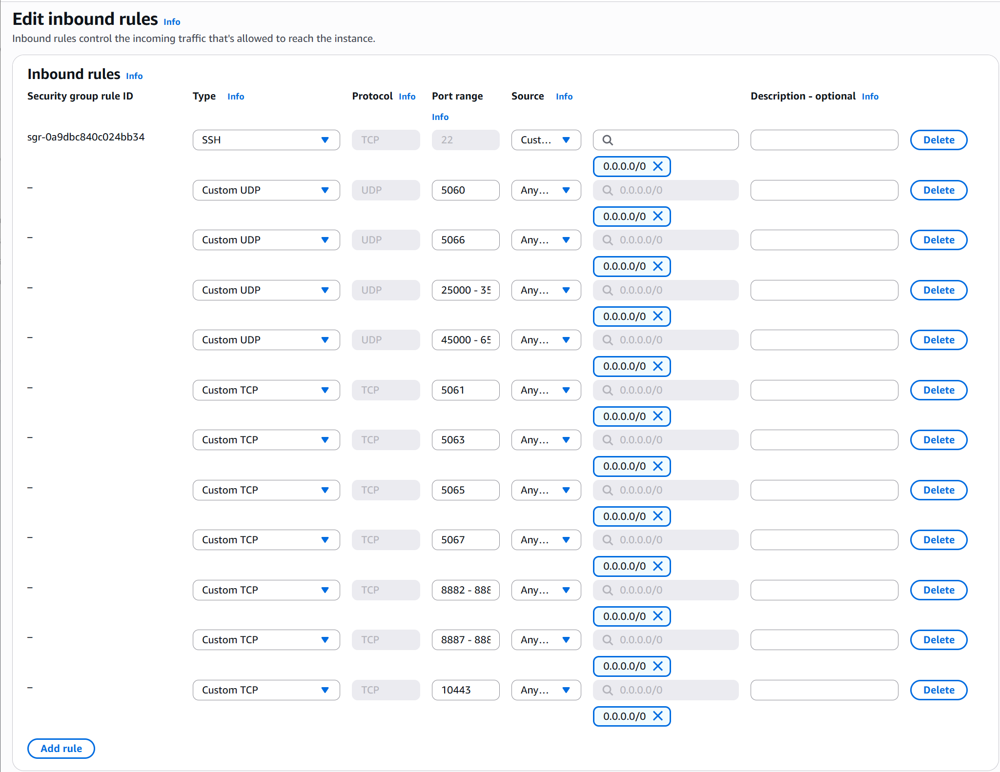
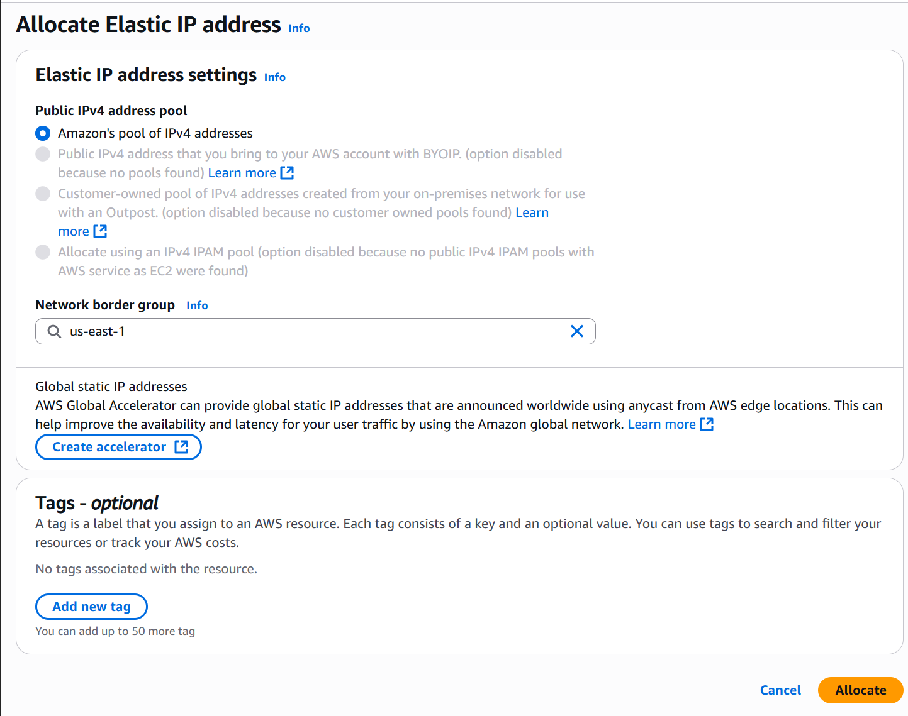
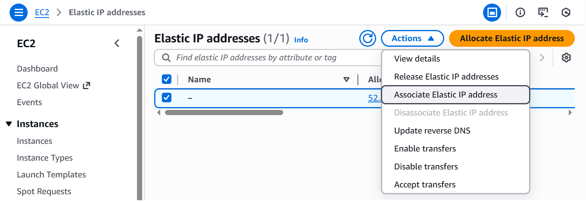
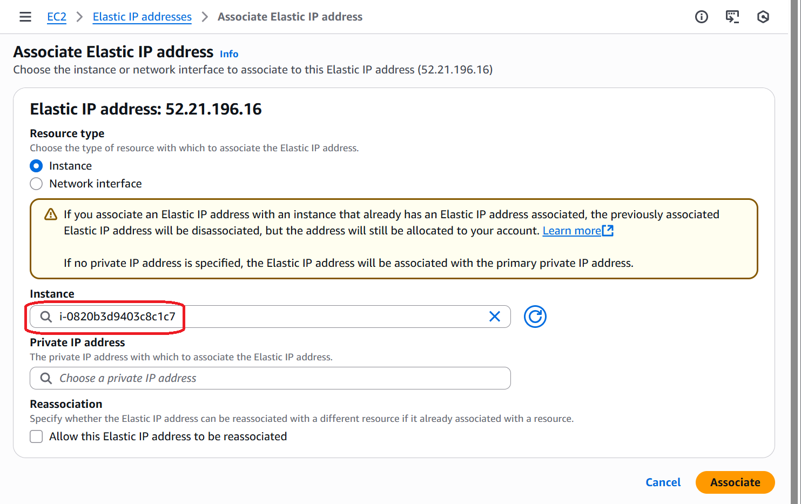

# Prepare the AWS Environment for Deployment

If you plan to deploy PortSIP PBX on Amazon Web Services (AWS), follow the steps below to prepare the required EC2 instance, Elastic IP, and security groups.

Proper AWS resource preparation is critical to ensure stable SIP signaling, high-quality media processing, and reliable system performance in production environments.

***

### Step 1: Sign In to the AWS Management Console

1. Log in to the [AWS Management Console](https://aws.amazon.com/console/).
2. Select the **AWS region** and **availability zone** where you want to deploy the PortSIP PBX instance.

> ❗ **Important**\
> Choose a region geographically close to your users and SIP trunk providers to minimize network latency, reduce jitter, and improve overall call quality.

***

### Step 2: Launch an EC2 Instance

1. Open the **EC2 Dashboard**.
2. Navigate to **Instances > Instances**.
3. Click Launch instances in the upper-right corner. The Launch an instance configuration page will appear.

***

### Step 3: Choose the Operating System and Instance Type

1. In the **Name and tags** section, assign a descriptive name, such as **PortSIP PBX Server**.
2. In the **Application and OS Images (Amazon Machine Image)** section, select **Ubuntu 24.04 LTS**.
3. In the **Instance type** section, choose an instance based on your expected workload, such as:
   * `m3.large`
   * `m6i.large`
   * `m7i.large`
4. Ensure the **architecture** is set to **64-bit (x86)**.

<figure><figcaption></figcaption></figure>

> ❗ **Important**\
> For production deployments, select a general-purpose or compute-optimized instance with sufficient CPU and memory to handle **SIP signaling**, **media processing**, and **concurrent call volume**. Insufficient resources may lead to degraded call quality, audio issues, or dropped calls.

***

### Step 4: Generate an SSH Key Pair

AWS requires an **SSH key pair** to securely access your EC2 instance.

1. In the **Key pair (login)** section of the instance launch wizard, do one of the following:
   * If you already have an existing SSH key pair, select it from the drop-down list.
   * If you do not have a key pair, click **Create new key pair**.
2. On the **Create key pair** page:
   * Enter a descriptive name for the key pair (for example, `portsip-pbx-key`).
   * Keep all other settings at their default values.
   * Click **Create key pair**.
3. When prompted, download the `.pem` key file and store it securely on your local computer.

> ❗ **Important**\
> The private key file (`.pem`) can only be downloaded once. AWS does not retain a copy.\
> If the key file is lost, you will not be able to access the instance via SSH and may need to recreate the instance or perform key recovery procedures.

Please refer to the screenshot above for visual guidance.

<figure><figcaption></figcaption></figure>

***

### Step 5: Configure Network Settings and Storage

#### Network Settings

1. In the Network settings section, configure the security group:
   * If this is your first PortSIP PBX deployment, select Create security group to automatically create a new security group.
   * If you already have an existing security group configured for PortSIP PBX, select Select existing security group and choose it from the list.
2. Keep all other network parameters at their default values unless you have specific networking or security requirements.

> ❗ **Important**\
> Ensure that the selected security group allows the required inbound and outbound traffic for **SIP signaling**, **RTP media**, **Web management**, and **SSH access**. Incorrect security group rules are one of the most common causes of call setup failures and one-way audio issues.

***

#### Storage Configuration

1. Allocate **at least 50 GB** of storage for the **root volume**.
2. If you plan to store a large number of call recordings, voicemails, or CDR data, increase the disk size accordingly.

> ❗ **Important**\
> As a general guideline, approximately **1 MB of disk space is required for every 1 minute of audio recording**.\
> Calculate the total required storage capacity based on:
>
> * Average call duration
> * Number of concurrent and daily calls
> * Recording retention period

> Insufficient disk space may result in failed recordings, missing voicemails, or service interruptions.

<figure><figcaption></figcaption></figure>

#### Launch the Instance

After completing the network and storage configuration, click **Launch instance** to start your EC2 server.

***

### Step 6: Configure the Security Group

1. Navigate to **EC2 > Instances** and select your newly created instance.
2. Scroll down to the **Security** tab to view the associated security group\
   (for example, `sg-051aa65b609ce7120 (launch-wizard-1)`).
3. Click the **security group** link to open its configuration page.

Please refer to the screenshot above for reference.

<figure><figcaption></figcaption></figure>

***

#### Configure Inbound Rules

1. Under the **Inbound rules** tab, click **Edit inbound rules**.
2. Add the following inbound rules required by **PortSIP PBX**:

**UDP Ports**

* `5060`, `5066`
* `25000–35000`
* `45000–65000`

**TCP Ports**

* `5061`, `5063`, `5065`, `5067`
* `8882–8883`
* `8887–8888`
* `10443`

3. **Keep the default SSH rule (TCP port 22)** unchanged. Do **not** remove or modify it.

> ❗ **Important**
>
> * **UDP 25000–35000** is used by the **SBC**.\
>   Skip this rule if the SBC is deployed on a **separate server**.
> * **UDP 45000–65000** is used by the **PBX media server** for RTP media.\
>   Skip this rule if the media server runs on a **different host**.

> ❗ **Important**\
> These ports are required to ensure proper **SIP signaling**, **RTP media flow**, and **management access**.\
> Missing or incorrectly configured rules are a common cause of **call failures, one-way audio, or no audio issues**.

<figure><figcaption></figcaption></figure>

#### Apply the Configuration

After adding all required rules, click **Save rules** to apply the changes.

***

### Step 7: Allocate and Associate an Elastic IP

A static public IP address is required to ensure that SIP devices, SIP trunk providers, and external services can consistently reach your PortSIP PBX. On Amazon Web Services, this is achieved using an Elastic IP (EIP).

***

#### Allocate an Elastic IP

1. In the left navigation pane of the EC2 console, go to\
   **Network & Security > Elastic IPs**.
2. Click **Allocate Elastic IP address** in the upper-right corner.
3. Keep all default settings and click **Allocate**.

Please refer to the screenshot above for reference.

<figure><figcaption></figcaption></figure>

***

#### Associate the Elastic IP with the EC2 Instance

1. Return to **Network & Security > Elastic IPs**.
2. Select the newly allocated Elastic IP from the list.
3. Click **Actions**, then choose **Associate Elastic IP address**.

<figure><figcaption></figcaption></figure>

4. On the **Associate Elastic IP address** page:

* In the **Instance** field, select your PortSIP PBX EC2 instance.
* Click **Associate**.

<figure><figcaption></figcaption></figure>

> ❗ **Important**\
> A stable public IP address is **mandatory** for SIP-based systems.\
> Without an Elastic IP, the public IP may change after a reboot or stop/start operation, which can cause:
>
> * SIP registration failures
> * One-way or no-audio issues
> * Call routing and trunk authentication problems

> ❗ **Important**\
> Always configure your **SIP trunks**, **DNS records**, and **firewall rules** using the **Elastic IP address**, not a dynamic public IP.

***

#### **Result**

Your EC2 instance now has a **persistent public IP address**.\
You can use this **Elastic IP** to:

* Connect to the instance via **SSH**
* Configure SIP trunks and NAT settings
* Allow external SIP devices and services to reliably reach the PBX

***

### Step 8: Verification

After associating the **Elastic IP** and applying the required **security group rules**, verify that your AWS environment is correctly prepared for the PortSIP PBX deployment.

#### Verification Checklist

* The EC2 instance has a **fixed public IP address** (Elastic IP).
* All required ports are open for:
  * **SIP signaling**
  * **RTP media**
  * **Web management access**
* The instance is reachable from the public network.

***

#### Connect to the Instance via SSH

To connect to your EC2 instance using an SSH client:

* **Default username:** `ubuntu`
* **Authentication method:** SSH key pair created in a previous step

**Example SSH command:**

```bash
ssh -i /path/to/your-key.pem ubuntu@<Elastic-IP>
```

> ❗ **Important**\
> Ensure that the SSH private key file (`.pem`) has the correct permissions.\
> On Linux or macOS, you may need to run:
>
> ```bash
> chmod 400 /path/to/your-key.pem
> ```
>
> Incorrect permissions may cause SSH authentication failures.

***

### **Result**

If the SSH connection is successful, your AWS environment is **fully prepared** for the PortSIP PBX deployment.

You can now proceed to the next section: [Installing PortSIP PBX](installation-of-portsip-pbx-v22.3-beta-version/install-portsip-pbx.md).


