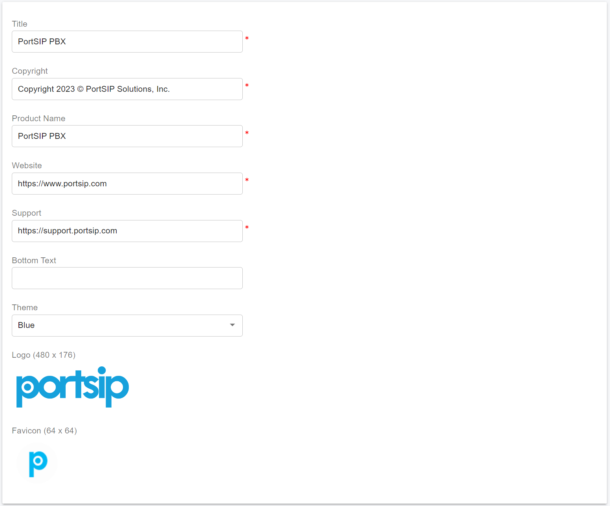

# Rebranding PortSIP PBX, SBC

The PortSIP PBX and SBC provide a simple, but powerful rebranding feature that allows you to customize the PortSIP PBX Web Portal according to your preferences. Below is the list of options or elements that you may customize with this add-on:

* Product Name
* Company Name
* Website Link
* Logo
* Favicon
* Theme
* User Agent string of PortSIP PBX and SBC
* WebRTC, Windows, Mobile Apps
* Phone Template
* Email Notifications Template

## Rebranding PortSIP PBX

### User Agent

You can customize the PortSIP PBX User-Agent by following the steps.

Sign in to the PortSIP PBX Web Portal with "**System Admin**" credentials. Click the Menu "**Advanced > Settings**", on the "**General**" page, and in the "**User Agent**" field, type the User-Agent string you want.

### Company Name, Product Name, Website, Logo

Sign in to the PortSIP PBX Web Portal by using "**System Admin**" credentials, click the Menu "**Advanced > Settings**", and on the "**Rebranding**" tab, you can edit the below items for rebranding.

* Web Portal Title
* Website Link
* Support Link
* Company Name
* Product Name
* Logo
* Favicon
* Theme
* The bottom text for the login page


We recommend customizing your experience by uploading your own logo and favicon to align with each theme’s color palette. This will personalize your Web portal and WebRTC client app, displaying your unique logo and favicon for each theme.


<figure><figcaption></figcaption></figure>

### IP Phone Template

PortSIP PBX allows you to customize the IP Phone template, which will give you a unique user experience and your own brand of the IP Phone. Please refer to this article: [Custom IP Phone Template](4-phone-device-management/custom-ip-phone-template.md).

### Email Notification Template

One of the features of the PortSIP PBX is the ability to customize Email Templates. Please refer to this article: [Configuring Email Notifications](31-configuring-email-notifications/#custom-email-notification-template).

## Rebranding PortSIP SBC

### User Agent

You can customize the PortSIP SBC User-Agent by following the steps.

Sign in to the PortSIP SBC Web Portal. Click the Menu "**Settings > Advanced**", in the "**User Agent**" field, type the User-Agent string you want.

### 2.2 Company Name, Product Name, Website, Logo

Sign in to the PortSIP SBC Web Portal, and click the Menu "**Settings > Rebranding**", and you can edit the below items for rebranding.

* Web Portal Title
* Website Link
* Support Link
* Company Name
* Product Name
* Logo
* Favicon
* Theme
* The bottom text for the login page


We recommend customizing your experience by uploading your own logo and favicon to align with each theme’s color palette. This will personalize your Web portal and WebRTC client app, displaying your unique logo and favicon for each theme.


<figure><figcaption></figcaption></figure>

