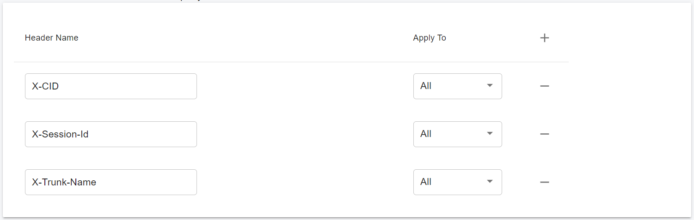
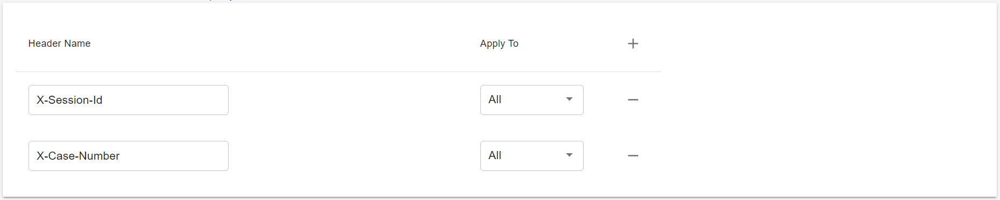
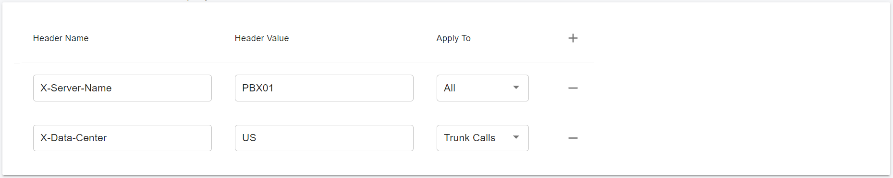

# SIP Header Manipulation

SIP header manipulation allows you to add, delete, or modify SIP message attributes on the PortSIP PBX. For example, SIP headers and SIP header elements.

The most common reason for manipulating SIP headers and SIP header elements is to fix an incompatibility problem between two SIP endpoints, or pass the special information. For example, Softswitch - PSTN incompatibility or a SIP messaging problem between two different IP PBX platforms in a multi-site deployment where calls between the platforms are unsuccessful due to problems in the SIP messaging.

To enable the SIP header manipulation, create rule sets in which you specify header manipulation rules. SIP header elements are the sub-parts of the header, such as the header value, the header parameter, the URI parameter, and so on, excluding the header name. You can specify the actions that you want the system to perform for each header element.

## 1 Relay SIP Header

PortSIP Header Manipulation support allows you to manipulate SIP headers by relaying them to the next hop. For example, if an INVITE message containing a SIP header such as "**X-Case-Number**" arrives at the PBX from a SIP trunk and is routed to the **IVR > Call Queue > Agent**, we expect the PBX to include this header when sending an INVITE to the agent. This way, the agent’s application can access this header to retrieve the case number and query related information from the CRM. By doing so, the agent can review the call history information and provide better service to the customer.

Sign in as a tenant administrator and select the "**Advanced > Customer Headers**" menu.&#x20;

In the "**Relay SIP Headers"** section, you can specify which headers to relay and choose the type of call to which this relay will be applied. The following options are available:

* All: Relay the header for all calls.
* Tunk Calls: Only relay the headers for calls from or sent to the trunk.
* User Calls: Only relay the headers for calls between users.

<figure><figcaption></figcaption></figure>

By default, the PortSIP PBX will relay the following headers for all calls:

* X-CID: This is used to tie the call legs of a call for debugging and troubleshooting purposes. You can reference the [Trace server - A Better Way to Debug PortSIP PBX](debug-sip-message.md).
* X-Session-Id: This feature is used to identify a call by a unique ID across all call legs. For example, if someone makes a call from a trunk to the PBX and it is routed to the **IVR > Queue > Agents**, the **X-Session-Id** will be included in all call legs. PortSIP PBX uses this unique session ID to identify the call and access its CDR information.
* X-Trunk-Name: If the call is between the PBX and a SIP trunk, the SIP trunk name will be included in the SIP messages. This makes it easy to identify which SIP trunk the call is going through.

If you do not want to include a SIP header, simply click the minus icon to remove it.

The screenshot below shows that the **X-Trunk-Name** and **X-CID** headers are not added, but the **X-Case-Number** header is relayed to the next hop if it is present in the SIP message received by the PBX.

<figure><figcaption></figcaption></figure>

Based on the above settings, if someone makes a call to the PBX that includes the SIP header **X-Case-Number**, the PBX will relay it to the callee in the INVITE message.

## 2 Add SIP Header

PortSIP Header Manipulation support allows you to manipulate SIP headers by adding them to the next hop. For example, if an INVITE message arrives at the PBX from a SIP trunk and is routed to the **IVR > Call Queue > Agent**, we expect the PBX to include a specified SIP header and value when sending an INVITE to the agent. This way, the agent’s application can access this header for some purposes.

Sign in as a tenant administrator and select the "**Advanced > Customer Headers**" menu.&#x20;

In the "**Add SIP Headers**" section, you can enter the SIP header name and value that you wish to add to the SIP message and choose the type of call to which it will be applied. The following options are available:

* All: Add the header to all calls.
* Tunk Calls: Only add the headers to the calls from or sent to the trunk.
* User Calls: Only add the headers to the calls between users.

<figure><figcaption></figcaption></figure>

Based on the above settings, if someone makes a call to the PBX, the PBX will add the following SIP headers to the SIP message when sending an INVITE to the called party:

* Add the SIP header "**X-Server-Name**" with the value "**PBX01**" for all calls.
* Add the SIP header "&#x58;**-Data-Center**" with the value "**US**" if the call is to a SIP trunk.

## 3 Mainipulate Known SIP Headers

PortSIP PBX also allows you to modify and remove the known SIP headers, please read [Handle Outbound Calls Through SIP Trunk](7-trunk-management/handle-outbound-calls-through-sip-trunk.md#h.rhrzb9hdve5w) for more details.


Modifying or removing known SIP headers may cause the call to not work. Please be careful when doing so, or contact PortSIP Support for assistance.

