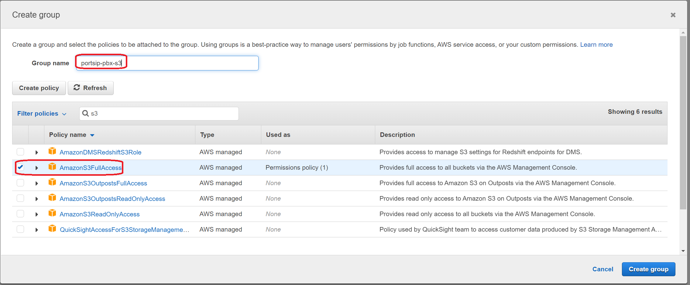
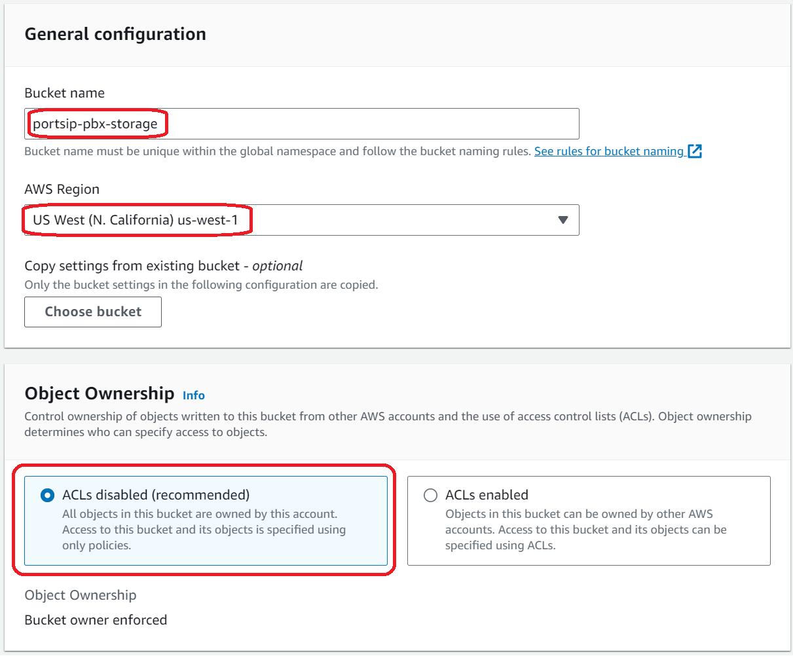

# Storing Into AWS S3

With [PortSIP PBX](https://www.portsip.com/portsip-pbx), you can configure the system to store call recordings and related media assets directly in your own Amazon Web Services (AWS) [Amazon S3](https://aws.amazon.com/s3/) bucket, instead of using local disk storage on the PBX server.

This approach is recommended for customers who require scalable storage, centralized data management, or strict compliance with regulatory and data residency requirements.

This guide walks you through the required AWS-side preparation to enable S3-based storage for PortSIP PBX.

***

### Important Notes

* Once **external S3 storage** is enabled, PortSIP PBX will **no longer store uploaded files on the local disk**.
* You will be fully responsible for:
  * Access control and security policies
  * Data retention and lifecycle management
  * Backup and compliance of stored media

Uploaded content affected by this change includes (but is not limited to):

* Call recordings and voicemail recordings
* Voice prompts and IVR announcements
* Queue and system audio files
* User profile images and tenant logos
* QR codes and other uploaded media assets

> ❗**Use this feature when your organization must avoid reliance on third-party hosted storage or needs full ownership and governance of recorded communications.**

***

### ⚠️ Warnings and Best Practices

Please carefully review the following considerations **before enabling Amazon S3 storage**:

1. **Irreversible Access to Historical Data**\
   Once Amazon S3 storage is enabled:
   * Existing recordings stored on the PBX local disk will no longer be accessible.
   * All previously uploaded media (queue prompts, voicemail greetings, IVR audio, system announcements, logos, profile images, and QR codes) **must be re-uploaded**.
2. **Enable S3 Storage Early**\
   To avoid data migration issues, it is **strongly recommended** to configure Amazon S3 storage **immediately after completing the PBX installation**, before uploading any production media or recordings.
3. **Do Not Toggle the Storage Mode**\
   After the **“Store to S3”** option is enabled:
   * **Do not disable it**.
   * Disabling S3 storage will prevent access to historical recordings and disrupt the creation of new recordings.
   * The same caution applies when switching **from S3 back to local disk storage**.

***

### Step 1: Create an IAM Group and User

1. Navigate to the **Identity and Access Management (IAM)** menu, select **Access Management**, and then click **Add User**.
2. Enter a user name (for example, `s3store`), select **Programmatic Access**, and then click **Next**.


3.  Click **Create group** to create a new IAM group.&#x20;

    You may choose to add this user to an existing group instead of creating a new one; however, the existing group **must be granted the AmazonS3FullAccess permission**.


4. Enter a group name (for example, `portsip-pbx-s3`), select the **AmazonS3FullAccess** policy, and click **Create group**.



5. Once the group is successfully created, select it and click **Next**. You may optionally add tags to the user, or skip this step by clicking **Next**.
6. After the user is successfully created, make sure to record the **Access Key ID and Secret Access Key** as shown.\
   These credentials will be required later, and the secret access key cannot be retrieved again.


***

### Step 2: Create an S3 Bucket

1. Navigate to the **Amazon S3** menu and click **Create bucket** to create the S3 storage that **PortSIP PBX** will use to store recording files. Pay close attention to the **Bucket name**, **AWS Region**, and **Object Ownership** settings, as shown in the screenshot below.
2. The **AWS Region must be the same region** where your PBX is deployed. Make sure to record the following information, as it will be required later:
   * **Bucket name**
   * **Bucket region** (the AWS region where the S3 bucket is located)
3. Click **Create bucket** to complete the process. The S3 bucket will then be created successfully.

<figure><figcaption></figcaption></figure>

***

### Step 3: Modify the PortSIP PBX Settings

#### Open the Configuration File

Edit the `system.ini` configuration file on the server where PortSIP PBX is installed:

* &#x20;`/var/lib/portsip/pbx/system.ini`

> ❗Ensure you open the file with administrative/root privileges.

***

#### Configure the API Gateway Storage Backend

Locate the `[apigateway]` section and set the `storage` parameter to `s3`, as shown below:

```ini
[apigateway]
storage = s3
```

***

#### Configure Amazon S3 Storage Settings

Edit (or add) the `[storage.s3]` section with your Amazon S3 configuration details:

```ini
[storage.s3]
endpoint = http://s3.region-code.amazonaws.com
cred_id = <Access key ID>
cred_secret = <Secret access key>
region = region-code
bucket = portsip-pbx-storage
```

**Parameter Descriptions**

*   **endpoint**\
    The Amazon S3 service endpoint URL. Replace `region-code` with your actual AWS region.\
    For example, if your EC2 instance and S3 bucket are in `us-west-1`:

    ```ini
    endpoint = http://s3.us-west-1.amazonaws.com
    ```

    If your EC2 and S3 services are located in **AWS China regions**, use the `.com.cn` domain:

    ```
    amazonaws.com.cn
    ```
* **cred\_id**\
  The **Access Key ID** of the IAM user created for S3 access.
* **cred\_secret**\
  The **Secret Access Key** of the same IAM user.
* **region**\
  The AWS region code where both the EC2 instance and S3 bucket reside (for example, `us-west-2`).
* **bucket**\
  The name of the Amazon S3 bucket used by PortSIP PBX (for example, `portsip-pbx-storage`).

> ❗A complete list of AWS region codes is available here:\
> [https://docs.aws.amazon.com/general/latest/gr/rande.html](https://docs.aws.amazon.com/general/latest/gr/rande.html)

***

#### Configure S3 URL Style (Path-Style vs Virtual-Hosted–Style)

Amazon S3 supports two URL styles for accessing objects:

* Path-Style URLs
* Virtual-Hosted–Style URLs

By default, **PortSIP PBX uses Path-Style URLs** to ensure compatibility with AWS S3–compatible private object storage services.

**URL Style Configuration**

You can explicitly control the URL style by adding the `path_style` parameter to the `[storage.s3]` section:

*   Path-Style (default, recommended for S3-compatible storage services)

    ```ini
    path_style = true
    ```
*   Virtual-Hosted–Style (recommended for official AWS S3)

    ```ini
    path_style = false
    ```

> ❗According to AWS best practices, **Virtual-Hosted–Style** URLs are preferred when using official Amazon S3.

***

### Apply the Configuration

After completing the configuration:

1. Save the changes to `system.ini`.
2. **Restart the PortSIP PBX service** to apply the new settings.

```shellscript
cd /opt/portsip && sudo /bin/sh pbx_ctl.sh restart
```

> ❗The updated S3 storage configuration will not take effect until the PBX service has been restarted.


