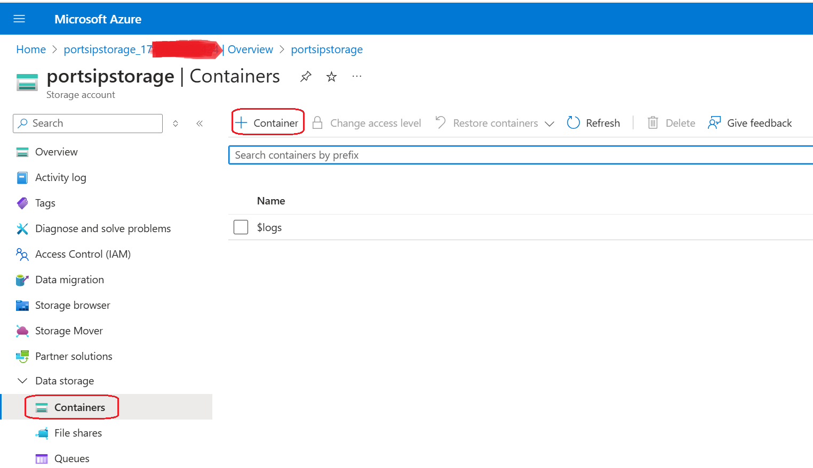

# Storing Into Azure Blob Storage

With PortSIP PBX, you can configure your system to store call recordings and compositions directly to your own Azure Blob Storage, instead of using local disk storage. This guide will walk you through setting up your AWS account or project to leverage this feature.

**Note:** Once external Azure Blob Storage is enabled, PortSIP PBX will stop storing uploaded files (such as voice prompts, profile pictures, and audio/video recordings) on the local disk. You will then be responsible for managing the security and lifecycle of your recorded content.

Use this feature if you need to comply with regulatory requirements that prohibit reliance on third-party storage solutions.

**Warning:** Please be aware of the following considerations when configuring Azure Blob Storage for your recordings:

* Historical recordings stored on the local disk of the PBX server will no longer be accessible after Azure Blob Storage is activated. Therefore, it is recommended to configureAzure Blob Storage before making or receiving calls.
* Once the "**Azure Blob Storage**" option is activated, do not disable it. Disabling this feature will prevent the PBX from accessing historical recordings and will disrupt the process of storing new recordings on Azure Blob Storage.

## Prerequisites

* Debian 11/12, Ubuntu 22.04/24.04, 64-bit
* We recommend deploying the PortSIP PBX on Azure to get the best performance

## Step 1: Create Storage Account <a href="#create-an-iam-group-and-user" id="create-an-iam-group-and-user"></a>

1. Sign the [Azure web portal](https://portal.azure.com/).
2. Select the menu Storage accounts, then click **Create**.

<figure><figcaption></figcaption></figure>

3. In the **Basic** tab, fill in the **Storage Account Name** field and note down it, as you will need it in a later step.
4. For the **Primary Service**, select **Azure Blob Storage** **or Azure Data Lake Storage Gen 2**.
5. Follow the page instructions and select the appropriate values for the remaining fields.
6. Click the **Next** button to complete the creation process.

<figure><figcaption></figcaption></figure>

## Step 2: Create the Container <a href="#change-the-portsip-pbx-settings" id="change-the-portsip-pbx-settings"></a>

Now, follow these steps to create the storage container:

1. Double-click the **Storage Account** you created in the previous steps.
2. In the **Data Storage** menu, click **+ Container**.

<figure><figcaption></figcaption></figure>

3. Enter a name for the container, make a note of the container name, and click the **Create** button.

<figure><figcaption></figcaption></figure>

## Step 3: Retrieve the Access Key <a href="#change-the-portsip-pbx-settings" id="change-the-portsip-pbx-settings"></a>

1. Navigate to the **Security + Networking** menu.
2. There are two keys available. Click **Show** for either key, then copy it.

<figure><figcaption></figcaption></figure>

## Step 4: Modify the PortSIP PBX settings <a href="#change-the-portsip-pbx-settings" id="change-the-portsip-pbx-settings"></a>

Open the settings file:

* On Linux is  `/var/lib/portsip/pbx/system.ini`
* On Windows is  `c:/programdata/portsip/pbx/system.ini`

In the section **apigateway**, modify the value of the key **storage** to **azure** as shown below.

```
[apigateway]
storage=azure
host=localhost
port=8903
```

Edit the section **storage.azure** as shown below.

```
[storage.azure]
account_name = Storage account name
account_key = Access key of your Azure Blob Storage
container = Container name
```

After modifying the parameters for **Azure Block Storage**, save the changes made to **system.ini**. You will then need to restart the PortSIP PBX for the changes to take effect.

## Step 5: Restart the PortSIP PBX

### Linux

Restart the PBX by performing the following commands:

```
cd /opt/portsip && pbx_ctl.sh restart
```

### Windows

Restart the Windows Server directly.

