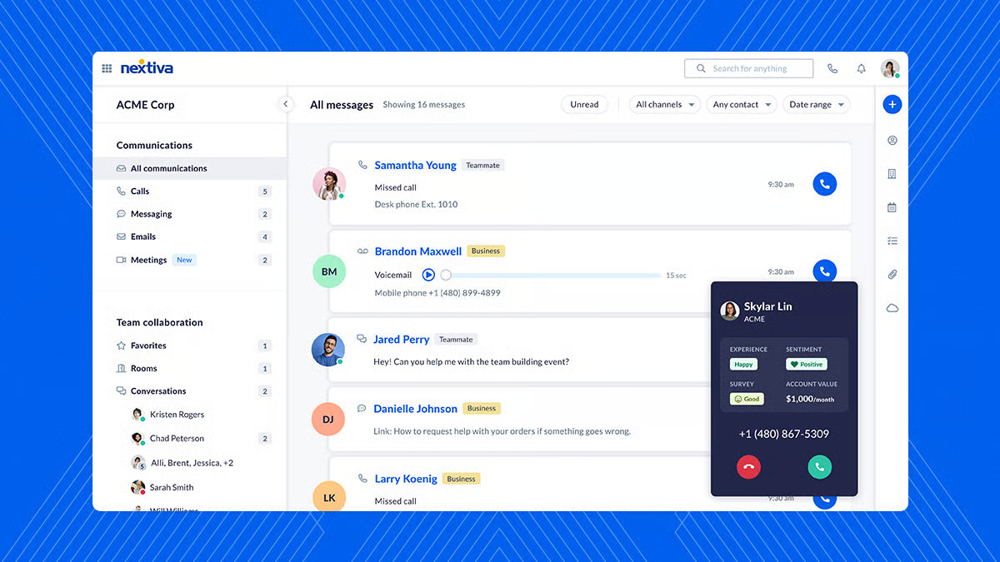
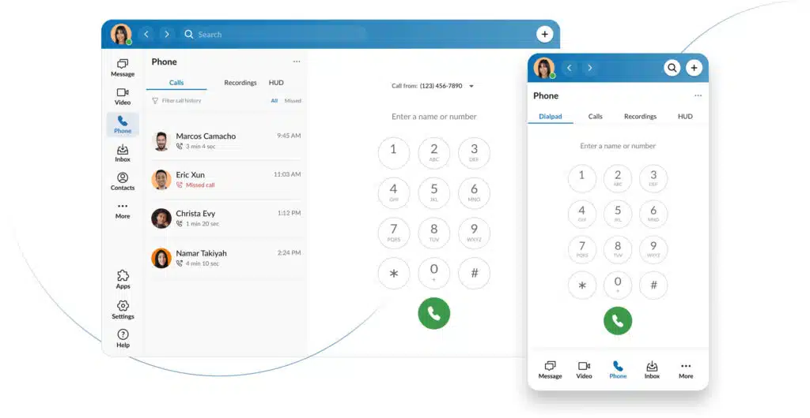

# Softphone: What It Is, How It Works, and Why Your Business Needs It

Modern business has transformed dramatically over the last decade. Today, remote and hybrid work models are not just trends; they're the norm for many successful companies. This shift has been largely empowered by technological innovations, and softphones stand out as a prime example.

If your company is still tethered to traditional office setups, you might be falling behind. To stay competitive, it’s crucial to understand the communication technologies available. Let's start with the basics: What exactly is a softphone?

<figure><figcaption></figcaption></figure>

### What Is a Softphone?

A softphone is a software application that allows users to make and receive phone calls over the internet using a computer, tablet, or smartphone. Unlike traditional hardware-based desk phones, a softphone provides a digital calling interface that operates via Voice over Internet Protocol (VoIP) networks. Businesses are increasingly adopting softphones for their flexibility, enabling seamless communication for remote teams, hybrid workforces, and centralized call operations.

Softphones effectively replicate the functionality of physical phones while offering a significantly expanded feature set. Many softphone applications include robust capabilities like call forwarding, voicemail, call recording, instant messaging, video conferencing, and deep integration with CRM platforms and other collaboration tools. Employees can make and receive calls using their professional business numbers, maintaining privacy without needing to share personal mobile details.

### How Does a Softphone App Work?

In essence, a softphone application behaves much like a traditional desk phone or landline. The key difference lies in the underlying technology: softphone software leverages VoIP to facilitate internet-based voice calls.

Because they're software-driven, softphone apps can do everything traditional desk phones can—and much more, including:

* **Video calling**: Transition from a voice call to a video conference with a single click.
* **Click-to-dial**: Initiate calls directly from your computer screen, email, or web browser.
* **Call recording**: Capture conversations for quality assurance, training, or record-keeping.
* **Visual voicemail management**: Easily listen to, manage, or even read transcriptions of your voicemails.
* **Team messaging & SMS**: Communicate via text with colleagues and clients directly within the app.
* **Presence management**: See the availability status of your colleagues (e.g., online, on a call, busy, away).

Softphones run on a wide array of devices and operating systems. You can find desktop applications for Mac, Windows, as well as web-browser-based versions. Mobile softphone apps are widely available for both iOS and Android, allowing you to manage calls, transfer, hold, and even switch calls between Wi-Fi and your mobile carrier's network without interruption.

When making a call, you simply speak into your device's microphone (or a connected headset). The softphone then uses VoIP technology to mimic desk phone functions, routing your voice over the internet.

### What Does a Softphone Look Like?

Since a softphone is purely software, its appearance will vary depending on the provider. However, most softphones are designed to mimic the familiar experience of a desk phone. You'll typically find an intuitive interface featuring a dial pad, an interactive display panel, and standard telephone buttons (like hold, transfer, and mute).

Beyond the basic phone interface, softphones often incorporate additional features directly into the software, offering a highly intuitive user experience. For example, many apps allow you to seamlessly switch an ongoing voice call to a video call, or manage call transfers and voicemails with simple clicks.

### Why Businesses Are Choosing Softphones

When it comes to empowering your team with modern communication tools, softphones offer compelling advantages:

***

#### **1. Cost-Effective Alternative to Desk Phones**

A VoIP softphone is a significantly more cost-effective alternative to expensive traditional phone lines and proprietary hardware systems. Businesses that switch to softphones often report reducing their phone costs by 60% or more by eliminating the need for costly desk phone hardware and maintenance. Unlike traditional VoIP phones, softphone functionality is often included (or available at a low cost) as part of your existing business phone service, ensuring you're not paying for unused equipment.

#### **2. Instant Setup and Deployment**

Deploying a softphone application takes mere minutes. Simply download the app to your computer or mobile device, log in with your VoIP provider’s credentials, and you’re ready to go. Onboarding new team members is equally swift, requiring only account creation.

Softphones are compatible with diverse devices and operating systems. While dedicated software applications offer the best experience, many providers also offer web-browser-based softphones. With no physical hardware involved, your communication system can be up and running almost instantly.

#### **3. Easy to Use and Support**

Today’s softphone apps boast intuitive interfaces, often featuring a familiar telephone dial pad, tabbed sections for different functions, and real-time notifications. Consistency between desktop and mobile apps ensures a familiar experience for users across devices.

Because they are software-based, updates that introduce new features, security enhancements, or performance improvements can be rolled out seamlessly without any physical system modifications. Always ensure your softphone provider prioritizes robust security measures to safeguard your communications.

#### **4. Access to More Features**

Softphones inherently offer a broader range of features than conventional phones. These capabilities significantly improve call handling, enhance collaboration, and simplify communications. Examples include advanced call forwarding, seamless CRM integration, integrated video conferencing, and easy call transfers. Calls made with softphones can be effortlessly integrated into Customer Relationship Management (CRM) systems. Furthermore, conference calling and video calling are typically included at no additional cost.

Starting a call center? The same softphone app can often provide built-in functionality for your agents, streamlining operations and boosting efficiency.

### Softphone Benefits for Enterprises

* Enhance Call Center Efficiency: Softphones are invaluable for call centers, boosting agent performance with features like intelligent call routing, call queuing, live monitoring, and performance analytics. This enhances service delivery while dramatically reducing hardware and maintenance requirements.
* Simplify Technology Requirements: By eliminating the need for physical desk phone hardware, softphones simplify deployment and reduce capital expenditures. Their ability to integrate with essential enterprise platforms like CRM systems and help desk tools streamlines workflows and supports more coordinated communication strategies.
* Add Greater Business Agility: Implementing softphones requires no additional physical infrastructure. New users can be added quickly with minimal setup, making it incredibly easy for businesses to scale communication operations in line with staffing needs, whether for rapid growth or seasonal fluctuations.

### Essential Softphone Features

Despite their name, softphone software does far more than just place and receive phone calls; they are packed with advanced communication capabilities:

* HD Voice Calls: Experience richer, high-definition audio quality for crystal-clear, confident conversations.
* Text Messaging (SMS/MMS): Send and receive SMS and MMS messages directly through your softphone app, using your business VoIP number.
* Video Calls: Meet face-to-face in a video conference directly from your softphone app, often without needing separate applications.
* Visual Voicemail: Easily play back or read voicemail messages, bypassing confusing PINs or key presses. You can also receive voicemail transcriptions via email.
* Computer Telephony Integration (CTI): CTI functionality allows you to answer, reject, or hold calls using your headset, streamlining call management.
* Presence Management: Instantly see if colleagues are online, offline, busy, or in a meeting, optimizing collaboration.
* Call Transfer: Seamlessly transfer calls to another user or team member within your business, ensuring callers aren't dropped or forced to call back.
* Encryption: Ensure your conversations are secure and private. Softphones encrypt telephony data regardless of your internet connection type.
* Conference Calling: Conduct group audio calls instantly without complicated dial-in processes, fostering quick team collaboration.
* Call Recording: Automatically or on-demand record phone calls, enabling review of past conversations and enhancing quality assurance.
* Caller ID Management: Control the caller ID information displayed, including your name, company, area code, and phone number.
* Call Forwarding: Easily toggle forwarding settings to direct calls to another team member or your company’s auto attendant.
* Call Pulling: Seamlessly switch devices mid-call, for instance, moving from a desk phone to a softphone on your mobile device without interruption.
* Shared Contacts: Softphone apps enable users to subscribe to company-wide contact lists and share their own contacts with coworkers. This is immensely useful for quickly finding client details and saving time that would otherwise be spent manually looking up extensions.

***

### Softphones vs. Desk Phones (Hard Phones): How to Choose

While the trend is strongly leaning towards remote and flexible work, some businesses and industries still find value in physical desk phones. The choice often comes down to specific needs and workflows.

Here are a few questions to consider when deciding between softphones, hard phones, or a combination of both:

* What remote capabilities do you need? If your team (or a portion of it) frequently works remotely or on the go, a robust softphone solution is essential. If a significant part of your team is always in a fixed office location, a physical VoIP phone might be beneficial for quick, dedicated access. Many businesses find a hybrid approach, like a receptionist forwarding calls from their desk phone to their mobile softphone when in meetings, to be the most effective.
* How much are you prepared to invest upfront? One of the significant advantages of softphones is their ability to drastically reduce upfront costs by eliminating the need for expensive desk phones and other hardware. This also cuts down on complicated onboarding and setup expenses. Maintaining an in-house telephony system with hard phones can involve substantial initial capital investment and ongoing maintenance costs.
* Do you want to call, text, and have video meetings from one app? If your business relies on multiple communication channels, a softphone can help consolidate them into a single, unified application. With a traditional telephony setup, you'd typically need a dedicated phone line, plus separate apps for messaging, video conferencing, and more. Modern Unified Communications as a Service (UCaaS) solutions, often centered around a softphone app, integrate all these capabilities.

### **What are the advantages of a hard-wired VoIP desk phone?**

Hard-wired phones offer a familiar, tactile interface for quick dialing and feature dedicated network connectivity (Ethernet), which can be advantageous in certain environments. They are ideal for quick paging, checking if an executive is on a call, or rapidly dialing extensions. Traditional phone calls transmit data via copper landlines from a fixed location.

Desk phones are designed for immediate use, without the need to unlock a mobile phone or find an icon on a computer. They also aren't subject to your smartphone's battery life, a common concern for mobile users.

Bottom line: Softphones and VoIP desk phones often work hand-in-hand within modern communication systems. They give your teams the flexibility to choose their preferred method of communication and collaborate effectively on a single platform.

***

### Top Softphone Apps for Business Use

Choosing the right softphone is crucial for optimizing your business communications. Here’s a quick overview of some leading VoIP softphone apps:

**1. PortSIP ONE**

[PortSIP ONE](https://www.portsip.com/portsip-one/) is engineered as a comprehensive [cloud PBX and UCaaS solution](https://www.portsip.com/portsip-pbx/), centralizing calls, video meetings, and SMS/WhatsApp messages into one intuitive application. It connects your team members and clients with exceptional call quality across desktop (Windows, macOS), web browsers, iOS, and Android devices.

<figure><figcaption></figcaption></figure>

PortSIP ONE is available for free, and crucially, PortSIP also offers a white-label softphone based on the PortSIP ONE app. This is a significant advantage for service providers looking to offer a one-stop UCaaS solution under their own brand, providing unparalleled flexibility and brand recognition.

**2. NextivaONE by Nextiva**

NextivaONE is more than just a softphone; it's a complete communication solution. Nextiva includes a free softphone with any of its business phone services, accessible on desktop (Windows, Mac, Linux) or mobile devices (iOS, Android).&#x20;

<figure><figcaption></figcaption></figure>

It allows businesses to manage calls, send texts, and conduct video conferences from any device, making it a cost-effective solution that reduces the need for expensive hardware. Nextiva's softphone apps provide essential features for remote work and call centers, optimizing communication infrastructure.

**3. RingCentral**

RingCentral provides a [softphone app](https://www.ringcentral.com/office/features/softphone/overview.html), fax, text, video calls, and many more additional features, all on one easy-to-use platform.&#x20;

<figure><figcaption></figcaption></figure>

Once you’ve subscribed to a UCaaS solution, setting up a softphone is easy. You don’t need a [dedicated IP phone](https://www.ringcentral.com/what-is-a-voip-phone.html) or any other hardware. Instead, all you have to do is install the softphone on a device with network access and then set up the software with your personal details and display name.&#x20;

**4. Zoiper**

Zoiper is a versatile standalone softphone application that supports numerous codecs for VoIP calls. This makes it a adaptable choice for businesses of all sizes and compatible with a wide range of VoIP providers. Zoiper often requires IT professionals for setup and deployment across an organization.

**5. Bria Solo by CounterPath**

Bria Solo (formerly X-Lite) is another excellent softphone solution, designed for individuals and teams needing a platform to manage voice calls, video conferences, messaging, and team collaboration. While X-Lite is no longer free, Bria Solo offers a free two-week trial. It's also a handy dialer for testing SIP trunks or performing lighter-duty voice communications using Session Initiation Protocol.

### Is Your Business Ready for Flexible Internet Calling with a Softphone?

Softphones deliver scalable and flexible internet phone service, making them an ideal choice for businesses that require fluid communications from anywhere. They promise all the core features of traditional telephone devices, enhanced with significant benefits like seamless integration with video conferencing, chat, and SMS.

If you desire the full features of a traditional desk phone experience combined with the convenience of portability and powerful integrations, [PortSIP PBX](https://www.portsip.com/portsip-pbx/), with its integrated softphone applications like [PortSIP ONE](https://www.portsip.com/portsip-one/) could be precisely what your business needs to thrive in the modern communication landscape.
