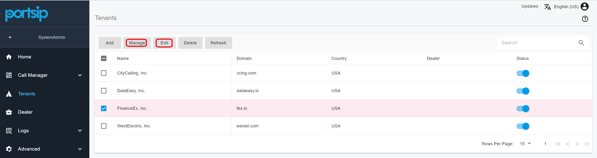
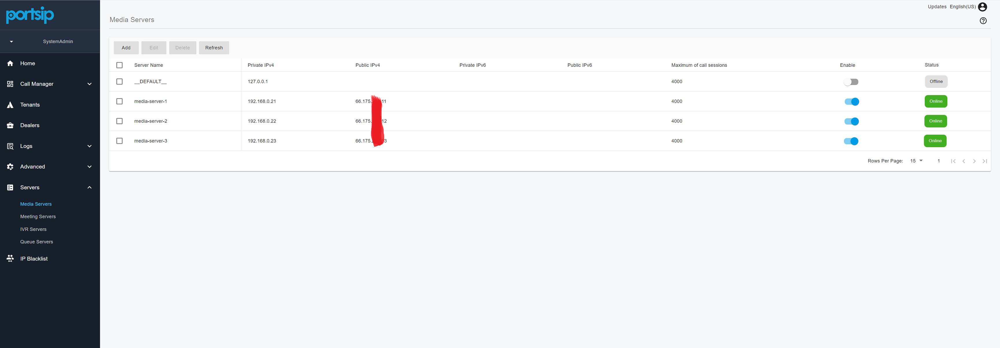

# The Advantages of PortSIP PBX vs. Other PBXs

The communications technology landscape is evolving at an unprecedented pace. Cloud-based unified communication platforms have emerged as the go-to choice for businesses of all sizes, replacing aging traditional phone systems that struggle to support modern needs. Today’s organizations require solutions that are not only efficient and reliable, but also flexible, scalable, and capable of supporting remote and hybrid work models.

As service providers and IT leaders evaluate business communications platforms, one question becomes increasingly important:

**When comparing PortSIP PBX with other PBX solutions, which platform delivers the most value, performance, and future-ready architecture?**

This article explores the key advantages of PortSIP PBX, explaining how it outperforms traditional PBXs and why it’s uniquely positioned to meet the needs of modern unified communications deployments.

<figure><figcaption></figcaption></figure>

### PortSIP PBX: A True Multi-Tenant Solution Built for the Cloud Era

While many vendors claim to offer multi-tenant PBX platforms, most of them rely on **pseudo multi-tenant architectures**. In practice, their solutions deploy a **separate PBX instance for each customer**, with all instances managed through a centralized portal. Although end users may not notice this difference, service providers quickly encounter serious operational challenges, including:

* Maintaining and monitoring a large number of PBX instances
* Inefficient use of server CPU, memory, and storage resources
* Complex upgrades, backups, and troubleshooting across tenants

Consider a service provider with 1,000 customers. If each customer is treated as a separate tenant, typically with 10 to 50 extensions, this results in 1,000 individual PBX instances that must be operated and maintained. The infrastructure overhead and administrative burden of this model quickly become unsustainable.

PortSIP PBX takes a fundamentally different approach. It delivers a **true multi-tenant architecture**, enabling service providers to run a **single PBX instance** that securely supports thousands of tenants. Each tenant has its own isolated configuration, users, and extensions. From the customer’s perspective, it feels like a dedicated PBX, while service providers benefit from centralized management and significantly reduced infrastructure costs.

This architecture:

* Maximizes hardware utilization
* Simplifies upgrades and ongoing maintenance
* Scales predictably as tenant counts grow

***

#### Centralized Tenant Management, Built for Scale

Through the web portal, system administrators and dealers (including distributors, sub-distributors, and resellers) can easily view and manage all tenants. Common management actions include:

<figure><figcaption></figcaption></figure>

* **Add** – Instantly create a new tenant
* **Manage** – Switch to the tenant’s administrator interface to configure users, routing, and features
* **Edit** – Adjust tenant-level capabilities and feature access
* **Disable** – Temporarily suspend a tenant while preserving all data and settings
* **Delete** – Permanently remove a tenant and all associated data

Designed specifically for the cloud era, this modern multi-tenant PBX model combines operational simplicity with carrier-grade scalability. PortSIP executes this approach exceptionally well, enabling service providers to scale faster, operate more efficiently, and deliver a superior unified communications experience to every tenant.

***

### **Full White-Label Solution**

A white-label solution allows one company to deliver a product or service under its own brand, even though the underlying technology is developed by another vendor. While building a strong and consistent brand identity can be challenging, **PortSIP PBX** makes it straightforward by offering a fully customizable white-label PBX and Cloud PBX platform.

With PortSIP’s comprehensive rebranding capabilities, service providers can completely private-label the solution and present it as their own. You can customize:

* Visual theme and branding
* Product name and company name
* Website links
* Logo and favicon
* SIP user agent strings for the PBX and SBC
* WebRTC, desktop, mobile, and Microsoft Teams Phone applications
* IP phone provisioning templates
* System notification and email templates

This level of flexibility enables you to deliver a consistent, professional brand experience across every touchpoint—while PortSIP handles the underlying platform, performance, and ongoing innovation.

As a result, service providers can focus on **marketing, sales, customer onboarding, and billing**, rather than platform development and maintenance.\
For step-by-step configuration details, please refer to the article [Rebranding PortSIP PBX, SBC](portsip-pbx-administration-guide/rebranding-portsip-pbx-sbc.md).

***

### **A Scalable Communications Platform**

In a cloud-based, multi-tenant PBX environment, service providers host the PBX in the cloud and deliver calling services to a large and diverse user base. Unlike single-tenant PBXs—typically designed for small and mid-sized businesses, cloud PBXs must support **thousands of tenants and high volumes of concurrent calls**. In this model, performance, reliability, and predictable scalability are non-negotiable.

**PortSIP PBX** is purpose-built for the cloud era, delivering exceptional performance and horizontal scalability. It is designed to handle large numbers of extensions (users) and simultaneous calls without compromising call quality or system stability.

For large-scale deployments, PortSIP PBX scales by extending key service components within a cluster, including:

* **Queue Server**
* **Meeting Server**
* **IVR Server**
* **Media Server**
* **IM Server**
* **Data Flow Server**

This modular architecture ensures that each service can be scaled independently based on actual workload. The PBX Call Manager focuses exclusively on **call signaling**, while media processing and application logic are distributed across dedicated servers.

<figure><figcaption></figcaption></figure>

Combined with multi-threaded processing and advanced caching technologies, this design allows a **single PortSIP PBX instance** to support up to **100,000 users and 20,000 concurrent calls** capacity, typically associated with carrier-grade platforms.

This approach ensures that PortSIP PBX remains **scalable, resilient, and cost-efficient**, even under peak demand, making it an ideal foundation for large UCaaS, CCaaS, and Cloud PBX deployments.

***

### Designed for High Performance

When designing a PBX for cloud/UCaaS, every feature must be engineered with scale in mind. A design that works well for a small deployment can quickly become a performance bottleneck when the number of tenants and users grows into the thousands.

#### Why Traditional Call Parking Breaks at Scale

Take the call park feature as an example. In other PBX designs, the system creates multiple _park spots_ for each tenant. In practice, these park spots are implemented as PBX extensions that must:

* Register with the PBX and periodically refresh their registrations
* Subscribe to the dialog events to detect when a call is parked
* Maintain those subscriptions by sending recurring SIP `SUBSCRIBE` messages

Now consider the impact at scale.\
If each tenant creates just **five park spots**, a cloud PBX serving **1,000 tenants** must manage **5,000 additional extensions** solely for call parking.

These extensions continuously consume CPU, memory, and network bandwidth due to registration refreshes and SIP subscriptions, placing unnecessary load on the system and significantly degrading overall PBX performance. For service providers, this approach is simply unacceptable, especially as tenant requirements grow.

#### Performance-First Feature Design

PortSIP takes a fundamentally different approach. Every feature is designed specifically for **multi-tenant, large-scale cloud environments**, avoiding legacy PBX assumptions that do not scale.

Call parking in PortSIP PBX is implemented using a **modern, resource-efficient design** that:

* Eliminates the need for large numbers of park-spot extensions
* Reduces SIP registrations and subscriptions
* Minimizes CPU, memory, and bandwidth consumption

The result is a call park feature that is easy to use, intuitive for end users, and highly efficient for service providers, delivering strong performance even in deployments with thousands of tenants.

This performance-first philosophy is applied consistently across the entire platform, ensuring PortSIP PBX remains fast, stable, and predictable at scale—exactly what cloud PBX and UCaaS providers require.

You can find more details in these articles:

* [Using Enhanced Call Park on Fanvil IP Phones](https://support.portsip.com/portsip-pbx-administration-guide/14-call-parking/using-enhanced-call-park-on-fanvil-ip-phones)
* [Using Enhanced Call Park on Yealink IP Phones](https://support.portsip.com/portsip-pbx-administration-guide/14-call-parking/using-enhanced-call-park-on-yealink-ip-phones)
* [Using Enhanced Call Park on GrandStream IP Phones](https://support.portsip.com/portsip-communications-solution/portsip-pbx-administration-guide/14-call-parking/using-enhanced-call-park-on-grandstream-ip-phones)
* [Using Enhanced Call Park on Dinstar IP Phones](https://support.portsip.com/portsip-pbx-administration-guide/14-call-parking/using-enhanced-call-park-on-dinstar-ip-phones)

***

### Administrator Management

PortSIP PBX supports multiple administrators to manage the system on behalf of the PBX owner or service provider. To simplify daily operations, PortSIP provides **three predefined administrator roles**, each with a different level of access:

* **System Administrator** – Full system-level control and configuration
* **Operation Administrator** – Day-to-day operations and service management
* **Site Administrator** – Management of assigned sites or tenants

In addition to predefined roles, PortSIP PBX includes **role-based access control (RBAC)** for administrators. Service providers can create custom administrator roles with fine-grained permissions to match specific operational needs.

This flexible access model is designed for large, multi-tenant environments, enabling secure, scalable administration without sacrificing control or efficiency.

### Complete Contact Center Solution

***

PortSIP PBX includes a comprehensive **contact center solution** designed to streamline operations and enhance customer engagement. With intelligent call queues, real-time visibility, rich analytics, and native SMS and WhatsApp integration, customers can reach your business through their preferred channels—ensuring a seamless, modern communication experience.

<figure><figcaption></figcaption></figure>

#### Key Features Include

* **Skill-Based Routing & Queue Strategies**\
  Intelligently route calls to the most appropriate agents to improve efficiency and customer satisfaction.
* **Call-Back Options**\
  Reduce wait times and abandonment rates by allowing callers to request a callback instead of staying in the queue.
* **Queue Exit Options**\
  Give callers the ability to exit the queue and take alternative actions, such as leaving voicemail or reaching another destination, improving overall caller experience.
* **Automatic Wrap-Up Time**\
  Ensure agents have sufficient time to complete post-call work while maintaining accurate reporting and workload balance.
* **Integrated Supervisor Tools in PortSIP ONE**\
  Supervisors can manage and monitor agents directly from the PortSIP ONE app, without requiring separate tools or consoles.
* **Real-Time Monitoring & Training Tools**\
  Features such as **Listen In**, **Whisper**, and **Barge In** enable supervisors to monitor calls, coach agents in real time, and maintain consistent service quality.
* **Live Wallboards**\
  Display real-time metrics for queues, agents, and calls to improve visibility, accountability, and team performance.
* **SMS & WhatsApp Integration**\
  Engage customers on the channels they prefer, enabling faster responses and more convenient interactions.
* **Last Called Agent Routing**\
  Automatically route repeat callers to the last agent who handled their call, improving continuity and customer satisfaction.
* **VIP Support**\
  Prioritize calls from VIP customers to ensure faster response times and a premium service experience.
* **Exclusive Agent Assignment**\
  Assign specific agents to handle designated customers or call types, delivering personalized service and specialized expertise.
* **Advanced Analytics & Reporting**\
  Gain actionable insights with detailed, customizable reports covering call performance, agent productivity, queue behavior, and customer experience metrics.

<figure><figcaption></figcaption></figure>

All of these powerful contact center capabilities allow service providers to deliver a full-featured CCaaS offering in one platform.

***

### CRM Integrations

PortSIP PBX integrates directly with leading CRM systems to give agents instant access to customer information before and during every call. By connecting voice and CRM data, agents can respond faster, have more meaningful conversations, and resolve issues more efficiently.

<figure><figcaption></figcaption></figure>

**Caller Identification**
\
When an inbound call is received, PortSIP PBX automatically looks up the caller in the CRM and displays the contact name if a match is found.

**CRM Contact Search from PortSIP ONE**

Agents can search CRM contacts directly from PortSIP ONE on Windows, macOS, or the Web Client. Contacts are matched by phone number, making it easy to find and call customers without leaving the client.

**Automatic Call Logging**

All trunk calls are automatically recorded as call activities in the CRM contact record. Agents can also add notes at any time, ensuring call history is complete and easy to review.

Automatic Contact Creation
\
If a call comes from an unknown number, agents can quickly create a new contact or lead directly from the PortSIP client, ensuring no customer interaction is missed.

**Call Recording and AI Transcription**

Call recording links and AI transcription links are automatically attached to the related CRM activity, making it easy to review conversations, support quality assurance, and improve team performance.

This CRM integration helps service providers deliver a modern Cloud PBX, UCaaS, and CCaaS experience—while keeping the system open, flexible, and easy to deploy.

***

### AI-Powered Transcription

PortSIP PBX integrates with leading AI platforms such as [Amazon Web Services (AWS)](https://aws.amazon.com/) and [Microsoft Azure](https://azure.microsoft.com/), and will continue expanding support to additional AI providers, including [OpenAI](https://www.openai.com), [Deepgram](https://deepgram.com/), and others in future releases.

This open, cloud-based approach gives service providers the flexibility to choose their preferred AI engines while ensuring scalability and high transcription accuracy.

<figure><figcaption></figcaption></figure>

#### Voicemail Transcription

Voicemail transcription converts voicemail audio into text, making it easy to review missed messages without listening to full recordings.

With voicemail transcription, users can:

* Quickly read and understand missed messages
* Save time by avoiding long audio playback
* Respond faster and stay organized

This feature is ideal for busy professionals who need quick access to voicemail content.

***

#### Call Transcription

Call transcription converts recorded calls into searchable text transcripts, making conversations easier to review and analyze.

<figure><figcaption></figcaption></figure>

By using AI-powered transcription, PortSIP PBX allows teams to:

* Capture important conversation details automatically
* Reduce manual note-taking
* Improve follow-ups, quality assurance, and compliance

Call transcription is built directly into the PortSIP PBX platform, eliminating the need for separate transcription services or third-party tools.

***

### **Modern Unified Collaboration Solution**

PortSIP PBX delivers a comprehensive collaboration and communications solution—available at no additional cost, designed specifically for modern hybrid work environments. It enables seamless, inclusive communication for all users while protecting business data with enterprise-grade security.

By unifying **calling, messaging, meetings, and content sharing** across web, desktop, and mobile applications, PortSIP PBX provides a truly integrated and consistent user experience—allowing teams to communicate and collaborate effectively from anywhere, on any device.

<figure><figcaption></figcaption></figure>

**PortSIP PBX offers multiple ways to connect, including:**

* Audio and Video Calling
* Audio and Video Meetings
* Messaging
* Group Chat
* SMS and WhatsApp Integration
* Presence
* Audio Messaging
* Video Messaging
* Screen Sharing
* File Sharing
* CRM Integration
* AI Transcription
* Contacts Syncing
* CDR Syncing

This unified platform ensures that businesses can efficiently communicate and collaborate, regardless of location, while maintaining secure and flexible connectivity options for their teams.

### Effortless User Management

***

Tenant administrators can easily manage users through the intuitive **user list** in the PBX web portal. This view provides real-time status for all extensions, including whether a user is online or offline, currently on a call, has push notifications enabled, automatic callback enabled, or **Do Not Disturb (DND)** activated. With this clear, at-a-glance visibility, administrators can efficiently monitor user activity and manage extensions with minimal effort.

<figure><figcaption></figcaption></figure>

Administrators can click the **search** icon next to any online extension to view detailed device registration information. For example:

* **Fanvil V65** registered to the PBX from `192.168.2.36` on port `5060` via UDP
* **Snom** phone registered from `192.168.2.48` on port `35278` via UDP
* **Grandstream** phone registered from `192.168.2.107` on port `44862` via UDP
* **Yealink T42U** registered from `192.168.2.14` on port `5060` via UDP
* **PortSIP ONE app** registered from `192.168.2.71` via UDP

<figure><figcaption></figcaption></figure>

This detailed visibility allows administrators to quickly identify which devices are connected to each extension, troubleshoot registration issues, and maintain full operational awareness across the tenant environment.

For more information, please refer to the article on [User Management](portsip-pbx-administration-guide/5-user-management/).

***

### **CDR and Recording**

PortSIP PBX supports both audio and video recording and can record calls in MP3 or MP4 format, which makes it easy to play them in the browser.

The CDR is linked with the recording file, which can be downloaded and played in a browser.

The PortSIP CDR feature is different from other PBXs in that if a call is rerouted and forwarded multiple times during the call, the PBX will tie all call targets in one CDR. This makes it easy to track the call flow.

<figure><figcaption></figcaption></figure>

<figure><figcaption></figcaption></figure>

For example, if a call comes from the SIP trunk and arrives at the PBX, then is routed to the IVR and re-routed to the queue by the user pressing DTMF, and an agent of the queue answers that call, all this information(callee number, callee IP address, and port) and timestamp are recorded in the CDR. For more details, please refer to the article on [CDR and Call Recording](the-advantages-of-portsip-pbx-vs.-other-pbxs.md#cdr-and-recording).

***

### Data Analytics and Reports

The **PortSIP PBX Data Flow Service** is designed for real-time analytics, advanced reporting, and large-scale data processing. It powers fast, accurate insights across calls, queues, and agents， built specifically for high-volume, multi-tenant environments.

<figure><figcaption></figcaption></figure>

#### Key Capabilities

* **Massive-scale data processing**\
  Analyze billions—even tens of billions of call records with response times measured in milliseconds.
* **Next-generation call reports**\
  All-new reports with richer, more actionable metrics for deeper visibility into call performance.
* **Enhanced CDRs**\
  Extended call detail records with additional filters for more precise analysis and reporting.
* **Redesigned dashboards and wallboards**\
  Real-time views of queue and agent performance, optimized for supervisors and operations teams.
* **Real-time data pipelines**\
  Built to handle continuous, high-volume data streams across large service provider deployments.

### Storing Recordings in AWS S3 and Azure Blob Storage

***

With PortSIP PBX, you can configure the system to store audio recordings, video recordings, and compositions directly in your own cloud storage—such as Amazon Web Services S3 or Microsoft Azure Blob Storage—instead of relying on local disk storage.

This approach improves scalability, reliability, and long-term storage management, while giving service providers full control over their data and storage costs.

You can use your own AWS account or Azure project to enable this capability. For step-by-step configuration details, please refer to the following guides:

* [**Storing into AWS S3**](portsip-pbx-administration-guide/storing-into-aws-s3.md)
* [**Storing into Azure Blob Storage**](portsip-pbx-administration-guide/storing-into-azure-blob-storage.md)

### Recording Privacy and Compliance

***

PortSIP PBX is designed with privacy and regulatory compliance in mind. In many countries, privacy and security regulations require that **calls between two external numbers must not be recorded**.

Consider the following scenario:\
A customer calls the contact center via a SIP trunk, and an agent answers the call. Call recording begins as expected. During the conversation, the agent transfers the call to another external landline or mobile number. At that point, the call becomes a **PSTN-to-PSTN call**.

To comply with regulatory requirements, the PBX must automatically stop recording when this transition occurs.

PortSIP PBX provides a built-in option to handle this scenario automatically, ensuring that recording is stopped as soon as a call is between two external numbers. This helps service providers and enterprises remain compliant with local privacy regulations without manual intervention.

For configuration details, please refer to the article  [Automatically stop recording if the call between two external numbers](portsip-pbx-administration-guide/20-cdr-and-call-recordings/#automatically-stop-recording-if-the-call-between-two-external-numbers).

***

### Flexible Trunk Management for Different Business Models

Cloud PBX service providers operate under different business models, each with distinct requirements for SIP trunk management.

* **PBX-only hosting model**\
  Some providers host the cloud PBX but do not offer SIP trunks. In this scenario, tenants are responsible for configuring and managing their own SIP trunks.
* **PBX + SIP trunk bundle model**\
  Other providers offer a bundled solution that includes both the cloud PBX and SIP trunk services. In this case, all SIP trunks are configured and managed by the service provider. DID numbers are allocated from a provider-managed **DID pool**, and tenants can only use the assigned trunks and DID numbers when creating call routing rules.
* **Hybrid model**\
  Some service providers support a hybrid approach, allowing tenants to configure their own SIP trunks while also using trunks and DID numbers assigned by the service provider.

**PortSIP PBX** supports all of these deployment models, giving service providers the flexibility to align the platform with their specific business strategy.

Service providers can control tenant-level trunk configuration using the **Enable Tenant Level Trunk** option. This setting can be enabled or disabled by signing in to the PBX web portal as a system administrator and navigating to: **Advanced > Settings**

This flexibility allows service providers to enforce consistent policies, simplify operations, and maintain full control over trunk usage across all tenants.

<figure><figcaption></figcaption></figure>

For more details, please read the article [Trunk Management.](portsip-pbx-administration-guide/7-trunk-management/)

***

### Webhook

PortSIP PBX allows tenant administrators to send **CDRs (Call Detail Records)** and **extension call events** to a preconfigured **webhook**. This enables seamless integration between the PBX and third-party systems such as CRM platforms, billing systems, analytics tools, or custom applications.

All webhook payloads are delivered in **JSON format**, making them easy to parse and process in any modern development environment.

For configuration details and implementation examples, please refer to the article [Push CDR to Webhook](portsip-pbx-administration-guide/20-cdr-and-call-recordings/#push-cdr-to-webhook).

***

### Pub/Sub (Real-Time Events)

PortSIP PBX provides a **Pub/Sub mechanism** based on **WebSocket technology (PortSIP WSI)**, enabling real-time event delivery from the PBX to external systems.

Developers can establish a WebSocket connection using **any programming language** to subscribe to PBX events. When a subscribed event occurs, PortSIP PBX automatically pushes the event to the subscriber in **JSON format**, allowing immediate processing without polling.

This real-time event model is ideal for integrations such as live dashboards, call monitoring, analytics, CRM synchronization, and custom automation workflows.

For implementation details and examples, please refer to the article [Going Real-Time with PortSIP PBX Pub/Sub](../development-portsip/going-real-time-with-portsip-pbx-pub-sub.md).

***

### Dealers

In a cloud PBX and unified communications ecosystem, service providers focus on **hosting and operating the PBX platform**, ensuring service availability, performance, and long-term stability.

<figure><figcaption></figcaption></figure>

**Distributors and resellers** partner with service providers to deliver cloud PBX services and products to end customers. In this model, a distributor or reseller purchases cloud PBX services from the service provider and resells them to end users under their own customer relationships.

To support this business structure, **PortSIP PBX** includes a dedicated **Dealers** feature that enables service providers to easily manage distributors and resellers from within the platform. This feature simplifies partner management while maintaining centralized control over tenants, services, and operations.

For configuration details and usage instructions, please refer to the article [Dealers](the-advantages-of-portsip-pbx-vs.-other-pbxs.md#dealers).

***

### Flexible Office Hours and Holiday Schedules

PortSIP PBX supports flexible office hours and holiday schedules, allowing tenants in different countries and regions to define working hours based on local business practices. This ensures accurate call routing, voicemail handling, and automated responses that align with regional time zones and public holidays.

For configuration details, please refer to the article [Office Hours and Holiday Schedule](portsip-pbx-administration-guide/office-hours-and-holiday-schedule/).

***

### Free SBC for WebRTC and Microsoft Teams Direct Routing

PortSIP PBX includes a **free Session Border Controller (SBC)** to support **WebRTC** and **Microsoft Teams Direct Routing**. The SBC can be deployed as a **cluster** to handle large call volumes and ensure high availability.

Supported deployment guides include:

* [Configuring SBC for WebRTC](portsip-pbx-administration-guide/9-configuring-portsip-sbc/)
* [Configuring SBC for MS Teams](portsip-pbx-administration-guide/10-configuring-sbc-for-ms-teams/)

This integrated SBC eliminates the need for third-party SBC licensing, reducing deployment complexity and overall costs for service providers.

***

### Microsoft 365 Integration

PortSIP PBX seamlessly integrates business communications into the **Microsoft 365** ecosystem, transforming it into an enterprise-grade communications hub. This integration provides a powerful yet intuitive user experience that is easy for end users to adopt and simple for IT teams to manage.

For more information, please refer to the article [Microsoft 365 Integration](portsip-pbx-administration-guide/integrations/).

***

### Open REST API

PortSIP PBX provides a **comprehensive REST API**, enabling customers and service providers to easily integrate the platform with third-party systems such as CRM, billing, analytics, and custom applications.

The PortSIP PBX web portal itself is built on this same REST API, demonstrating the openness, consistency, and extensibility of the platform.

For API documentation, see [PortSIP PBX REST API](https://www.portsip.com/pbx-rest-api/v16/html/index.html).&#x20;

***

### Free PortSIP VoIP SDK for CPaaS

PortSIP offers a powerful **VoIP SDK** that works seamlessly with PortSIP PBX, allowing service providers to build modern unified communications applications for:

* iOS
* Android
* Windows
* macOS
* WebRTC

This SDK enables service providers to operate and scale **CPaaS offerings** efficiently without developing a communications stack from scratch.

The PortSIP VoIP SDK is trusted by many well-known enterprises, including T-Mobile, Nextiva, Qualcomm, Telstra, HPE, Siemens, Netflix, Agilent, and Dialogic.

For more details, please refer to [PortSIP VoIP SDK](https://www.portsip.com/portsip-voip-sdk/).

***

### Push Notifications

A Voice over Internet Protocol (VoIP) application allows users to make and receive calls over an internet connection instead of relying on the device’s cellular network. However, because VoIP apps must maintain network connectivity to receive calls, they can consume significant battery power—especially on mobile devices.

PortSIP PBX addresses this challenge by supporting **mobile push notifications** for both **iOS and Android** applications. With push notifications enabled, the app remains idle until an incoming call or message arrives, dramatically reducing power consumption while ensuring users never miss important communications.

All PortSIP users benefit from this capability.\
For more details, please refer to the article [How Do Push Notifications Work with PortSIP PBX?](../development-portsip/mobile-push-notifications/how-do-push-notifications-work-with-portsip-pbx.md)

***

### Rebrandable Applications Across All Platforms

PortSIP PBX provides native client applications for the following platforms:

* **iOS**
* **Android**
* **Windows Desktop**
* **MacOS**
* **MS Teams Phone**
* **WebRTC (Web Client)**

These applications can be **fully rebranded**. This allows service providers to deliver a consistent, fully branded user experience across all devices, without investing in custom client development.

***

### Seamless Migration from BroadSoft

PortSIP PBX offers a rich and mature feature set comparable to legacy carrier-grade platforms such as BroadSoft, including extensive support for **Feature Access Codes (FACs)**, also known as dial codes.

Because PortSIP’s FAC behavior closely mirrors that of BroadSoft, users familiar with BroadSoft-based systems can transition quickly with minimal retraining. In addition, each tenant can customize its own feature access codes to match internal workflows and user preferences.

This compatibility and flexibility significantly reduce migration risk and simplify the transition for service providers and enterprises moving away from BroadSoft-based environments.

For more information, please refer to the article [Feature Access Codes](portsip-pbx-administration-guide/23-feature-access-codes.md).

***

### PortSIP PBX Solution Has Your Back

When selecting a Cloud PBX platform, it’s essential to consider not only your current requirements, but also where your business needs to be in the next one, two, or five years.

At PortSIP, we work closely with service providers to ensure long-term success. We support **free migration and porting** from existing solutions and assist with selecting VoIP desk phones that meet your customers’ budgets, use cases, and daily operational needs.

In the cloud era, continuing to rely on a legacy PBX is no longer sustainable. Traditional PBX systems often cost more to operate than they deliver in value—and limit your ability to scale, innovate, and compete.

With PortSIP PBX, you gain a future-ready platform that allows you to focus on **growing your business and serving your customers**, while we take care of the technology.

