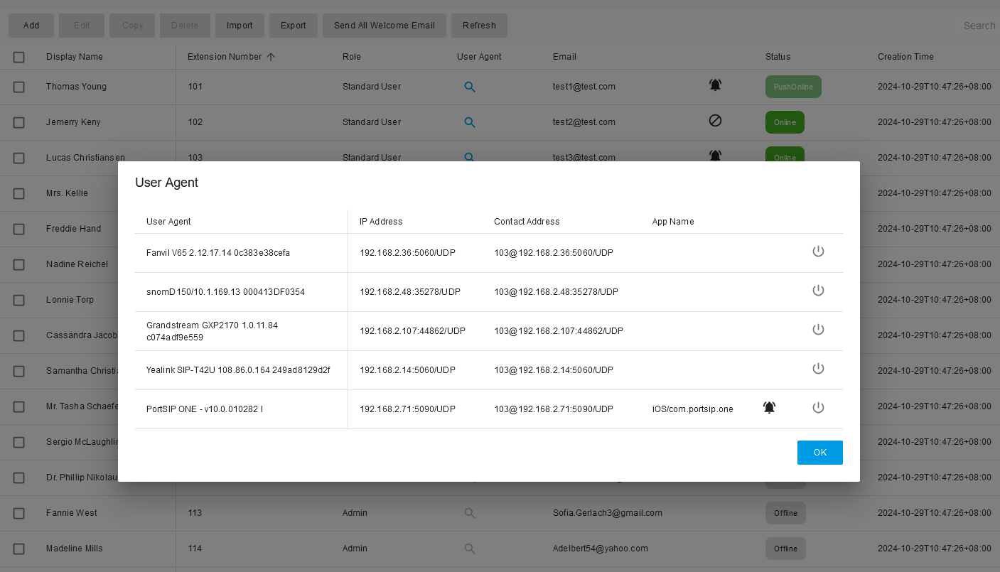
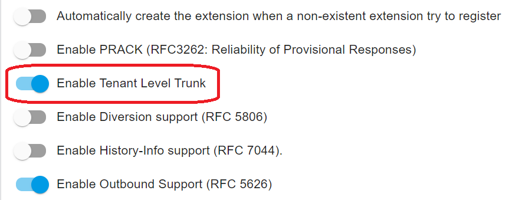

# The Advantages of PortSIP PBX vs. Other PBXs

The realm of communication technology is rapidly expanding, with modern cloud-based unified communication systems becoming the preferred choice for businesses of all sizes. As traditional phone systems are utilized less and less, organizations are seeking more efficient and versatile communication solutions. The scalability and flexibility offered by contemporary unified communication platforms present significant advantages, especially for those who have adapted to remote and hybrid work models.

Between PortSIP PBX and other PBXs as a business unified communications solution, which would you choose?

<figure><figcaption></figcaption></figure>

## PortSIP PBX: A True Multi-Tenant Solution Built for the Cloud Era

While many vendors claim to offer multi-tenant PBX systems, most rely on a pseudo-multi-tenant architecture. Typically, they require setting up a separate PBX instance for each tenant and managing these instances through a centralized web portal. While end-users may not notice, service providers face significant challenges with this approach:

* They must maintain a large number of PBX instances.
* They waste valuable server hardware resources.

For instance, if a service provider has 1,000 clients, with each client being treated as a separate tenant, each would require its own PBX instance. With tenants typically having between 10 and 50 extensions, the demand on server resources and the maintenance workload becomes overwhelming.

PortSIP PBX offers a genuine multi-tenant solution. Unlike other PBXs that require individual PBX instances per tenant, PortSIP PBX enables service providers to deploy a single instance that can support thousands of tenants. Each tenant has its own configuration and extensions, completely isolated from other tenants, making each one feel as though they have their own dedicated PBX system. This architecture significantly reduces the use of hardware resources and minimizes the effort needed for maintenance, delivering exceptional efficiency for service providers.

<figure><figcaption></figcaption></figure>

As shown in the screenshot, system administrators (service providers) or dealers (distributors, sub-distributors, resellers) can easily view and manage all tenants through the web portal. The following management actions are available:

* **Add**: Create a new tenant.
* **Manage**: Switch to the tenant’s administrator interface to manage extensions, call routing, and other configurations.
* **Edit**: Modify the tenant’s settings, such as adjusting capabilities or feature access.
* **Disable**: Temporarily disable a tenant. All settings and data are preserved and can be reactivated at any time.
* **Delete**: Permanently remove a tenant from the PBX. All data associated with the tenant is erased and cannot be recovered.

This modern multi-tenant PBX architecture is designed for the cloud era, offering flexibility and ease of management. PortSIP has executed this concept exceptionally well, and our clients are reaping the benefits of its streamlined operations and resource efficiency.

## **Full White-Label Solution**

A white-label solution refers to a product or service created by one company, which is then sold by another company under its own branding. Building a strong brand identity can be challenging, but PortSIP makes it easier with a fully customizable white-label PBX and cloud PBX service.

With PortSIP’s rebranding feature, you can fully private label your PBX, making it uniquely yours by customizing the following elements:

* **Theme**
* **Product Name**
* **Company Name**
* **Website Link**
* **Logo and Favicon**
* **User Agent String** of PortSIP PBX and SBC
* **WebRTC, Windows, and Mobile Apps**
* **IP Phone Templates**
* **Notification Email Templates**

This gives you the freedom to focus on marketing, sales, and billing while PortSIP takes care of the technology. For more detailed instructions, please refer to the article on [Rebranding PortSIP PBX, SBC](portsip-pbx-administration-guide/rebranding-portsip-pbx-sbc.md).

## **A Scalable Communications Platform**

In a cloud multi-tenant PBX environment, the service provider hosts the PBX in the cloud and delivers calling services to users. Unlike single-tenant PBXs typically used by SMBs, cloud PBXs must manage massive numbers of tenants and simultaneous calls. Ensuring performance and reliability is crucial for the PBX vendor.

PortSIP PBX is specifically designed for the cloud age, offering exceptional performance and scalability. It can easily manage a large volume of extensions (users) and simultaneous calls. For larger deployments, PortSIP PBX can scale by extending the following server components within a cluster:

* **Queue Server**
* **Meeting Server**
* **IVR Server**
* **Media Server**
* **IM Server**

By utilizing this server cluster architecture, the PBX Call Manager server is only responsible for processing signaling. This design, coupled with multi-threading and advanced caching technologies, allows a single PortSIP PBX instance to support up to 100,000 users and 20,000 simultaneous calls. This impressive capability ensures that PortSIP PBX can meet the demands of even the largest service providers.

<figure><figcaption></figcaption></figure>

As shown in the screenshot, we disabled the default media server in the PBX server and extended three additional media servers to efficiently manage a higher volume of calls. This configuration allows the system to handle heavy call loads while maintaining optimal performance and call quality, ensuring the PBX remains scalable and robust even under significant demand.

## Designed for High Performance

When designing a cloud PBX, every feature needs to be considered deeply, since it may cause the performance issue when the tenants and users amount is large.

For instance, for the call park feature, as per traditional PBX design, the PBX needs to create a dozen park spots for each tenant. In reality, these spots are PBX extensions that need to register with the PBX and refresh the registration period. The extensions also need to subscribe to these spot extensions for the dialog event in order to receive an alert when a call has been parked on the spot. Additionally, the extensions need to maintain their subscription by sending the SUBSCRIBE message periodically.

Assume each tenant creates 5 park spots, then for a cloud PBX with 1k tenants, there will need to be 5K park spots (extensions) created for the tenants. As mentioned above, these spots are actually PBX extensions. The registration and subscription of these spots will consume massive CPU, memory, and bandwidth resources and reduce cloud PBX performance. This is unacceptable for service providers. It’s hard to imagine if tenants need to create more park spots!

PortSIP pays attention to each feature for multi-tenancy. In order to avoid the problems of traditional PBXs, PortSIP has designed the call parking feature in a unique way that is easy to use and more friendly. It also has good performance and uses fewer resources. You can find more details in this article: [Call Parking](portsip-pbx-administration-guide/14-call-parking/).

## **Seamless Migration from BroadSoft**

PortSIP PBX offers a rich set of features that distinguish it from other PBX solutions, many of which are similar to BroadSoft, such as Feature Access Codes (dial codes). This similarity ensures a smooth transition for users familiar with BroadSoft systems.

PortSIP PBX's feature access codes closely mirror those of BroadSoft, allowing users to adapt quickly and work more efficiently. Additionally, each tenant can customize their own feature access codes to align with their specific user experience requirements. This flexibility enhances the overall user experience and simplifies the migration process for organizations transitioning from BroadSoft.

For more information, please refer to the article on [Feature Access Codes](portsip-pbx-administration-guide/23-feature-access-codes.md).

## **Modern Unified Collaboration Solution**

PortSIP PBX offers a comprehensive and free collaboration and communication solution tailored for hybrid work environments, enabling inclusive and seamless experiences for all users while safeguarding your data with industry-leading security. It unifies calling, messaging, meetings, and sharing across web, desktop, and mobile apps, providing a truly integrated user experience.

**PortSIP PBX offers multiple ways to connect, including:**

* **Audio and Video Calling**
* **Audio and Video Meetings**
* **Messaging**
* **Group Chat**
* **SMS and WhatsApp Integration**
* **Presence**
* **Audio Messaging**
* **Video Messaging**
* **Screen Sharing**
* **File Sharing**

This unified platform ensures that businesses can efficiently communicate and collaborate, regardless of location, while maintaining secure and flexible connectivity options for their teams.

## Effortless User Management

Tenant administrators can easily manage users through the intuitive user list within the PBX web portal. This list provides real-time updates on all extensions, showing their current status—whether online, offline, on a call, push notifications enabled, automatic callback enabled, or Do Not Disturb (DND) enabled. With this clear visibility, administrators can efficiently monitor and manage user activity with minimal effort.

<figure><figcaption></figcaption></figure>

You can click the search icon to view the device details for any online extension. In the example shown below:

* Fanvil v65 registered to PBX from 192.168.2.36 on port 5060 via UDP
* Snom registered to PBX from 192.168.2.48 on port 35278 via UDP
* Grandstream registered to PBX from 192.168.2.107 on port 44862 via UDP
* Yealink T42U registered to PBX from 192.168.2.14 on port 5060 via UDP
* PortSIP ONE app register to PBX from 192.168.2.71 via UDP&#x20;

This detailed view enables administrators to easily monitor the devices connected to each extension.

<figure><figcaption></figcaption></figure>

For more information, please refer to the article on [User Management](portsip-pbx-administration-guide/5-user-management/).

## **CDR and Recording**

PortSIP PBX offers advanced call recording features, enabling recordings to start automatically once a call is established. Additionally, recordings can be initiated in the middle of a call and paused or resumed as needed. The PBX supports both audio and video recording, with files saved in MP3 or MP4 formats, making it easy to play the recordings directly in a browser.

A key advantage of PortSIP PBX is that the Call Detail Record (CDR) is linked with the recording file, allowing for easy download and playback within a browser. What sets PortSIP’s CDR apart from other PBX systems is its ability to consolidate call flow details into a single record, even if the call is rerouted or forwarded multiple times. This comprehensive CDR makes tracking complex call flows straightforward.

For example, if a call originates from a SIP trunk, is routed to the PBX, then to an IVR system, and subsequently forwarded to a queue by the user pressing DTMF, where an agent finally answers, all relevant details (such as callee number, callee IP address, port, and timestamps) are captured and recorded in one CDR.

For further information, please refer to the article on [CDR and Call Recording](the-advantages-of-portsip-pbx-vs.-other-pbxs.md#cdr-and-recording).

## Storing Into AWS S3

With PortSIP PBX, you can write your Video Recordings and Compositions to your own AWS (Amazon Web Services) S3 bucket, rather than a local disk. This guide explains how you can set up your own account or project to use this capability. For more details please read this article: [Storing into AWS S3](portsip-pbx-administration-guide/storing-into-aws-s3.md).

## Privacy

PortSIP PBX also takes care of the privacy of the recording. Due to privacy and security concerns in some countries, the law stipulates that when a call is made between two external numbers, it should not be recorded.

Consider the following scenario: The client calls the contact center from the trunk and the agent answers. The call is starting to be recorded, and after a while of conversation, the agent transfers the client’s call to another landline/mobile phone number, the call is now between two PSTN phone numbers. At this point, the PBX should stop the call recording automatically. PortSIP provides an option for this feature, please read the details in this article: [Automatically stop recording if the call between two external numbers](portsip-pbx-administration-guide/20-cdr-and-call-recordings/#automatically-stop-recording-if-the-call-between-two-external-numbers).

## Trunk Management

Different cloud PBX providers have varying requirements due to their unique business models.&#x20;

Some providers only host the cloud PBX and do not offer SIP trunks to tenants, requiring tenants to configure their own trunks.&#x20;

Other service providers offer cloud PBX and SIP trunk bundles, limiting tenant configuration of trunks. In this case, all trunks must be configured by the service provider, who assigns a range of DID numbers (DID pool) to tenants. Tenants can only use the trunk and DID numbers assigned by the service provider to create call routing rules.

Some service providers offer a hybrid mode that allows tenants to configure their own trunks and uses the trunks and DID numbers assigned by the service provider.

PortSIP PBX supports all requirements for service providers to meet their business models. An option called **Enable Tenant Level Trunk** allows service providers to enable or disable tenant trunk configuration. You can access this option by selecting the menu **Advanced > Settings** after signing in to the PBX web portal as the system administrator.

<figure><figcaption></figcaption></figure>

For more details, please read the article [Trunk Management.](portsip-pbx-administration-guide/7-trunk-management/)

## Webhook

PortSIP PBX supports sending the CDR and extension call events to a pre-configured webhook by the tenant admin. This allows the client to integrate the PBX with any third-party system. The webhook is in JSON format. For more details, please read this article: [Push CDR to Webhook](portsip-pbx-administration-guide/20-cdr-and-call-recordings/#push-cdr-to-webhook).

## Pub/Sub

PortSIP PBX provides the Pub/Sub mechanism which is based on the WebSocket (PortSIP WSI).&#x20;

The user is able to create the WebSocket in any programming language to subscribe to the PBX events, once the subscribed events occur, PortSIP PBX will send the event message to the subscriber automatically, the message is in the JSON format. For more details please read this article: [Going Real-Time with PortSIP PBX Pub/Sub](../development-portsip/going-real-time-with-portsip-pbx-pub-sub.md).

## Dealers

The cloud PBX/UC service providers just need to focus on hosting the PBX system in the cloud, ensuring service operation, and providing continuous stable service.&#x20;

Distributors/Resellers partner of the service providers to give out cloud PBX services and products to the customers.&#x20;

A distributor or the reseller purchases cloud PBX services and cloud-based PBX products from the cloud service provider and further sells them to the end users.

PortSIP PBX offers a great feature called **Dealers** for the above scenario that allows service providers to manage dealers (distributors and resellers) easily. For more details please read the article: [Dealers](the-advantages-of-portsip-pbx-vs.-other-pbxs.md#dealers).

## Flexibility Office Hours and Holidays

PortSIP PBX offers flexible office hours and holiday schedules for tenants located in different countries around the world to meet their local usage. For more details, please read the article: [Office Hours and Holiday Schedule](portsip-pbx-administration-guide/office-hours-and-holiday-schedule/).

## Free SBC

PortSIP PBX offers a free SBC to support WebRTC and Microsoft Teams Direct Routing. The SBC can be deployed as a cluster to support large calls:

* [Configuring SBC for WebRTC](portsip-pbx-administration-guide/9-configuring-portsip-sbc/)
* [Configuring SBC for MS Teams](portsip-pbx-administration-guide/10-configuring-sbc-for-ms-teams/)

## Microsoft 365 Integration

PortSIP PBX seamlessly integrates business communications into your cloud work environment, transforming Microsoft 365 into an enterprise-grade communications hub with a powerful and easy-to-use interface that is simple for end-users to deploy and IT to manage.

For more details, please read this article: [Microsoft 365 Integration](portsip-pbx-administration-guide/microsoft-365-integration.md).

## Open REST API

PortSIP PBX provides full REST API which means customers can easily integrate it with any 3rd system.

In fact, the PortSIP PBX Web Portal is also built based on this REST API: [PortSIP PBX REST API](https://www.portsip.com/pbx-rest-api/v16/html/index.html).&#x20;

## Free PortSIP VoIP SDK for CPaaS

PortSIP offers a VoIP SDK that can be used with PortSIP PBX to create modern UC apps for iOS, Android, Windows, macOS, and WebRTC. It allows the service provider to operate the CPaaS easily.

This award-winning SDK is used by many large companies such as T-Mobile, Nextiva, Qualcomm, Telstra, HPE, Siemens, Netflix, Agilent, and Dialogic: [PortSIP VoIP SDK](https://www.portsip.com/portsip-voip-sdk/).

## Push Notifications

A Voice over Internet Protocol (VoIP) app lets users make and receive phone calls by using an Internet connection instead of the device’s cellular service. Since the VoIP app relies heavily on the network, it’s not surprising that making calls usually results in high power consumption.

PortSIP PBX supports mobile push notifications for iOS and Android apps. All PortSIP users will benefit from this feature, for more details please read this article: [How Do Push Notifications Work with PortSIP PBX?](../development-portsip/mobile-push-notifications/how-do-push-notifications-work-with-portsip-pbx.md)

## Rebranding App

PortSIP PBX has an app for the below OS:

* iOS
* Android
* Windows Desktop
* WebRTC

The apps can be rebranded for free if you purchase the extension license and reach X extensions.

## PortSIP PBX Solution Has Your Back

When weighing the solution for hosting the Cloud PBX, you have to look at your needs today and tomorrow. You have to ask yourself where you want to be in the next year or two and beyond.

Here at PortSIP, we’ll walk you through everything, including free porting of your existing solution. We’ll help you select the right VoIP desk phones that meet your client's budget and everyday business needs.

In the age of the cloud, you cannot keep inching along with a legacy PBX. Your traditional PBX solution costs you more than it’s saving.

Take advantage of PortSIP Solution and the freedom to work from anywhere. PortSIP PBX lets you focus on serving your customers, not trying to figure out the system. You can leave the rest to us.

