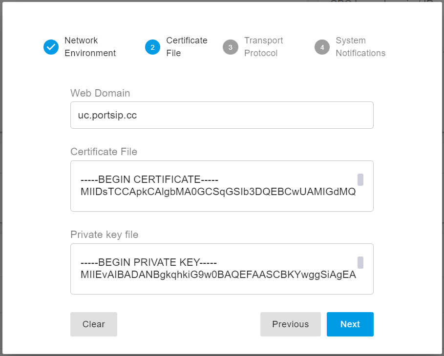

# Update Certificates

Before updating the certificates for the **PortSIP PBX** and **PortSIP SBC**, ensure that both systems have been properly installed and configured according to the following guides:

* [**Installing the PortSIP PBX**](../../portsip-pbx-administration-guide/1-installation-of-the-portsip-pbx/)
* [**Configuring the PortSIP PBX**](../../portsip-pbx-administration-guide/2-configuring-the-portsip-pbx.md)
* [**Configuring the SBC for WebRTC**](../../portsip-pbx-administration-guide/9-configuring-portsip-sbc/)

After completing the [**Preparing TLS Certificates**](preparing-tls-certificates.md) steps, you should have the following files ready:

* **`portsip.pem`** – The full-chain TLS certificate
* **`portsip.key`** – The private key

These files will be used to update the certificates for both the PortSIP PBX and SBC.

> In this example, we assume that the domain `uc.portsip.cc` resolves to the **PBX server IP adress**, and `sbc.portsip.cc` resolves to the **SBC server IP adress**.

***

### Updating Certificates for the PBX

#### 1. Steps to Update Certificates

1. Sign in to the PBX Web Portal as the **system administrator**.
2. On the home page, click **Setup Wizard**.
3. In **Step 2** of the Setup Wizard, click **Clear**.
4. Enter your PBX web domain in the **Web Domain** field.
   * You do **not** need to include `https://` or `www.` — just the domain name itself.\
     Example: `uc.portsip.cc`
5. Open the `portsip.pem` file using **Windows Notepad** (or any plain text editor). Copy the entire content and paste it into the **Certificate File** field.
6. Open the `portsip.key` file in Notepad, copy its entire content, and paste it into the **Private Key File** field.
7. Click **Next** to complete the Setup Wizard and save the updated certificates.

<figure><figcaption></figcaption></figure>

***

#### 2. Restarting the PBX Service

To apply the new certificates, restart the PBX service.

**For Linux:**

```bash
cd /opt/portsip
sudo /bin/sh pbx_ctl.sh restart
```

**For Windows:**

Simply restart the Windows server.

> 💡 **Note:** If your browser still shows the site as “Not Secure,” try opening the PBX Web Portal in a new browser tab. The browser may need to reload the new certificate chain.

***

### Updating Certificates for the SBC

#### 1. Steps to Update Certificates

1. **Sign in** to the **SBC Web Portal** as the **system administrator**.
2. Go to the **TLS Certificates** menu.
3. If an existing certificate is listed for your SBC domain, click the **Delete** icon to remove it.
4. Click **Add** to upload a new certificate.
   * If your certificate is a **wildcard** for the domain (e.g., `*.portsip.cc`), enter `portsip.cc` in the **TLS Domain** field.
   * If your certificate is **domain-specific**, enter the exact domain, for example `sbc.portsip.cc`.
5. Ensure the "**This is SBC Web Domain Certificate"** option is **activated**, unless the certificate is used solely for SIP TLS transport.
6. Open the `portsip.pem` file in **Windows Notepad**, copy all contents, and paste them into the **Certificate Contents** field.
7. Open the `portsip.key` file, copy all contents, and paste them into the **Private Key Contents** field.
8. Click **OK** to save the certificate.
9. Go to the **Network** menu, enter `sbc.portsip.cc` in the **Web Domain** field, and click **OK** to save your changes.

<figure><figcaption></figcaption></figure>

***

#### 2. Restarting the SBC Service

To apply the new certificates:

**For Linux:**

```bash
cd /opt/portsip
sudo /bin/sh sbc_ctl.sh restart
```

**For Windows:**

Simply restart the Windows server.

> 💡 **Note:** If your browser still indicates that the site is not secure, open the SBC Web Portal in a new browser tab. This should refresh the SSL session and display the secure connection correctly.

***

### Summary

After completing these steps, both the PBX and SBC will use the newly installed TLS certificates (`portsip.pem` and `portsip.key`).\
This ensures secure HTTPS access to the management portals and encrypted SIP/TLS signaling for your unified communications environment.

