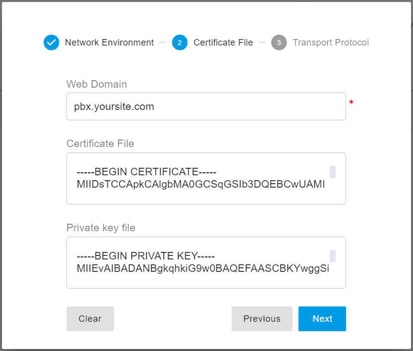
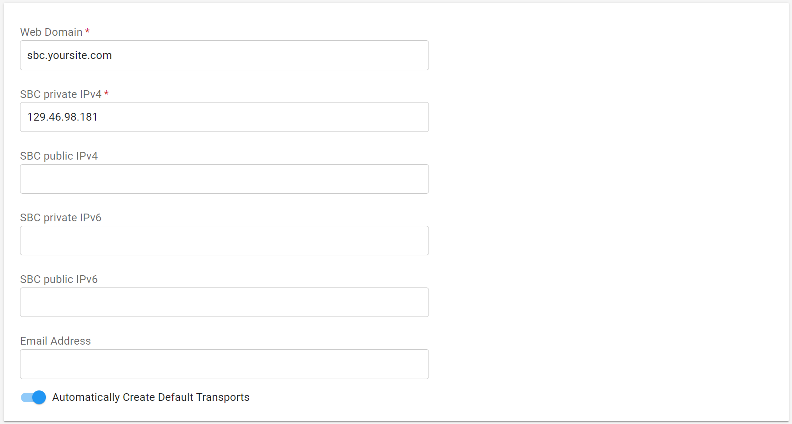

# Using a Free Let’s Encrypt Certificate

Let’s Encrypt is a free, automated, and open Certificate Authority (CA) that enables HTTPS servers to obtain browser-trusted TLS certificates automatically, without manual intervention.

With Let’s Encrypt, the certificate needs to be installed only once. After installation, it is automatically renewed before expiration, ensuring continuous trust and avoiding service interruptions.

PortSIP provides a Cert Manager service that integrates with Let’s Encrypt to automatically obtain and renew certificates for PortSIP PBX and PortSIP SBC. When a certificate is nearing expiration, the renewal process is handled automatically by Cert Manager. No user action is required, and services continue to operate securely during renewal.

* To use a free Let’s Encrypt certificate, follow this guide.
* To use a certificate purchased from a trusted certificate provider, refer to [Preparing TLS Certificates](../../portsip-pbx-administration-guide/certificates-for-tls-https-webrtc/preparing-tls-certificates.md).

***

❗ **Important Note**

* **Cert Manager is supported on Linux only.**\
  If PortSIP PBX is installed on Windows, Let’s Encrypt certificates cannot be used, and you must deploy a manually issued TLS certificate.

***

### Prerequisites

Before using a Let’s Encrypt SSL certificate, ensure the following requirements are met.

#### System Requirements

* PortSIP PBX or SBC has been successfully installed
* The server is running a supported Linux operating system
* From PortSIP PBX v22. 4 and PortSIP SBC v11.2.3

#### Network and DNS Requirements

* A **static public IP address** assigned to your **PortSIP PBX** server
* A **domain name** that resolves to the PBX server’s static public IP address
* A **static public IP address** assigned to your **PortSIP SBC** server
* A **domain name (DNS A record)** that resolves to the SBC server’s static public IP address

Correct DNS resolution is required so that Let’s Encrypt can validate domain ownership and issue trusted certificates.

> ❗ Note
>
> If PortSIP PBX and PortSIP SBC are installed on the same server, you may use the **same static public IP address and domain name** for both services.

***

### Firewall and Network Requirements

Let’s Encrypt validates domain ownership over **TCP port 443 (HTTPS)**.

Ensure the following:

* TCP port 443 is open and reachable from the public internet
* If deployed on a cloud platform (such as AWS or Azure), the **security group / firewall rules allow inbound traffic on port 443**
* No other application is using port 443 on the PBX or SBC server

Failure to meet these requirements will prevent certificate issuance or renewal.

***

### Installing PortSIP Cert Manager

❗ **Important**

Follow the steps in this section in order. Do not skip any steps unless explicitly instructed.

***

#### Step 1: Verify PBX / SBC Installation

Ensure that **PortSIP PBX or PortSIP SBC** is already installed and running on the server before proceeding.

***

#### Step 2: Create and Run the Cert Manager Docker Instance

For most deployment scenarios, run the following command to create and start the PortSIP Cert Manager Docker container:

```bash
cd /opt/portsip && sudo /bin/sh certmanager_ctl.sh run -i portsip/certmanager:22
```

The Cert Manager also provides the command parameters below to satisfy your specific requirements.

**Command Parameters**

* `-p` — Specifies the Cert Manager data directory
* `-i` — Specifies the Cert Manager Docker image version

If you want to store the Cert Manager data not in the default path `/var/lib/portsip` but `/portsip/data` , specify it explicitly:

```shellscript
sudo mkdir -p /portsip/data
```

```bash
cd /opt/portsip && sudo /bin/sh certmanager_ctl.sh run \
-p /portsip/data -i portsip/certmanager:22
```

To install a specific Cert Manager image version:

```bash
cd /opt/portsip && sudo /bin/sh certmanager_ctl.sh run -i portsip/certmanager:22
```

***

#### Step 3: Update PBX Settings to Apply the Certificate

After Cert Manager is running, update the PBX configuration to trigger certificate issuance.

#### Procedure

1. Access the PBX web portal using the **IP address**, for example:\
   `https://129.46.98.181:8887`
2. Sign in as the system administrator
3. On the **Home** page, click **Setup Wizard**
4. Click **Next** and navigate to **Step 2**
5. Enter the **PBX web portal domain name** to be secured, for example:\
   `pbx.yoursite.com`
6. Click **Next**, then complete the Setup Wizard to save the changes

<figure><figcaption></figcaption></figure>

#### Expected Result

* Cert Manager automatically requests a certificate from Let’s Encrypt
* After a few minutes, open a new browser window and access:\
  `https://pbx.yoursite.com:8887`
* The browser should trust the connection, and no certificate warning should appear

***

#### Step 4: Update SBC Settings to Apply the Certificate

After Cert Manager is running, update the SBC configuration to trigger certificate issuance.

#### Procedure

1. Access the SBC web portal using the **IP address**, for example:\
   `https://129.46.98.181:8883`
2. Sign in as the system administrator
3. Navigate to the **Network** menu
4. In the **Domain and IP Address** section, enter the SBC web domain in the **Web Domain** field, for example:\
   `sbc.yoursite.com`
5. Click **OK** to save the changes

<figure><figcaption></figcaption></figure>

#### Expected Result

* The SBC restarts automatically
* Cert Manager requests and installs the Let’s Encrypt certificate
* After a few minutes, access:\
  `https://sbc.yoursite.com:8883`
* The browser should trust the SBC web portal without warnings

***

After the Let’s Encrypt certificate is successfully configured, Cert Manager automatically renews the certificate before it expires.\
The renewal process is fully automated and requires no manual intervention.

Once configured, you do not need to manage or monitor the certificate lifecycle—Cert Manager ensures the certificate remains valid and trusted at all times.

***

### Managing PortSIP Cert Manager Docker Instance

After successfully installing the **PortSIP Cert Manager**, you can use the following commands to manage the PBX Docker instance.

All commands must be executed from the following directory:

```bash
cd /opt/portsip
```

#### Show Cert Manager Status

```bash
sudo /bin/sh certmanager_ctl.sh status
```

#### Start the Cert Manager

```bash
sudo /bin/sh certmanager_ctl.sh start
```

#### Stop the Cert Manager

```bash
sudo /bin/sh certmanager_ctl.sh stop
```

#### Restart the Cert Manager

```bash
sudo /bin/sh certmanager_ctl.sh restart
```

#### Remove the Cert ManagerContainer

> This command **does not delete data**.

```bash
sudo /bin/sh certmanager_ctl.sh rm
```


