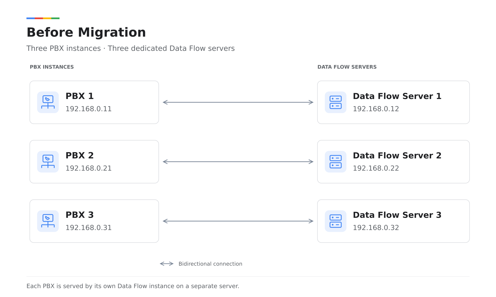
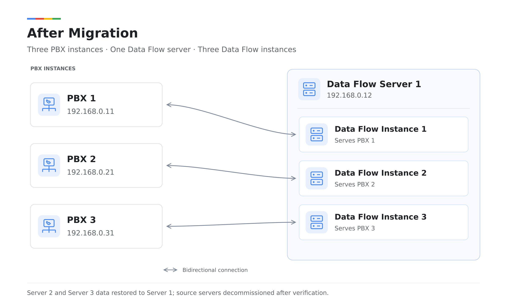

# Migrate Multiple Data Flow Instances to One Server

Starting with **PortSIP PBX v22.8.0**, you can run multiple Data Flow instances on a single server. Each Data Flow instance serves a separate PBX instance, reducing the number of servers required and lowering operating costs.

If you currently use a dedicated Data Flow server for each PBX instance, you can upgrade to **v22.8.0 or later** and migrate the Data Flow instances and their data to one server.

For details about multi-instance deployment, see [**Install Multiple Data Flow Instances on One Server**](../portsip-pbx-administration-guide/1-installation-of-the-portsip-pbx/installation-of-portsip-pbx-v22.3/install-data-flow-service.md#install-multiple-data-flow-instances-on-one-server).

***

### Migration Example

In this example, three PBX instances running PortSIP PBX v22.6.3 each have a dedicated Data Flow server:

| PBX instance | PBX static private IP | Current Data Flow server | Data Flow server IP |
| ------------ | --------------------- | ------------------------ | ------------------- |
| PBX 1        | `192.168.0.11`        | Data Flow Server 1       | `192.168.0.12`      |
| PBX 2        | `192.168.0.21`        | Data Flow Server 2       | `192.168.0.22`      |
| PBX 3        | `192.168.0.31`        | Data Flow Server 3       | `192.168.0.32`      |

#### Before Migration

<figure><figcaption></figcaption></figure>

The goal is to keep **Data Flow Server 1 (`192.168.0.12`)** and move the Data Flow instances and historical data from Server 2 and Server 3 to it.

The migration consists of the following tasks:

1. Upgrade all three PBX instances and their Data Flow services to v22.8.0 or later.
2. Create two additional Data Flow instances on **Data Flow Server 1 (`192.168.0.12`)** to serve PBX 2 and PBX 3.
3. Restore the historical data from Data Flow Server 2 and Data Flow Server 3 to Data Flow Server 1.
4. Verify the migration, then decommission Data Flow Server 2 and Data Flow Server 3.

#### After Migration

After migration, Data Flow Server 1 hosts three Data Flow instances, one for each PBX.

<figure><figcaption></figcaption></figure>

> ❗ **Important:** Perform the migration during a maintenance window. Keep the original servers, data directories, and backup files until the migration is complete and all verification checks have passed.

***

### Step 1: Upgrade the PBX and Data Flow Services

Follow the applicable upgrade instructions in **Installation of PortSIP PBX v22.x** to upgrade the following components to **v22.8.0 or later**:

* PBX 1, PBX 2, and PBX 3.
* The Data Flow services on Data Flow Server 1, Data Flow Server 2, and Data Flow Server 3.

Verify that each PBX and its Data Flow service are working correctly before continuing.

***

### Step 2: Remove the Data Flow Instances from the Source Servers

Remove the Data Flow instances from **Data Flow Server 2** and **Data Flow Server 3** using the commands below.

> ❗ **Important:** Leave the existing Data Flow instance on Server 1 running at this stage. The commands below remove the Data Flow instances from Server 2 and Server 3 without deleting their data. Keep both source servers and their data directories for the backup in Step 3.

#### On Data Flow Server 2

```shell
cd /opt/portsip
sudo /bin/sh dataflow_ctl.sh rm -x 192.168.0.21
```

#### On Data Flow Server 3

```shell
cd /opt/portsip
sudo /bin/sh dataflow_ctl.sh rm -x 192.168.0.31
```

The `-x` argument specifies the **IP address of the PBX served by the Data Flow instance**.

***

### Step 3: Back Up the Source Data

Run the following commands on **both Data Flow Server 2 and Data Flow Server 3**:

```shell
cd /opt/portsip
sudo /bin/sh dataflow_migration.sh backup
```

Each backup archive is saved in:

```
/opt/portsip/dataflow-migration/
```

The archive filename includes a UUID and additional identifiers. For example:

```
dataflow-a33c37d7-0b31-49b8-89a7-3d369a0402f8-20261009T064757Z-38874-19164.tar.zst
```

To make the source of each archive easier to identify, you can rename the files as shown below:

| Backup source      | Suggested filename           |
| ------------------ | ---------------------------- |
| Data Flow Server 2 | `dataflow-<uuid2>-2.tar.zst` |
| Data Flow Server 3 | `dataflow-<uuid3>-3.tar.zst` |

> ❗ **Important:** Preserve the original UUID in each filename. Replace `<uuid2>` and `<uuid3>` with the actual UUIDs from the backup filenames.

Confirm that backups on **both source servers** completed successfully before continuing.

***

### Step 4: Copy the Backups to the Destination Server

On **Data Flow Server 1**, create the backup directory:

```shell
sudo mkdir -p /opt/portsip/dataflow-migration/
```

Copy the backup archives from **Data Flow Server 2** and **Data Flow Server 3** to this directory on Data Flow Server 1:

```
/opt/portsip/dataflow-migration/
```

Confirm that both archives are present before continuing.

***

### Step 5: Create the Additional Data Flow Instances

#### Allow Access from Data Flow Server 1

On **both PBX 2 and PBX 3**, run the following commands to allow access from **Data Flow Server 1 (`192.168.0.12`)**:

```shell
sudo firewall-cmd --permanent --zone=trusted --add-source=192.168.0.12
sudo firewall-cmd --reload
```

#### Create the Instances on Data Flow Server 1

Create two additional Data Flow instances on Server 1, one for PBX 2 and one for PBX 3. The existing instance continues to serve PBX 1.

| New Data Flow instance | PBX served | PBX IP         |
| ---------------------- | ---------- | -------------- |
| Instance 2             | PBX 2      | `192.168.0.21` |
| Instance 3             | PBX 3      | `192.168.0.31` |

On **Data Flow Server 1**, run the following commands in order:

```shell
cd /opt/portsip
sudo /bin/sh dataflow_ctl.sh run \
  -a 192.168.0.12 \
  -x 192.168.0.21

sudo /bin/sh dataflow_ctl.sh run \
  -a 192.168.0.12 \
  -x 192.168.0.31
```

The `-a` argument specifies the Data Flow server IP. The `-x` argument specifies the PBX IP for that instance.

***

### Step 6: Stop All Instances and Restore the Data

Perform all operations in this step on **Data Flow Server 1**.

#### Stop All Three Data Flow Instances

```shell
cd /opt/portsip
sudo /bin/sh dataflow_ctl.sh stop -x 192.168.0.11
sudo /bin/sh dataflow_ctl.sh stop -x 192.168.0.21
sudo /bin/sh dataflow_ctl.sh stop -x 192.168.0.31
```

#### Restore Both Backup Archives

Replace the archive filenames below with the actual filenames copied in Step 4. Then run the restore command with **both archives**:

```shell
cd /opt/portsip
sudo /bin/sh dataflow_migration.sh restore --execute \
  --archive "/opt/portsip/dataflow-migration/dataflow-<uuid2>-2.tar.zst" \
  --archive "/opt/portsip/dataflow-migration/dataflow-<uuid3>-3.tar.zst"
```

> ❗ **Important:** Wait for the restore operation to complete successfully before starting any Data Flow instance.

***

### Step 7: Start All Data Flow Instances

On **Data Flow Server 1**, start all three instances:

```shell
cd /opt/portsip
sudo /bin/sh dataflow_ctl.sh start -x 192.168.0.11
sudo /bin/sh dataflow_ctl.sh start -x 192.168.0.21
sudo /bin/sh dataflow_ctl.sh start -x 192.168.0.31
```

***

### Step 8: Verify the Migration and Decommission the Source Servers

Sign in to **PBX 1, PBX 2, and PBX 3** and verify the following for each PBX:

* Features that depend on Data Flow work correctly.
* Historical data from before the migration is available.
* New data is collected and can be queried.
* The displayed historical data matches the data available before migration.

> ❗ **Important:** Decommission Data Flow Server 2 and Data Flow Server 3 only after all checks have passed. Retain the migration backups in case you need to restore the data later.

