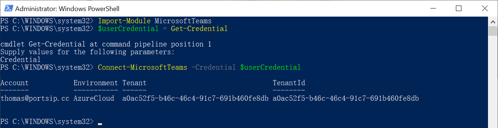
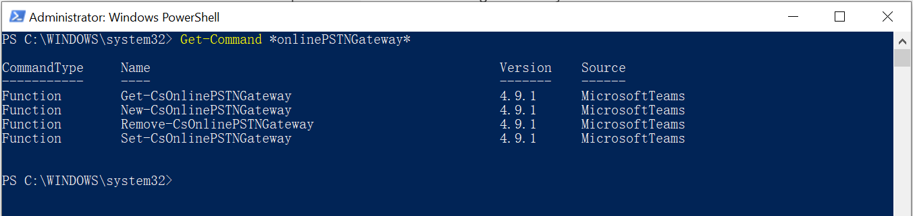

# Configuring Microsoft Teams

## TEAMS Office 365 setup

### 1 Install the Teams module

* Run the following command to confirm whether you have installed the Teams PowerShell module successfully: `Get-Module -ListAvailable -Name MicrosoftTeams`. If it is installed successfully, you will see the results below:&#x20;

<figure><figcaption></figcaption></figure>

* If you cannot see the result, it means that the PowerShell module wasn’t installed correctly, please visit [https://www.powershellgallery.com/packages/MicrosoftTeams/](https://www.powershellgallery.com/packages/MicrosoftTeams/) to install it manually.
* If there have new Teams module available, you can use the below command to upgrade it.

```
 Install-Module -Name MicrosoftTeams -Force
```

<figure><figcaption></figcaption></figure>

### 2 Create your domain in your Office 365 tenant

* Log in to your Office 365 admin account and create your domain. In the `Microsoft 365 admin center`, go to `Setup`, then press the `View` button for the `Get your custom domain set up`, then the `Manage` button. Add a domain there.
* Choose a domain name (e.g. `portsip.cc`) that you own.&#x20;


Since it will be verified by Microsoft for example by having you paste a value in the TXT value field of your DNS or signing in to the account where you got the domain etc. It is important that you own the domain and can perform the verification process. Once that is done, the domain will be created and you can add users to it.&#x20;


<figure><figcaption></figcaption></figure>

### 3 Create users in that domain

Now you can create users under the domain you just created in step 1 above.&#x20;

Again, in `Microsoft 365 admin center`, go `Active users` under `Users` and `Add a user`. Give the first and last name of the user (say "Thomas Oliveri") and under the username give a unique name that will be his/her email.


Make sure to choose the domain you created above for the domain part of the username (portsip.cc in this example) and not any other `*.onmicrosoft.com`.&#x20;


That way the user will reside in the domain you just created in step 1 above (in this example say: thomas@portsip.cc).

<figure><figcaption></figcaption></figure>

### 4 Use PowerShell to Connect to your Office 365 account

*   Open a Windows PowerShell command prompt window and run the following commands:

    ```shell
      Import-Module MicrosoftTeams
      $userCredential = Get-Credential
      Connect-MicrosoftTeams -Credential $userCredential
    ```
* In the **Windows PowerShell Credential Request dialog box**, type your administrator account name and password, and then press **OK**. Just the portion `Connect using a Skype for Business Online administrator account name and password` should be enough unless you want to do more.
*   If you get the error `cannot be loaded because running scripts is disabled on this system` then run the following command to adjust the permission:

    ```shell
      Set-ExecutionPolicy RemoteSigned
    ```

<figure><figcaption></figcaption></figure>

### 5 Create a PSTN gateway that will connect to the SBC

* Make sure it is the right one and connected to the right account as you did in the steps above. To confirm the steps were done correctly use the command:

```shell
Get-Command *onlinePSTNGateway*
```

Your command will return the four functions shown here that will let you manage the SBC.

<figure><figcaption></figcaption></figure>

* Using PowerShell, create a PSTN gateway that will connect to the PortSIP SBC using the FQDN of the domain, for example: `sbc.ortsip.cc`. Note, you must have a valid certificate for the domain `sbc.portsip.cc`. or a wildcard certificate for `portsip.cc`.
* The domain portion of this FQDN must match the domain registered in your tenant as in the step `Create users in that domain` above (e.g. it can be: sbc.portsip.cc, since the domain you created was portsip.cc).&#x20;
* It is also important that there is an Office 365 user in that domain (as you did in steps above, a user in portsip.cc) and an assigned E3 or E5 license. If not, you will receive an error: Can not use the `sbc.portsip.cc` domain as it is not configured for this tenant.
* This FQDN (say sbc.portsip.cc) must resolve to a reachable IP of the PortSIP SBC, the Teams Direct Routing will route the calls to PortSIP SBC by this FQDN:
  * This FQDN (sbc.portsip.cc in this example) must be a SIP domain in PortSIP PBX.&#x20;
  * You must make sure that a DNS A record is made for that domain (e.g. sbc.portsip.cc) that will reach the PortSIP SBC.&#x20;
  * A valid certificate must be added to the PortSIP SBC for this domain.

**PowerShell command example to create the PSTN gateway:**


```shell
New-CsOnlinePSTNGateway -Identity sbc.portsip.cc -Enabled $true -SipSignalingPort 5067 -MaxConcurrentSessions 1000
```



That port 5067 in the above commands refers to the PortSIP PBX(SBC) TLS port; by default, the PortSIP PBX(SBC) creates TLS transport on port 5067 for Teams; if you changed the TLS default port for Teams in the PortSIP PBX(SBC), please replace the 5067 by the new TLS port in the above commands.


You can check the gateway parameters at any time with:

```shell
Get-CsOnlinePSTNGateway -Identity sbc.portsip.cc
```

<figure><figcaption></figcaption></figure>

### 6 Enable the user for direct routing service

* Direct Routing requires the user to be homed on Skype for Business Online. You can check this by looking at the RegistrarPool parameter. It needs to have a value in the infra.lync.com domain.

**PowerShell command**

```shell
Get-CsOnlineUser -Identity "email" | fl RegistrarPool
```

For our example:

```shell
Get-CsOnlineUser -Identity "thomas@portsip.cc" | fl RegistrarPool
```

* Using PowerShell, enable the user for direct routing service by configuring the phone number and enabling enterprise voice and voicemail for the user.
* Using PowerShell, enable the user for direct routing service by configuring the phone number and enabling enterprise voice and voicemail for the user. Notice, that is a 4-digit number for our example, but it could be a full E.164 number. For this example, we want to use the users as extensions (and here 1001 is the extension for this user) which can connect and can be connected as an extension between TEAMS and PortSIP PBX.&#x20;
* PSTN or SIP trunk inbound and outbound calls can be handled by the PortSIP PBX trunk just like any PBX and users on TEAMS can act as extensions of the PBX. But you can easily use other setups and scenarios and assign the full E.164 numbers (with country code) to the users.

```shell
Set-CsPhoneNumberAssignment -Identity thomas@portsip.cc -PhoneNumber +1001 -PhoneNumberType DirectRouting
Set-CsPhoneNumberAssignment -Identity thomas@portsip.cc -EnterpriseVoiceEnabled $true
```

**Note:** It can take some time between creating a user in Teams and being able to change its setting here with `Set-CsUser`  or `Set-CsPhoneNumberAssignment`, so you may have to wait an hour or two if it gives errors like the user does not exist and you have made sure that the user email (or name) is correct.

The user should be able to receive calls from the PortSIP PBX now, either from extensions on PortSIP PBX itself or from PSTN and SIP trunks (set up within the PortSIP PBX), as the case may be.

### 7 Configure voice routing for outgoing calls to the PortSIP PBX

Now you can configure the rules as to when to use the PSTN gateway setup to route the call to PortSIP PBX.

As explained in the Microsoft document, Microsoft Teams has a routing mechanism that allows a call to be sent to a specific SBC based on:

* Called number pattern
* Called number pattern + Specific User who makes the call

Call routing involves:

* Online PSTN Gateway: It connects to the SBC or PBX (in this case, PortSIP SBC). It also stores the configuration that is applied when a call is placed via the SBC, such as forward P-Asserted-Identity (PAI) or Preferred Codecs. It is used by Voice Routes.
* Voice Route: It uses Online PSTN Gateways to use for calls where the calling number matches the pattern.
* PSTN Usage: It uses Voice Routes and other PSTN Usages. Different Voice Routing Policies can use it.
* Voice Routing Policy: It uses PSTN Usages. It can be assigned to a user or to multiple users.

In summary:

**User > Voice routing policy > PSTN usage > Voice route > PSTN gateway.**

In our example, since we use the user as an extension of PortSIP PBX, we want the call to first go there and use the dial plans in PortSIP PBX for routing calls. There can be other scenarios easily implemented as well. For this simple one, let’s create:

**Thomas Oliveri (User) > MyPolicy (Voice policy) > MyUsage (PSTN usage) > sbc.portsip.cc** (PSTN gateway).

*   Let’s create the usage first as it is going to be used in the route:

    ```shell
      Set-CsOnlinePstnUsage -Identity Global -Usage @{Add="MyUsage"}
    ```
*   Let’s create the route using the PortSIP PSTN gateway and the above usage:

    ```shell
    New-CsOnlineVoiceRoute -Identity "MyRoute" -NumberPattern "^\+(\d{4})|^(\d{4})" -OnlinePstnGatewayList sbc.portsip.cc -Priority 1 -OnlinePstnUsages "MyUsage"
    ```

As you can see, the command creates a route `MyRoute` where TEAMS will pass the call to the PSTN gateway `sbc.portsip.cc` (a domain in PortSIP PBX) if the dialed number has at least 4 numbers (that is of course based on our example here where we want to give each user a 4-digit extension, but it is up to your setup), with or without a "+" sign. That way, you could dial a 4-digit extension or an E.164 number with a country code and a "+" sign.

Of course, multiple routes can be created with different priorities.

*   To find out different routes, use:

    ```shell
      Get-CsOnlineVoiceRoute
    ```

Let’s create a voice policy using the same usage to which our PSTN gateway is linked above:

```shell
  New-CsOnlineVoiceRoutingPolicy "MyPolicy" -OnlinePstnUsages "MyUsage"
```

The result for the example:

```shell
  Identity         : Tag:MyPolicy
  OnlinePstnUsages : {MyUsage}
  Description      :
  RouteType        : BYOT
```

You can, of course, create a policy with several PSTN Usages, but we will keep it simple and to the point regarding our example.

Let’s grant our user `thomas@portsip.cc` our voice policy:

```shell
  Grant-CsOnlineVoiceRoutingPolicy -Identity "thomas@portsip.cc" -PolicyName "MyPolicy"
```

You can check the policy assignment with this command:

```shell
  Get-CsOnlineUser "thomas@portsip.cc" | select OnlineVoiceRoutingPolicy
```

<figure><figcaption></figcaption></figure>

Now the outbound dialing policy and routing are complete and `thomas@portsip.cc` can call out. In this example, that outbound call will end up in your PortSIP PBX SIP domain `sbc.portsip.cc`.

In our example, we could set up your domain in PortSIP PBX (explained in the PortSIP PBX section) so that:

* If that extension (4 digits in this case) exists in your PortSIP PBX domain and is registered, it will be called from your Office 365 user whether it's a SIP desktop phone registered to your PortSIP SIP domain, PortSIP desktop app, PortSIP web app or PortSIP mobile app.
* If that extension does not exist (say an E.164 10-digit number etc.), then PortSIP PBX will route the call to a SIP trunk so that call can go out.
