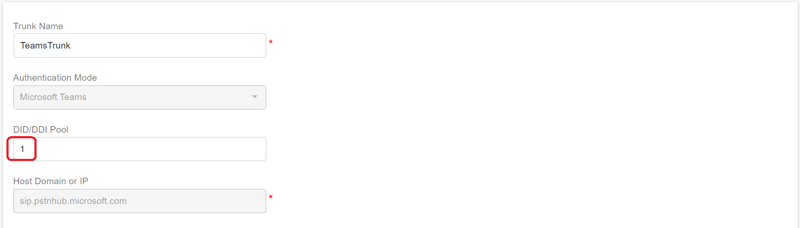

# Configuring SBC and PBX

## SBC and PBX Setup

Please confirm the following items have been completed before configuring the SBC and PBX for Microsoft Teams Direct Routing.

* The PBX has been [installed](../1-installation-of-the-portsip-pbx.md) and [configured](../2-configuring-the-portsip-pbx.md).
* The SBC has been [installed](../../portsip-sbc-administration-guide/1-installation-of-the-portsip-sbc.md) and [configured](../../portsip-sbc-administration-guide/2-configure-the-portsip-sbc.md).
* The Microsoft Teams Direct Routing has been [configured](configuring-microsoft-teams.md).

## 1 Add Teams Base Domain

1. Sign in to the SBC web portal [https://sbc.portsip.cc:8883/](https://sbc.portsip.cc:8883/)
2. Select the menu **Settings > Teams Base Domains**, and click the **Add** button to add the SBC  domain that SBC will send OPTIONS message to MS teams to keep alive, in case it's "**sbc.portsip.cc**".

<figure><figcaption></figcaption></figure>

After adding the teams base domain, the SBC will periodically send OPTIONS to Teams; if it receives 200 OK for the OPTIONS message, the **Status** of this domain will display as **Active**.&#x20;

If it is displayed as **Inactive**, something is wrong, please double-check every step.

## 2 Add SBC as Teams trunk in PBX

1. Ensure the TCP transport on port 5063 has been added to the PBX.
2. Sign in to the PBX web portal as **System Administrator**, navigate to the **Tenants** menu, select a tenant to be managed, and click the **Manage** button; or sign in the user who is the "**admin**" role of the tenant into the PBX web portal.
3. Ensure the **SIP domain** for this tenant is already set as `sbc.portsip.cc`.
4. Select **Call Manager > Trunks** menu, and click the arrow button to choose the trunk type **Microsoft Teams**.
   * `DID/DDI Pool` : The phone number that will be dialed from the teams to PBX, it's can be a single number or a number range, for example, 331001-331100; the 33 is the country code of the Teams user you specified when you create the tenant user(33 is for France);  1001-1100 is the phone number range for Teams users.
   * The host domain or IP can't be modified, the port is the SBC transport port that communicates with PBX, and by default, it `5069`.
   * Enter the SBC server private IP `192.168.1.73`  into the **Outbound Proxy Server** field. If the SBC is installed on the same server as PBX, then this is the PBX server's private IP.
   * The **Outbound Proxy Server Port** is the `5069` by default,  the port is the SBC transport port that communicates with PBX.
   * The **Transport** is TCP.

<figure><figcaption></figcaption></figure>

4. Click the **Next** button
5. Turn off the **Rewrite the host IP of Via header by public IP when sending the request to the trunk**, and click **OK** to complete the Teams Trunk configuring.

## 3 Creating Inbound Rules

The inbound rule must be created in order to route the Microsoft Teams call to the extension or system service, such as IVR, Call Queue, and Ring Group.

1. Sign in to the PortSIP PBX Web Portal by **System Admin** credentials, click the menu **Tenants**, select a tenant then click the **Manage** button to manage this tenant to configure the inbound rule. or sign a user who has the `Tenant Admin` permission into the Web Portal to manage that tenant.
2. From the Web Portal, select **Call Manager > Inbound Rules**, and click the **Add** button.
3. Enter a friendly name for the rule, for example, **From Teams**, as shown below screenshot, when dialing the number `331001` from Teams, the call will be routed to the PBX extension `101`. When the Teams user dials 1001, and once the call arrives at PBX, the dialed number will be `+331001`, we should remove the `+` and enter the number only.

<figure><figcaption></figcaption></figure>

## 4 Creating Outbound Rules

We can create the outbound rule that routes the calls from PBX to Microsoft Teams.

1. Sign in to the PortSIP PBX Web Portal by **System Admin** credentials, click the menu **Tenants**, select a tenant then click the **Manage** button to manage this tenant to configure the outbound rules. or sign a user who has  `Tenant Admin` permission into the Web Portal to manage that tenant.
2. From the Web Portal, select **Call Manager > Outbound Rules**, and click the **Add** button.
3. We want to route all calls made by extension 102 to Microsoft Teams, then configure the outbound rule as the below screenshot shows.

<figure><figcaption></figcaption></figure>

When extension 102 dials a number that does not exist in the PBX internal directory, the call is routed to Microsoft Teams.

For example, when extension 102 dials 1001, the PBX routes the call to Microsoft Teams, and since the callee number is 1001, the Teams user who has the phone number 1001 will be ringing.

## 5 Forward Teams calls to Trunk for any number

Consider this scenario: A Teams caller calls phone numbers and routes to SBC/PBX. These calls should be sent to the trunk in order to ring the mobile phone/landline. Since it is impossible to create multiple inbound rules for all phone numbers, we can implement it easily as follows:

1. When creating the Teams trunk, specify the DID pool as **1** or a number range that includes **1**, for example, **1-1000000**.

<figure><figcaption></figcaption></figure>

2. Create the inbound rule and specify the DID number as **1**. Specify the destination number as **0**. The **1** means to match all called numbers that come from Teams, and the **0** means don’t modify the called number.

<figure><figcaption></figcaption></figure>

3. Create the outbound rule to route Teams calls to the trunk as you prefer.

&#x20;
