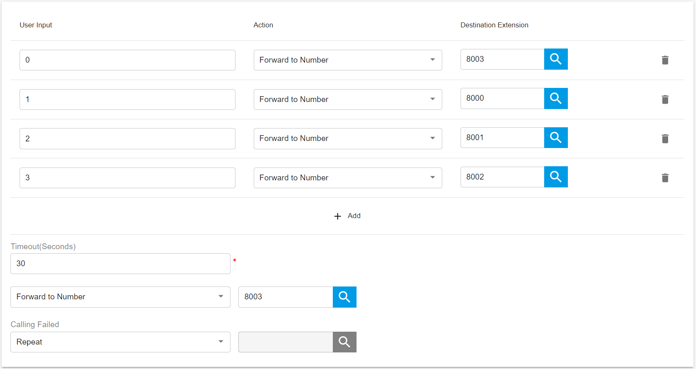

# Managing Virtual Receptionist

## **Recording a Menu Prompt**

Before creating your virtual receptionist, you must decide the menu options you wish to offer the caller and record the announcement. A sample would be, "**Welcome to XYZ. For sales, press 1. For support, press 2 or stay on the line for an operator**".


It is recommended to put the number the user should press after the option, i.e. "**For sales, press 1**", rather than “**press 1 for sales**". This is because the user will wait for the desired option and then "**register**" what number to press.



For the prompt file format, please refer to [What's the file format required for the PortSIP PBX prompt files?](../../faq/what-file-format-is-required-for-portsip-pbx-prompt.md)


## **Creating a Virtual Receptionist**

You can create multiple digital receptionists and link them to a particular line.

To create a virtual receptionist:

1. In the Web Portal menu, click **Advanced Services > Virtual Receptionist**, and double-click the **Add** button.
2. Specify the name and extension number of the virtual receptionist.
3. By default, PBX uses the system-predefined audio file for the prompt. Click on the **Browse** button to select a file that you previously recorded for the prompt menu. Besides, the user may also choose the prompt language for virtual receptionist in **Virtual Receptionist Language**
4. The prompt when the call is transferring - The prompt file will be played when the call is transferring after the caller presses DTMF.
5. Virtual Receptionist Language - The language for the prompt files
6. Menu options. Click the **Add** button to specify actions and the extension number or system extension number for each of the numeric keys. If the action is directed to a specific extension, ring group, call queue, or another virtual receptionist, please also select the target extension number you desired
7. User Input: this option allows you to determine when the virtual attendant will begin the search for an extension that matches the user’s input. The available options are detailed below:
   * When Extension Matches: The virtual attendant will wait until the caller’s digit sequence matches an existing account. Once the virtual attendant finds a match, it will call that extension. This mechanism is useful when accounts of varying name lengths are used; however, it might be annoying to callers who enter a non-existing number since the virtual attendant will never begin the search
   * Gap time between DTMF digits (seconds): The virtual attendant will wait until the time in seconds has passed before searching for an account that matches. If the account does not exist, the system will play an announcement indicating that the extension does not exist.
8. Timeout allows you to specify how long the system should wait for an input. If it receives no input, it will automatically perform this action. This is for callers who do not understand the menu or who do not have a DTMF-capable phone. When ready, click **OK** to save the virtual receptionist.
9. If the extension user enters a DTMF value or key that is not defined in Step 4, the action fails. User may define how the call should be handled in such case in the **Calling failed** section, and the extension number (if necessary)

## **Direct Destinations**

The Direct Destinations feature is somewhat like a built-in version of the IVR system.

To direct inbound calls to specified extensions, you can use the pre-configured destination fields and link them to pre-recorded announcements and user input options.

Using the sample shown below, the virtual receptionist’s welcome message will be as follows: “**For Sales, press 1. For Support, press 2. For Accounting, press 3. For all other inquiries, press 0**.” (The user input options are linked to extensions 8000, 8001, 8002, and 8003.)

<figure><figcaption></figcaption></figure>

When configuring straight forward, uncomplicated virtual receptionists, a direct destination is a great solution. However, when configuring virtual receptionists that require advanced IVR development and functionality, the IVR node is recommended.

Once the direct destination links have been established, the system will call the destination number whenever a caller enters the number that is associated with it. In the sample shown above, when the caller presses 2, the call will be connected to extension **8001**.

By placing a pound sign after the direct destination (e.g., “**2#**”), the system will wait 3 seconds before dialing the direct destination. This is useful if you have extension numbers in the 100 range (101, 102, etc.). The 3-second delay ensures that the caller’s complete input (e.g., 101) will be processed rather than just the first digit.

* **User Input:** This number can be one or multiple digits; however, the system dials direct destinations immediately after a user has provided keypad input, so overlapping between a direct destination and an extension number can be a problem. For example, extensions starting with “**1**” would conflict with a direct destination of “**1**” because the system would be unable to dial the extension number. The best way to avoid this situation is to choose extension numbers that do not overlap with either direct destinations or mailbox and outbound call prefixes. The extension range 4xx through 7xx meets these criteria. Wild cards can also be used in this field.
  * If circumstances render it difficult to change the extension assignments (e.g., business cards with extension numbers already in circulation), a timeout mechanism can be used. By placing a pound sign after the direct destination (e.g., “1#”), the system will wait for 3 seconds before dialing the destination.
  * To redirect fax messages to a specific destination, you can use the direct destination “**F**”. The CNG tone that announces a fax tone is recognized by the system and is translated into the “**F**” key.
* **Destination**: This number can be either an internal number (e.g., an extension or conference room).

## Allowing Callers to Dial a Known Extension Directly

Whilst a virtual receptionist prompt is playing, a caller can enter the extension number directly to be connected to an extension immediately. This allows callers who know their party’s extension to avoid going through a receptionist. This option is enabled by default. If you wish to make use of this feature, simply instruct your callers by explaining this in the voice prompt.

For example, _“W**elcome to Company XYZ. If you know your party's extension number, you may enter it now, otherwise, for sales press 1. For support press 2**”_.

## **Sending HTTP Request to WebHook**

When creating a virtual receptionist, the user has three tabs: **Virtual Receptionist**, **Action URL**, and **Outbound Caller ID**. In the **Virtual Receptionist** tab, the user can configure a common Virtual Receptionist and define WebHook and relevant actions in the **Action URL**.

**Action URL** is applied as in the below scenario:

When users dial the pre-configured DTMF key, the Virtual Receptionist will send an HTTP request to a third-party server as defined by the URL and parse the destination extension number in the response message from the third-party server to forward the call to the target extension.

* **Name:** Enter a user-friendly name for the Action URL. This field is mandatory.
* **Type:** Choose the method to trigger the Action URL. PortSIP PBX allows triggering it with the user-inputted DTMF key or caller number. Depending on his request, the user may choose **DTMF** or **Caller Number**. Once **DTMF** is chosen, if the DTMF entered is a replica of the DTMF specified in the **Virtual Receptionis**t tab, PBX will always invalidate settings in **Virtual Receptionist** and handle the call as defined in the **Action URL**.
*   **DTMF match list/ Caller number match list**: Depending on the selection in **Action Type**, the user may specify the **DTMF match number** or **Caller number match list**. Users may enter a semicolon-separated list of numbers at one time, e.g. “101;102;103”. The entered number must be unique and must not be duplicated.

    The match list also can specify a number range, for example, 860000-880000, it’s used for the below scenario: someone calls the virtual receptionist and enters his bank card number. If the number falls in the matched DTMF range, the virtual receptionist will call the action URL to return some values to indicate the next actions.

    Once an item of the Action URL is triggered, an HTTP request will be sent to the third-party server. Users may specify the username and password for authentication in the **Credentials for HTTP Basic authentication** section (not mandatory), and choose the method for sending HTTP requests in the POST or GET. Fields **Connection timeout** and **Timeout for waiting for response** are filled to set up the timeout value for communication between the Virtual Receptionist and WebHook server.
* **Request URL:** The WebHook URL to be executed will be entered here when the preset action is triggered. The virtual Receptionist will send an HTTP request to this URL and process the call depending on the HTTP response.&#x20;
* **Additional Headers**: Allows to set the additional HTTP headers when sending requests to the WebHook. For example, if we want to add the key1:value, and key2:value2 headers, enter them as the `key1:value1&key2:value2`.

## **HTTP Request Message**

PortSIP has defined the following parameters to form the HTTP request message to WebHook in JSON format:

* **from**: Caller’s number, i.e. the caller number who’s calling to Virtual Receptionist
* **to**: Callee’s number, i.e. the extension number for the Virtual Receptionist
* **input**: DTMF inputted by the user
* **from\_name**: The display name of the caller. It will be empty if no value is provided
* **account\_name**: Name of the Virtual Receptionist

Assuming that we have created a Virtual Receptionist with the number **888** and named **Sales**, and its **Action URL** is defined as follows:

* **Name**: Action1
* **Action Type**: DTMF
* **DTMF match list**: 22;33
* **HTTP method**: GET
* **Request URL**: http://www.appserver.com/dest.php

When extension 101 (display name Jason) calls 888, Virtual Receptionist 888 will auto-answer the call and play a prompt to the caller. As extension 101 dials DTMF 22, the Virtual Receptionist will send the below HTTP request in the GET method to: `http://www.appserver.com/dest.php?from=101&to=888&input=22&from_name=Jason&account_name=Sales`

If POST is chosen for the HTTP method, the Virtual Receptionist will send the below HTTP request in JSON format by means of POST:

```json
{
"from" : "101",
"to" : "888",
"input": "22",
"from_name" : "Jason",
"account_name" : "Sales"
}
```

## **HTTP Response Message**

PortSIP PBX has defined the following response to HTTP requests sent by Virtual Receptionist as follows:

* **status\_code:** 200 or other possible status code, of which 200 represents a successful request and others refers to failure.
* **action**: Values including "**call**", "**hangup**"**,** and "**repeat**" indicate the action to be taken by Virtual Receptionist.
  * call – To forward the call to the number as defined in "**destination**"
  * hangup – To hang up the call directly
  * repeat – To repeat the prompt message
* **destination**: The destination callee number. It’s valid only if the value for "**action**" is set as "**call**"; otherwise it will be ignored.

```json
{
"status_code" : 200,
"action" : "call",
"destination" : "222"
}
```

Once the Virtual Receptionist has received the response as above, it will forward the call to extension **222**.
