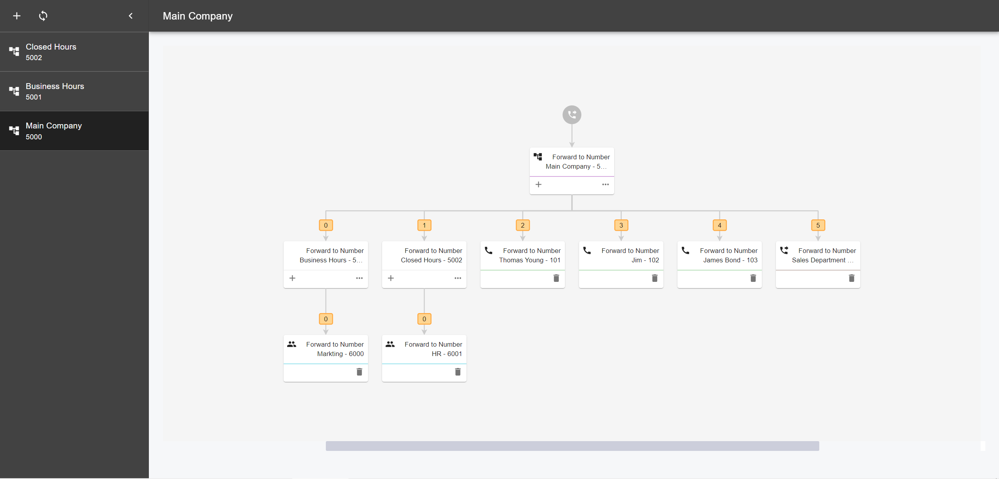
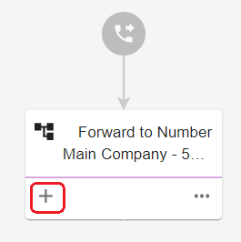
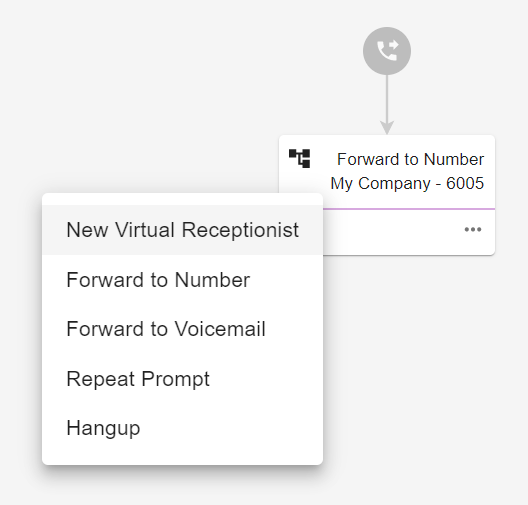

# Visual IVR Editor Guide

This article provides information for Tenant Administrators on how to use Visual IVR Editor.

The Visual IVR Editor lets Tenant Administrators configure the Multi-level IVR using an easy-to-use graphical interface. This feature helps Tenant Administrators to add IVR menus and assign them to extensions with just a few clicks. It allows Tenant Administrators to edit and update an existing IVR menu. Once the configuration has been saved, PortSIP PBX will automatically verify the settings and display any missing information.&#x20;

Tenant Administrators can log in the tenant to web portal and access the Visual IVR Editor by going to **Advanced Services > Virtual Receptionsit > IVR Editor** tab. Below is the  Visual IVR Editor.

<figure><figcaption></figcaption></figure>

## Create a new IVR menu

Below New Tree, click the plus icon. This will automatically generate a menu that can be customized.

<figure><figcaption></figcaption></figure>

## Open and edit an existing IVR menu

Click the IVR menu to edit. The IVR menus will be displayed on the right panel.

<figure><figcaption></figcaption></figure>

## Add sub-items to the IVR menu

1. Hover your mouse over the menu, then click the Plus icon.

<figure><figcaption></figcaption></figure>

This will expand to show a list of sub-items that you can add. The following sub-items can be added to an IVR Menu:

<figure><figcaption></figcaption></figure>

* New Virtual Receptionist - Lets you create a new IVR menu as an option to your IVR tree.&#x20;
* Forward to Number - Lets you add a specific extension to your IVR tree. This can be a ring group, queue, shared voicemail, or a user.
* Forward to Voicemail - Gives an option to your callers to leave a voicemail of a specified extension.
* Repeat Prompt - Repeat the currently prompt voice.
* Hangup: Hang up the caller.

