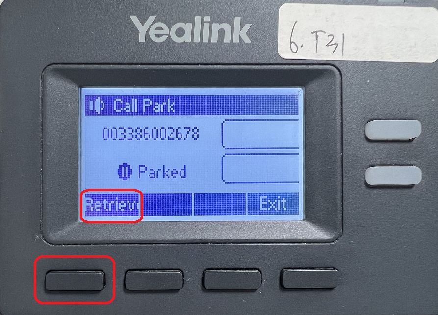

# Using Call Parking Feature

## Park calls and retrieve calls with PortSIP

**Park a call** — When you're on an active call, transfer the call to `*68` to place the call into a parking space.

**Retrieve a call** — To retrieve the call on an IP phone, softphone app, dial `*88` and you will be connected to the caller.

**Park at an extension** — To move the call to a parking extension, transfer the call to `*68` followed by the extension number.

### **Scenario 1**

Bob's extension number is 101, and he answered the client's call on his desktop IP phone. He now requires the assistance of colleague Alice, whose extension number is 102, in order to let Alice speak with this client. Bob simply transferred the call to `*68102` and the call hung up. Alice's IP phone is light and has the alert message displayed, Alice simply presses a button or dialing `*88` or `*88102` to retrieve the call and speak with the client.

If Alice is not at her desk, another colleague can retrieve this parked call by dialing `*88102`.

### **Scenario 2**

Bob's extension number is 101, and he answered the client's call using his desktop IP phone. He now needs to go to another office, so he transfers the call to `*68` and hangs up from IP Phone, the caller hears music. Bob uses his mobile phone App (which is also registered to the PortSIP PBX with the same extension number 101) to retrieve this call by dialing `*88` in order to continue speaking with the client while walking to another office.

### **Scenario 3**

Bob's extension number is 101, and he answered the client's call using his desktop IP phone. He now needs to go to another office, so he transfers the call to `*68` and hangs up from IP Phone, the caller hears music. When Bob arrived at the other office, he used another IP Phone to retrieve the call by dialing `*88101` in order to continue speaking with the client.

## Retrieve call by PortSIP App, Fanvil, and Yealink IP Phone

The PortSIP App, Fanvil, and Yealink IP Phone all support retrieving park calls with a single key press.

### **Scenario**&#x20;

Bob's extension number is 101, and he answered the client's call (client number is 003386002678) using his desktop IP phone. This call will now need to be handled by his colleague Alice, whose extension number is 102.

Bob simply transferred the call to `*68102` and then hung up. Once the call has been successfully parked, Alice's App (PortSIP Mobile App, Windows desktop App, WebRTC App), and IP Phone (Fanvil, Yealink, Dinstar) will receive a notification, and light, display a message to alert that a call has been parked on extension 102.&#x20;

Alice only needs to press the button (PortSIP App) or press the key (Fanvil, Yealink, Dinstar IP Phone) to retrieve the call rather than dialing `*88`.

<figure><figcaption></figcaption></figure>

## Group Call Park

The Group Call Park feature allows a defined group user to park a call against other available members of a Call Park group, which may be picked up by other members of the group on their phone.

### Feature Notes

What to know before getting started:

* Group Call Park is a tenant-level feature that is offered by the PortSIP PBX license, no extra cost is required.
* A user can only be assigned to one Call Park group.
* A Call Park group may only have users from the same tenant.
* A tenant may have multiple Call Park groups.
* Call Park group names must be unique.

### Modifying Call Park Settings

* Log in to the PBX web portal.
* Select the menu **Advanced Services > Call Park**.

### Adding and Deleting a Call Park Group

1. Select the Add button to add a Call Park Group. The Settings screen appears.
2. Within the settings area, enter a name within the **Group Name** field. This is a required field as it is used to identify the group down below.
3. Proceed to select the desired Recall destination from the drop-down Menu. The recall destination is the user or ring group the call will be redirected to if the call is not picked up.
   * **Alert parking user only** – If a parked call is not picked up, it is reverted to the person that parked the call after the Recall Timer has lapsed. If the parking user does not pick-up the reverted call and the Recall Timer lapses again, the parking user is attempted again in 10 seconds.
   * **Alert parking user first, then Ring Group** – If a parked call is not picked up, it is reverted to the person that parked the call after the Recall Timer has lapsed based on the configured recall time. If the parking user does not pick-up the reverted call in the set time (Alert Ring Group Wait Time), the call will be forwarded to the selected Ring Group. The call will then follow the Ring group routing and not be reverted. (This option is only available if a Ring Group has been configured).
   * **Alert Ring Group only** – If a parked call is not picked up call in the set time (Recall Timer), the call will be forwarded to the selected Ring Group. The call will then follow the Ring group routing and not be reverted. **Note:** This option is only available if a Ring Group has been configured.

* Ring Group – Choose a Ring Group (if configured) as a recall destination. Valid only if option 2 or 3 is chosen as the Recall To option above.
* To assign a user to the group, select the "**GROUP MEMBERS**" tab and click the "**Add**" button to select the users in the Available list.
* Click the OK button.

### Feature Operation

To park a call to a group, the parking user transfers an active call to the feature access code (FAC) `*58`. The call park group service automatically hunts for the first available member of the Call Park group to park the call against. The Group Call Park feature always starts with the first assigned member. When a member is available, and the call is parked against that member. All members of the group will receive the park notifications.

The parked caller is hearing the music until a group member retrieves the parked call by dials `*88`. If the parked call is not retrieved within the provisioned recall time, the parked call is retrieved and presented to the user that originally parked the call or an alternate recall user. The recall user is a Call Park group setting and is configurable.

### **Example**

Users 101, 102, and 103 are members of a Call Park Group.&#x20;

101 parks the call to the group by transferring the active call to `*58`, the caller will hear music,  the 102, and 103 will receive a notification alerting them that the call has been parked (PortSIP App, Fanvil, Yealink, Dinstar IP Phone), and they can simply press the button to retrieve the call, or retrieve the call by dialing `*88` from other 3rd apps or IP Phones.

## Enhanced Call Park

For the Fanvil, Yealink, and Dinstar phones, the enhanced call park feature is supported. Please see the following articles:

* [Using Enhanced Call Park on Fanvil IP Phones](using-enhanced-call-park-on-fanvil-ip-phones.md)
* [Using Enhanced Call Park on Yealink IP Phones](using-enhanced-call-park-on-yealink-ip-phones.md)
* [Using Enhanced Call Park on Dinstar IP Phones](using-enhanced-call-park-on-dinstar-ip-phones.md)

