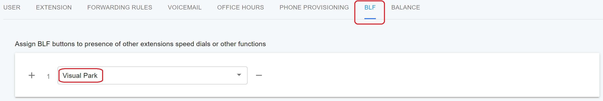
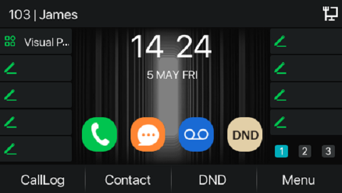
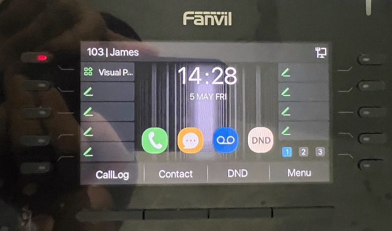

# Using Enhanced Call Park on Fanvil IP Phones

This article explains how to use the PortSIP PBX’s uniquely enhanced call park feature with Fanvil IP phones.

## Supported Fanvil IP Phone Models

### V1

Models: X4U,X5U,X6U,X7,X7C,X210, and X210i.

ROM: from version 2.4.13.

### V2

Models: X4U-V2/X5U-V2/X6U-V2, X7-V2/X7C-V2/X210-V2, V62,V64,V65&#x20;

ROM: from version 2.12.16.17.

## Supported PortSIP PBX Version

From version 16.0.2.

## Application Scenarios

### **Enhanced Call Park**

Enhanced Call Park is a feature that improved the call park experience on the phone. It provides the park and retrieve key instead of the call park FACs. And it provides the capability of call park notification and any other Enhanced features with PortSIP PBX.

### Call Park

The Call Park Service allows users to suspend a call for an extended period of time and then retrieve that call from any extension. For instance, you need to move to another place for some reason but you are answering a call. You can park this call in your number and retrieve the call you reach the place you want to go.

### Group Call Park

Provides a hunting mechanism so that when parking a call, the service hunts for an available user in a configured call park group as a place to park the call instead of only trying the parking user. For instance, your call will be parked in the line of your colleague if you are in the same call park group, your colleague can retrieve the call and then transfer it to you or just inform you after he/she retrieves the call.

### **Call Park Notification**

The Call Park Notification enables visual alert when a user received a parked call. There will be a visual alert when receiving a parked call, the user just needs to press the button to retrieve that parked call.

### **Retrieve Park**

The user dials the Call Park Retrieve feature access code with the extension number where the call to be retrieved is parked. For instance, you can retrieve the parked call by yourself or your colleague if the call was parked on his/her line then transfer the call or just inform you.

### **Recall**

The User can configure the recall settings such as recall object and recall timer. The server will recall the number which parked the call or the specified number if no one retrieves the call in the limited time. For instance, if you set the recall timer to 30s, the server will recall your number if no one retrieves the call in 30s.

## Configuring a Key for Visual Park

When provisioning an IP phone, a soft key can be configured for Visual Call Parking.&#x20;

<figure><figcaption></figcaption></figure>

After the IP phone has been successfully provisioned, the key will display the label "**Visual Park"**. As shown in the screenshot below, user James has extension number 103 and has configured the key with Visual Park.

<figure><figcaption></figcaption></figure>

## Parking Call

If James wants to park a call to his colleague whose extension is 105, he just needs to press the configured Visual Park key and enter the number 105, then **press the configured Visual Park soft key again**, the IP Phone will then park the call at extension 105. In this way, James does not need to remember the FAC for park operation.

## Group Call Park

1. To configure a park group, sign in to the PBX web portal as the tenant administrator.
2. Select the menu **Advanced Services > Call Park**.&#x20;
3. Follow the guide to [configure a park group](./#adding-and-deleting-a-call-park-group). Assume that extensions 101, 102, 103, 104, and 105 are in the same park group.

If James (extension number 103) wants to park a call to this park group, he just needs to press the configured **Visual Park key twice**. The IP phone will then park this call to the group, and all members of the group will receive the park alert notification. In this way, James does not need to remember the FAC for the group park operation.

## Retrieve Call

Alice established the call with Bob, and Bob park the call to James' extension number 103 by pressing the Visual Park key and entering James' extension number 103, then pressing the Visual Park key again. On James' IP Phone, the Visual Park key will flash with a red color to alert James that a call has parked on him.

<figure><figcaption></figcaption></figure>

James simply presses the key to view the parked call information, and the phone screen display as below screenshot, the caller's name will be displayed as "**Parked**", in this case, Alice.

James now presses the "**retrieve**" button in the bottom left corner to retrieve the call.  In this way, James does not need to remember the FAC for the retrieve operation.

<figure><figcaption></figcaption></figure>

##
