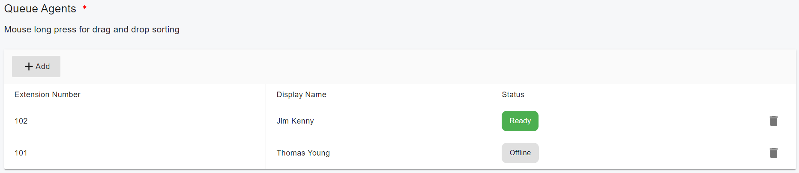

# Configuring Call Queue

## Creating a  Call Queue

From the Web Portal, select menu **Advanced > Call Queues** and click the **Add** button. Now fill in the necessary fields:

* **Queue Number** – Specify the queue number here. It should not be an existing extension number
* **Queue Name** – Enter a friendly name for the Queue
* **Ring Duration** – The timeout in seconds, i.e. for how long the phone keeps ringing before the call is considered unanswered by that agent
* **Music on hold** – The music that would be played when the caller is queued
* **Polling strategy** – This option allows you to choose how calls should be distributed to agents:
  * **Ring Simultaneous**: All Ring Group members will ring at the same time.
  * **Prioritized Hunt**: Ring each available member of the group in the configured order
  * **Cyclic Hunt**: Ring each available member of the group by the order the member was added. The member who has not been ringing previously will take priority
  * **Least worked Hunt**: Ring each available member of the group by the order the member was added to the group. The member that hasn't answered a call from this group takes priority
  * **Skill Based Routing Prioritized Hunt**: Ring each available agent in the queue serially in the configured order. Assign the call to agents in the highest level skill group first. If the call is not answered in the current skill group, move on to less experienced agents in subsequent skill groups.
  * **Skill Based Routing Cyclic Hunt**: Ring each available agent in the queue serially. Ring the agent who hasn't been rung from a call from this queue in the longest amount of time first. Assign the call to agents in the highest level skill group first. If the call is not answered in the current skill group, move on to less experienced agents in subsequent skill groups.
  * **Skill Based Routing Least Worked Hunt**: Ring each available agent in the queue serially. Ring the agent who hasn't answered a call from this queue in the longest amount of time first. Assign the call to agents in the highest level skill group first. If the call is not answered in the current skill group, move on to less experienced agents in subsequent skill groups.
* **Keep waiting if there are no members online** - If this option was checked, even if there is no agent online, the queue will still keep the caller in the queue until the maximum wait time.
*   **Set agent to Ready automatically** - If this option is enabled, once a queue agent (member) registers with the PBX, their status will automatically be set to **Ready**, and the queue will distribute calls to that agent. After the agent rings or completes a call, their status will automatically be set to **Ready** again.

    If this option is disabled, once the queue agent registers with the PBX, their status will automatically be set to **Logged Out**. The agent must use the REST API or dial a FAC to sign in to the queue first, then change their status to **Ready** using the REST API or FAC, and then the queue can distribute calls to them. After the agent rings (but does not answer the call) or completes a call, their status will automatically be set to **Wrap up**, and the PBX will not distribute calls to that agent. To receive calls, the agent must manually change their status to **Ready** using the REST API or by dialing a FAC.
* **Set agent status to Wrap Up after agent completes a Non ACD call** - If an agent completes a Non-ACD call and this option is enabled, the PBX will automatically set their status to **Wrap Up**. However, this option will be ignored if the “Set agent to Ready automatically” option is enabled.
* **Last Called Agent Routing** - Turn on this option to enable the Last Called Agent Routing feature. For more details please see [Skills Based Routing](skills-based-routing.md#5-last-called-agent-routing).
* **Destination if no answer** - Define the maximum queue waiting time and the action to be taken if the call remains unanswered. If no agent is logged into the queue and the **Keep waiting if there are no members online** option is disabled, this option will be triggered immediately.

## **Queue Options**

* **Announce queue position to the caller** – Announce the caller position in the caller:
  * **Don't announce position**: don't announce the position
  * **Periodically announce position**:  announce the position every interval time in seconds
  * **Announce position once caller connected**: Once the caller is connected to the queue, the position will be announced immediately, and then every interval time in seconds
* **Play intro prompt before calling agents** - You can specify a custom introduction prompt and a custom music on hold file. You can now choose whether to play the full intro prompt before the system starts to call queue agents
* **Maximum Queue Wait Time**. Once the caller stays in the call queue longer than this time, it will be processed as the **Destination if no answer** settings, and treated as an **Abandoned Call**.
*   **SLA time**. SLA refers to service level agreement. Calls that remain unanswered in the queue for longer than the number of seconds set in this field are considered to have breached the SLA time limit in relevant reports and statistics. Once it’s set, you will receive a notification every time a call stays in the queue longer than the specified SLA time.

    SLA is used to ensure that your callers are not queuing for longer than the time you have specified. For example, if you declare that all calls within your organization are answered within 3 minutes, you need to set the SLA in the queue to 180 seconds. Once that time is reached, the queue manager will receive an alert notifying them that a call has breached the SLA.

## **Configuring Queue Agents**&#x20;

By clicking the “**Members**” tab, you can select the agents for the call queue. To change the order of the agents, drag and drop them.

<figure><figcaption></figcaption></figure>

## **Notifications**

You can set one or more extensions as the queue manager(s) to receive email notifications if the call exceeds the SLA time or is lost.

<figure><figcaption></figcaption></figure>

In order to send the notification email to the queue managers, the SMTP server must be configured, and the notification option must be enabled.

Select the menu **Advanced > Notifications.**

<figure><figcaption></figcaption></figure>

<figure><figcaption></figcaption></figure>

## Outbound Caller ID

If you set an external number (PSTN) number in the **Destination if no answer**, the call will be forwarded to the trunk by a matched outbound rule, and you can specify the outbound caller ID here for this scenario, the outbound caller ID could be a replacement for certain SIP field. For more details, please refer to [Outbound parameters and Inbound parameters](../7-trunk-management/#7.2-outbound-parameters-and-inbound-parameters) and [Handle Outbound Calls Through SIP Trunk](../7-trunk-management/handle-outbound-calls-through-sip-trunk.md).

<figure><figcaption></figcaption></figure>
