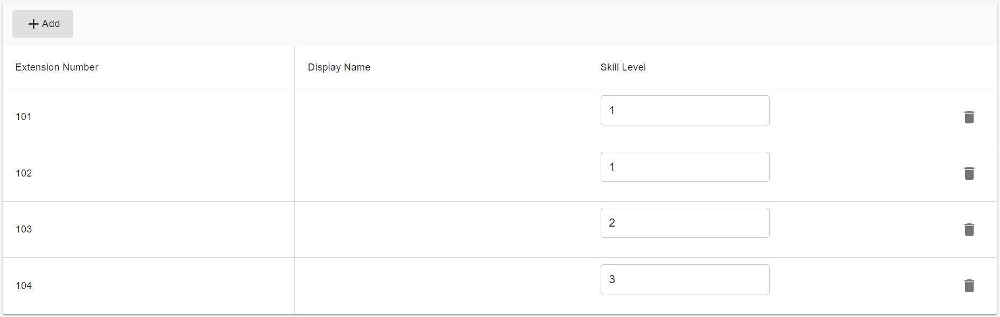

# Skills-Based Routing

Every call center agent has heard of irate customer stories. To avoid frustrating customers, a call center must make sure that the client’s concern is resolved as quickly and efficiently as possible. One way to do this is to ensure agents with the right skills address the customer’s problem.

That is where skills-based routing comes in handy. Let’s go over what skills-based routing is and how it can help improve your contact center. We’ll also get into how you can build an effective skills-based routing strategy for your own team.

## What Is Skills-based Routing?

Skill-based routing (or skill-based distribution) is a call routing strategy where customers are assigned to agents with the most relevant skills for handling their concerns. For example, Spanish-speaking customers are sent to agents that can speak Spanish.

The PortSIP PBX includes Skills-Based Routing, moving incoming queue calls to agents in the next skill group if members of the previous skill group(s) are busy, unavailable, or logged out. For example, a contact center can assign its support agents to increase skill groups based on their expertise. In this way, incoming calls are first assigned to agents in the skill group that has the highest skill level and when not available, move on to the less experienced agents(lower skill level) in subsequent skill groups.

With this routing system, the customer won’t have to deal with agents who aren’t equipped with the skills required to assist them, reducing the chances of them being angry.

## Route Call By Caller Language

You can create multiple inbound rules based on the same DID number with a trunk, but all these inbound rules must have a different CID number mask.

**Example**:&#x20;

You have the DID **`00442012345670`**. Create two inbound rules:&#x20;

1. The CID for the first rule is **`0044**********`**, the DID number mask is **`442012345670`**, and the call is routed to "**English Support Queue 8000**";&#x20;
2. The CID for the second rule is **`0033*********`**, the DID number mask is **`442012345670`**, and the call is routed to "**French Support Queue 9000**".

Now let all English-speaking employees be agents of **English Support Queue 8000**, and let all French-speaking employees be agents of **French Support Queue 9000**. When the caller calls  **00442012345670**, callers from the UK will be routed to **call queue 8000** to talk with an English agent, and callers from France will be routed to **call queue 9000** to talk with a French agent.

## Route Call By VIP

PortSIP PBX provides the **VIP Caller** feature, making VIP customers feel special when trying to connect to the PortSIP PBX contact center. When the VIP call was determined, the queue always gave the top priority to the caller and pushed them to the front of the queue.

* Click the menu **Contact Center > VIP Numbers**, and click the **Add** button
* **Enabled:** turn on/off
* Enter the VIP customer phone number
* **Description:** A descriptive name for the VIP Caller being entered. For example, enter **Microsoft team** as the description for the VIP caller
* Set up how long the VIP number validity


The VIP list is global validity for all queues in the tenant scope


## **Exclusive Agent**

In some scenarios, for the special industry callers in the contact center, we will need special agents who have rich special industry knowledge and skills to serve them.

PortSIP PBX provides the **Exclusive Agent** feature, which allows setting up one or more agents from the queue as **Exclusive Agents** for the special callers; once the call comes from these callers, the queue will distribute the call to the **exclusive agent,** giving it the highest priority if the agent is ready (idle); of course, if all exclusive agents are busy / Not Ready / signed out, the call will be distributed to other agents.

* Click the menu **Contact Center > Exclusive Agent**, and click the **Add** button
* **Description**: A descriptive name for the exclusive agent being entered. For example, enter **XXX Bank** as the description for the bank caller.
* **Caller number**: Enter the caller number who will be assigned the exclusive agents. Once the call comes from this caller, the call will be distributed to the exclusive agent with the highest priority. You can add more caller numbers by clicking the **Add** button.
* **Call Queue:** choose the queue member from the queues to set up as an exclusive agent


If the call does not come from the specified caller numbers, the exclusive agent works as the normal agent.


## Route Call By Agent Skill Level

PortSIP PBX currently supports the following skill base routing strategies:

* Skill Based Routing Prioritized Hunt: Ring each available agent in the queue serially in the configured order. Assign the call to agents in the highest level skill group first. If the call is not answered in the current skill group, move on to less experienced agents in subsequent skill groups.
* Skill Based Routing Cyclic Hunt: Ring each available agent in the queue serially. Ring the agent who hasn't been rung from a call from this queue in the longest amount of time first. Assign the call to agents in the highest level skill group first. If the call is not answered in the current skill group, move on to less experienced agents in subsequent skill groups.
* Skill Based Routing Least Worked Hunt: Ring each available agent in the queue serially. Ring the agent who hasn't answered a call from this queue in the longest amount of time first. Assign the call to agents in the highest level skill group first. If the call is not answered in the current skill group, move on to less experienced agents in subsequent skill groups.

When adding the agents to the queue, you can specify the skill level for each agent, a bigger number means a higher level.

<figure><figcaption></figcaption></figure>

## Last Called Agent Routing

**Last Called Agent Routing** is a feature that routes a customer call to the agent who last spoke with that customer (last called agent or LCA routing).&#x20;

PortSIP PBX has an option **Last Called Agent Routing** in the call queue that allows you to enable or disable this feature.

Here’s a summary of the scenario:

1. A customer calls the contact center and the call is routed to an agent.
2. The agent ID and the call time are saved to the customer contact information in the PortSIP PBX database.
3. A future call from the same customer can be routed to the same agent.
4. If **Last Called Agent Routing** is enabled and the customer calls again, the call is routed to that agent.
5. If that agent is unavailable, the call is routed to another appropriate agent.

## **Harass Numbers**

Spam calls are the plague of all businesses, especially contact centers, PortSIP PBX provides two ways to prevent spam calls.

* A global **Number Blacklist**, will reject the call silently if the caller is in the number blacklist. You can add the blacklisted number by selecting the menu **Blacklist and Codes > Number Blacklist**.
* **Harass Number:** PortSIP PBX also provides the **Harass Number** feature to prevent spam calls only for the Call Queue. The harass number is defined as having two levels.
  1. if a caller is determined in **Harass Number** **Level 1**, the preset prompt file will be played to alert the caller, and if the caller presses button **1** the call will hang up, press **2** the call will continue.
  2. If a caller is determined in **Harass Number** **Level 2**, the preset prompt file will be played to alert the caller, and the call will be hung up automatically after the play is finished.

The harass number feature can be enabled or disabled in the menu **Contact Center > Harass Number Level 1** and **Harass Number Level 2**, click the **Global Settings** to turn on or off the **Enable level 1 Harass Number** and **Enable level 2 Harass Number** options, and upload the prompt files.

