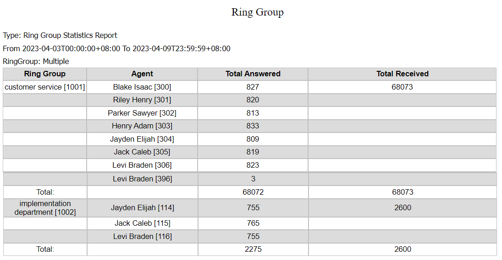

# 21 Call Reports

In-depth call reporting is essential for gaining real-time insights into your Unified Communications & contact center performance and customer needs. How long do your agents spend on a call? What’s the number of calls they make and receive? What is the overall performance of your queues? Which agent is underperforming or burning out? SLA statistics, unanswered calls, abandoned calls, callbacks – the list goes on.&#x20;

With PortSIP's Call Reporting feature, you can generate reports for analysis, view report details and status, and share the data with users throughout the enterprise. You can view reports in your browser, print them or send them via email.

you can utilize reports to make informed decisions about your business, restructure your call center, optimize agent productivity, and increase customer satisfaction.

To help you monitor your business, PortSIP offers a wide range of standard reports that can be customized to better suit your needs.

Depending on the type of report, the results may be presented as lists or data and/or in graphic form.

In this section, you will learn how to:

* [Create and run a report](21-call-reports.md#create-and-run-a-report) - To review and analyze interaction, speech, and external metadata.&#x20;
* [Saved reports](21-call-reports.md#save-reports) - To download the reports.&#x20;
* [Understand report layouts and parameters](21-call-reports.md#understand-report-layouts-and-parameters) - To better absorb the report information.&#x20;

## Create and run a report

New reports can be created by selecting the menu **Call Statistics > Call Reports,** and clicking the **Add** button.

### Configure the report as necessary using the available parameters

* Click the **Type** list to select which report template will act as the basis of your new report.
* **Range**: Each report includes a date selector option, indicating the date range or accounting period range of displayed report data. You can select from this field to change the report's date range filtering, and display different data. Current support **Today**, **Yesterday**, **Last Week**, **Last Seven Days**, **Last Month**, **Last Thirty Days**, and you can create the custom date range as well.
* **Frequency**: You can select a frequency at which to run a scheduled report. The frequency can be **One Time Now**, **Daily**, **the First Day Of the Week**, or **the First Day Of The Month.**
* **Name:** Set a friendly name for the report you created.
* **Mail To**: Specify an email address for receiving the call report. Once the PBX has completed generating a report, the report download link will be sent to this email. Note that the SMTP server must be configured correctly.
* **Export As**: Specify the report format, current support CSV, and HTML.

The above parameters are available for all types of reports.

### Configure the filter for the report

You can filter the data that is displayed in a report based on the values in one or more fields. For example, if you want to view answered calls, you filter the data by **Answered** **Call Status**.

Each filter is associated with a single report. Different report types have different filters that can be set.

After configuring the filter parameters, click the OK button to generate the report. If there are massive calls within the date range, it may take a long time to generate the report.


A single "**Normal**" report has a maximum limit of 20,000 calls. Other types of reports do not have this limitation.


<figure><figcaption></figcaption></figure>

The status will display as "**Running**" during generating the report.

### Save Reports

Once the report is completed, you can click the "**Refresh**" button to list the report then click the link icon to download it.

<figure><figcaption></figcaption></figure>

### Understand report layouts and parameters

#### Normal Call Report

This is a basic call report, and you can set up the filter as follows:

* **From**: Use this field to filter calls by the caller number, and support the below values:
  * **Extension or Extension Range** - Specify the extension number or extension number range, e.g., 101 or 101-110.
  * **Number** - Specify the caller number, not limited to the extension number only, also can be a phone number, e.g., 003321456783.
  * **Numbers Start With** - The PBX will filter calls by the caller number which starts with a specified number prefix. For example, if you specify this field as **035**, then all calls that have a caller number starting with **035** will be filtered.
  * **Numbers Contain** - The PBX will filter calls by the caller number which contains a specified number prefix. For example, if you specify this field as **327**, then all calls that have a caller number containing **327 will** be filtered, such as 00446**327**1001, 00382087**327**004, and 2001**327**10.
  * **Internal Extensions** - The PBX will filter calls by caller number if it’s an extension number.
  * **External Numbers** - The PBX will filter calls by caller number if it’s a phone number.
* **To**: Use this field to filter calls by the callee number, and supported values are the same as the From above.
* **Call Status**: Use this field to filter calls by the Call Status, which can be selected **Answered** or **Not Answered**.
* **Duration**: Use this field to filter the calls by the **Call Duration** or **Ring Duration**.

<figure><figcaption></figcaption></figure>

* Talking Time - The call duration.
* Cost - The cost of the call.
* CLI - The outbound caller ID if this is the outbound call to the trunk.
* DID/DDI - The DID/DDI number is this call received from the trunk.
* End Reason - Indicates the call is hung up by caller or callee.
* Trunk Name - Indicates the call over which trunk if it's made between trunks.
* User Data - If the call is launched by REST API, and passes a "user\_data" for the call, it will be recorded here.

#### Extension Group Call Cost

This report generates a call cost for a specified user group. You can set up the filter as follows:

* **Type**: Use this field to filter the calls by the call type, and support the below values:
  * **Any** - Don't filter, just generate the report for any call type.
  * **Local** - Filter the calls which are billed as the **Local** call.
  * **National** - Filter the calls which are billed as the **National** call.
  * **Mobile** - Filter the calls which are billed as the **Mobile** call.
  * **International** - Filter the calls which are billed as the **International** call.

<figure><figcaption></figcaption></figure>

* Group Name - Indicates that the user in the call belongs to which user group.
* Call Type - The billing type of the matched billing rule in this call.
* Prefix - The billing rule prefix to match the outbound calls.

#### Queue Performance

The service level for one or more of your queues is summarized in the “**Queue Performance Report**.” This report will show you the number of calls that were received, handled, and not handled per queue.

It also automatically breaks down the statistics by agents, letting you quickly identify which agent is performing at their peak.

You can set up the filter as follows:

* **Exclude Calls Dropped Before Seconds:** Don't count the calls if the call duration is less than the specified time.
* **Call Queue**: Select one or more queues to count

<figure><figcaption></figcaption></figure>

* Queue - Indicates the queue name and number.
* Received - Indicates how many calls were received in the report date range.
* Serviced - The calls were answered by an agent.
* Unanswered - The calls are not answered.

#### Queue Detailed Statistics

The detailed queue statistics report will give you all the required information to access the queues’ statistics. The queue statistics report includes the following:

* **Calls**: Answered, abandoned, total, and % serviced&#x20;
* **Ring Time**: The total and mean average&#x20;
* **Talk Time**: The overall and mean average&#x20;

<figure><figcaption></figcaption></figure>

* Serviced - The calls were answered by an agent.
* Abandoned - The abandoned calls of the queue in the report date range.
* % Serviced - The percentage of agents who answered calls based on the total number of calls received by the queue during the report date range.

#### Queue Abandoned Calls

Managers can use the statistics in the "**Queue  Abandoned Queue Calls**" report to help them pinpoint potential causes of abandoned calls. This contains the following information:&#x20;

* Waiting time
* Caller
* The agent who assigned the call
* The number of polling attempts

<figure><figcaption></figcaption></figure>

#### Queue SLA Statistics

The statistics SLA report shows the total number of calls that are received for one or more queues. Additionally, it will display the number and percentage of missed calls according to the SLA.

<figure><figcaption></figcaption></figure>

#### Queue Breaches SLA

The SLA time, or acceptable waiting time for clients calling your queues, is something you can configure. In addition to the configured SLA, this report will show how many calls are awaiting you in your queues.

The report will also include information on the time of the call, the caller ID, and how long they had to wait before speaking with an agent. Additionally, you can choose to not include any calls that were dropped earlier than the specified period of time.

<figure><figcaption></figcaption></figure>

#### Queue Callbacks

The number of callers who asked for a callback before being attended to by a user is displayed in the "**Queue Callbacks**" report. The number of calls the queue received, the number of callbacks placed, and the number of unsuccessful callbacks will all be shown in the report.

<figure><figcaption></figcaption></figure>

#### Team Queue General

The "Team Queue General Statistics" report emphasizes the queue at the team level rather than the agent level. This report provides information on how calls are handled when they enter and displays the number of agents in each queue.

<figure><figcaption></figcaption></figure>

#### Ring Group Statistics Report 

This report displays the number of calls that were answered and received for a single or a number of different ring groups. The statistics reflect the number of terms you include when scheduling reports. This information is also broken down using the agent extension number, so you can see which agents are effective and which ones require improvement.

<figure><figcaption></figcaption></figure>
