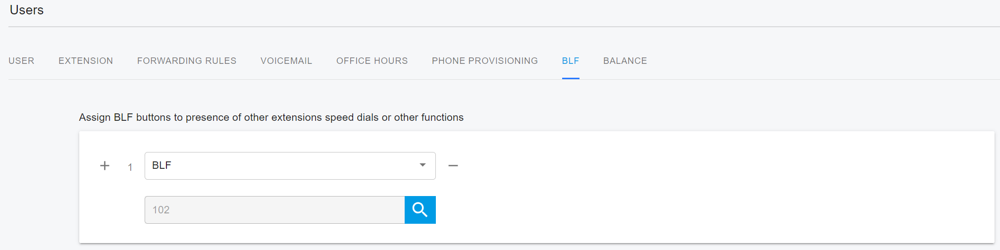
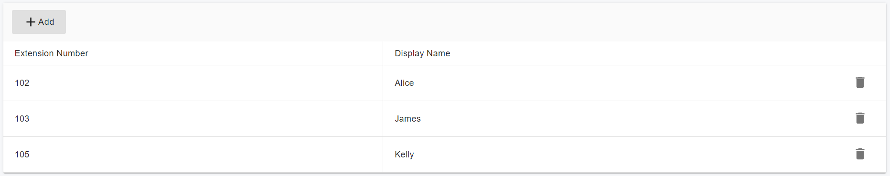

# 24 Call Pickup

Call pickup allows a user to dial a feature access code (\*97) followed by an extension, to pick up (answer) a call directed to a user with that extension. If the ringing party has already answered the call, or if it has no alerting call, or if the dialed extension is invalid, the pickup fails.

This feature also allows users to pick up incoming calls made to a monitored BLF line using the monitoring phone. When the feature is enabled and the BLF user is in alerting state, users can pick up a call from a monitoring phone using the Pickup soft key or a corresponding line key.

## Directed Call Pickup

The **Call Pickup** feature is enabled by default for PortSIP PBX users. This feature allows a user on any phone to answer calls that are ringing on other phones in the company. To access the Call Pickup feature, the user dials a corresponding Call Pickup FAC with the extension number - it's `*97` by default.&#x20;

For example, Alice's extension is **102**, she is out of the office and her phone rings, anyone can answer the call from another phone by dialing `*97102`.

Similarly, if Alice is away from her desk and across the room when her phone rings, she can quickly answer the call from another person's phone by dialing `*97102`.

## BLF Call Pickup From a Monitoring Phone

This feature allows users to pick up incoming calls made to a monitored BLF line using the monitoring phone. When the BLF user is in alerting state, users can pick up a call from a monitoring phone using the Pickup soft key or a corresponding line key.

The screenshot below shows that the user is monitoring extension 102’s Busy Lamp Field (BLF). When someone calls 102 and the phone is ringing, the BLF key will flash. The user can press that key to pick up 102’s call. In this case, the user does not need to remember the call pickup FAC `*97`.

<figure><figcaption></figcaption></figure>

## Group Call Pickup

A Group Pickup Group allows users to answer a call that is ringing at another extension within that group. If more than one phone within the group is ringing, the phone that has been ringing the longest is the one that gets picked up. When the call is picked up from another extension, the extension that was ringing is free to receive other calls.

Group Call Pickup is a great way to ensure calls are always answered promptly and customer service is at its best.

After you have configured Group Call Pickup, users can dial a [Feature Access Code](23-feature-access-codes.md) (default is `*98` ) to use this service.

### **Setting up a Group Call Pickup group**

To add group members to the PortSIP PBX Web portal, follow these steps:

1. Sign in to the PortSIP PBX Web portal as the tenant admin or sign in as the system administrator and then select a tenant to manage.
2. Select the menu **Advanced Services > Call Pickup**.
3. Click the **Add** button.
4. Enter a name for the group.
5. Click the **Group Members** tab to add the extensions as group members, then click the **OK** button to save the settings.

<figure><figcaption></figcaption></figure>

When a group pickup group user receives a call, other group members can answer the call by dialing `*98` .

