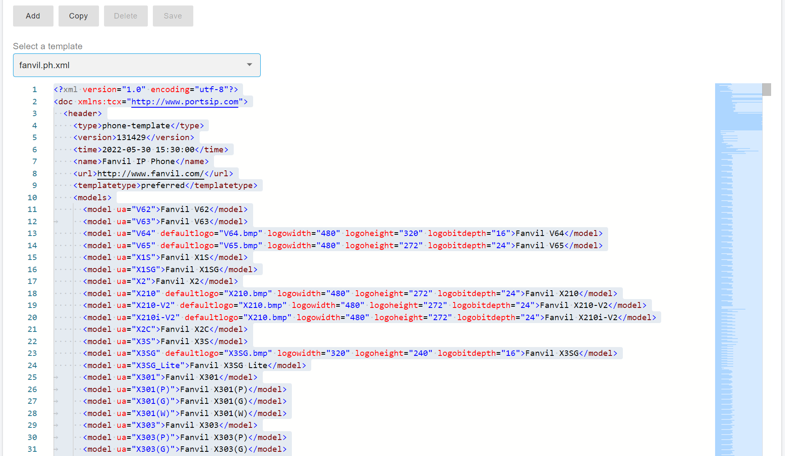
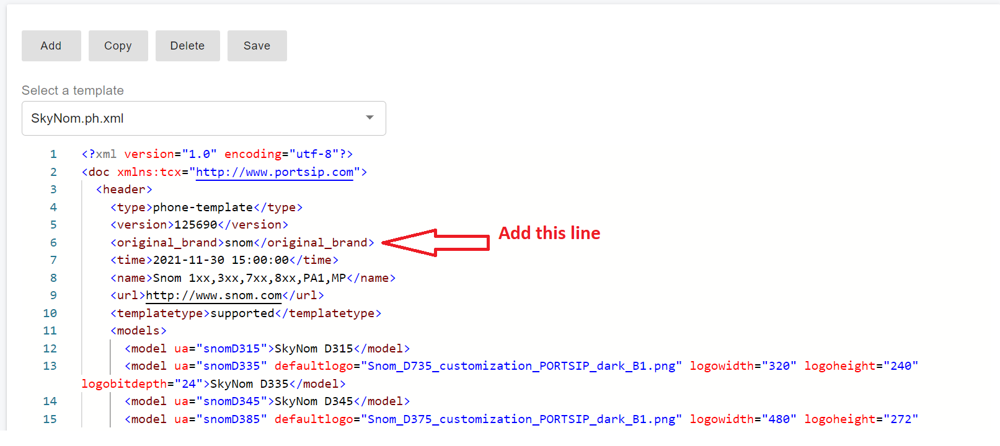
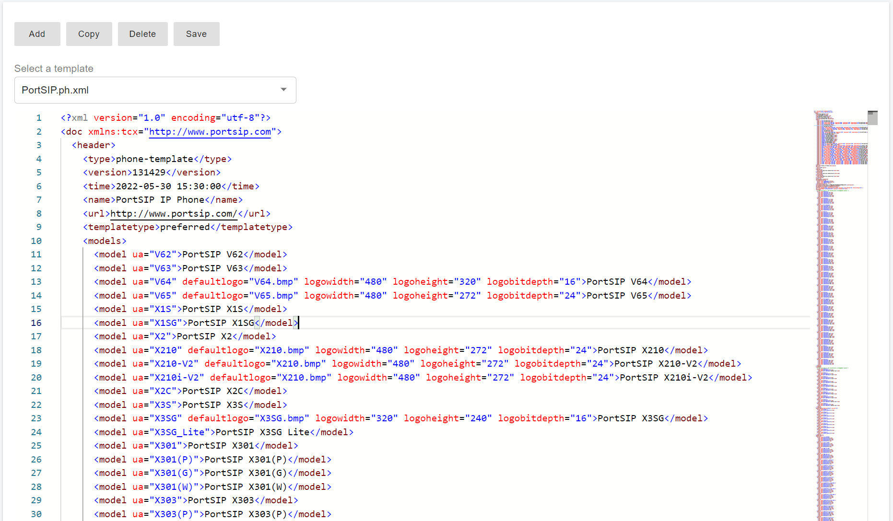
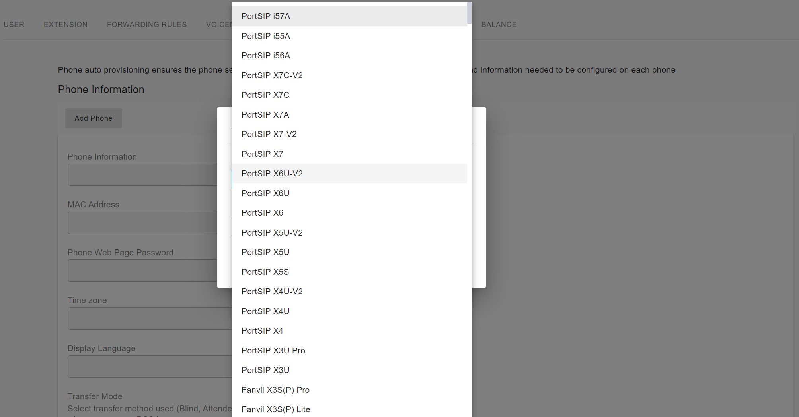
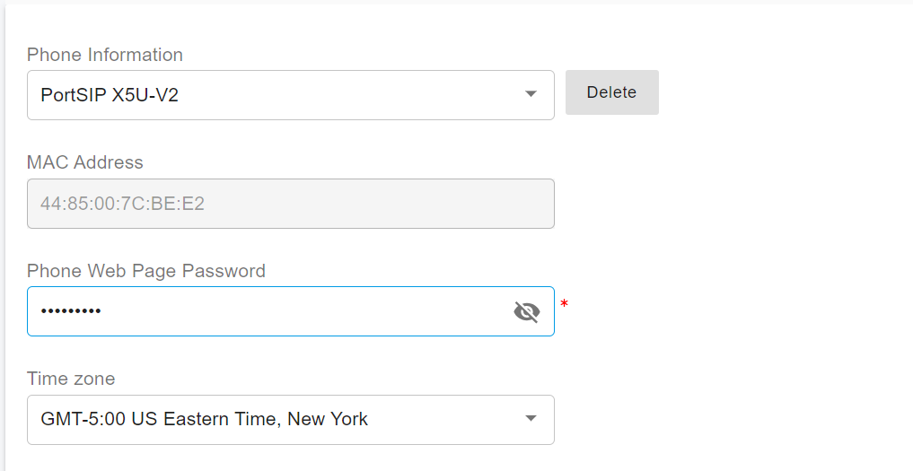

# Custom IP Phone Template

PortSIP PBX allows you to customize the IP Phone template, which will give you a unique user experience and your own brand of the IP Phone.

## Copy Base Template

<figure><figcaption></figcaption></figure>

1. Sign in as the System Administrator, and go to the menu **Advanced > Phone Templates**.
2. Select the default template from the drop-down **Select a Template** that you want to make a copy of.
3. Ensure that the models for which a custom template shall be created are listed within this template.
4. Click the **Copy** button and give it a new name, then click **OK**.&#x20;

You will get a new phone template that allows you to edit.&#x20;

You can edit the below items to make the custom phone template work.

* Edit the name: change the `<name>` section to your branding name, for example, **PortSIP IP Phone**.
* In the `models` section, edit the model that is defined in the "**ua=xxx**", this is not mandatory.
* In the `models` section, edit the model description. In this example, we change the branding name for each model. For example, change **Fanvil V62** to **PortSIP V62**, change **Fanvil 65** to **PortSIP V65**.
* Edit the **description** section to your branding name.
* Usually, the template has a section like the one below. Just change the name to your branding name. For this example, we changed it to **PortSIP Phone**.

```xml
  <data>
    <device>
      <type>phone</type>
      <!-- Friendly Name -->
      <field name="Name">PortSIP Phone</field>
```

### SNOM Phone


If you copy a template from the SNOM phone template, please follow the below instruction to add a line to the custom template.


Since the SNOM phone requires a configuration file named in uppercase letters of the MAC address, we need to add a line to the custom template if the base template is SNOM. This is because we don’t know if the custom template was copied from the SNOM phone.

```
<original_brand>snom</original_brand>
```

Please see the example in the below screenshot shown.

<figure><figcaption></figcaption></figure>

## Save Changes

Click the **Save** button once completed the above changes, you will get a new template as the below screenshot.

<figure><figcaption></figcaption></figure>

Now when a tenant performs auto-provision of an IP Phone for a user, the custom-branded IP Phones are listed as shown in the screenshot below.

<figure><figcaption></figcaption></figure>

Choose a phone model that you would like to provision for a user and [process it as a normal phone template](./).

<figure><figcaption></figcaption></figure>

## **Making Changes**

Keep in mind that any changes made to a template in the PBX Web portal will affect the IP Phones. Therefore it is advised to test template changes with a sample device in a non-production environment first.

The content sent to an IP phone will start just after this string within the template:

**\<!\[CDATA\[**

Any information above this is to do with the Web portal and should not be touched. Any mistake in this area will result in the inability to list the custom template in the Web Portal and extension settings may not be accessible anymore. The last working copy might need to be restored or the extension must be deleted completely.

## Precautions&#x20;

* Avoid duplicates of the same instruction (provisioning parameter) to the device.&#x20;
* Refer to the vendor’s provisioning guide or ask for PortSIP support.
* If a value should be changed from B to default device value A, do not just delete the provisioning entry. Set it actively back to A.&#x20;
* If in doubt, contact the IP phone vendor for more information or ask for PortSIP support.

## Yealink Phone-Specific Template Changes <a href="#h.3ifas3c43rjk" id="h.3ifas3c43rjk"></a>

Unlike most other phones, Yealink phones require two configuration files for provisioning and therefore have two `<![CDATA[` sections within one template generating two files.

* The first `<![CDATA[` section is the device defaults as **model** and refers to file-names like y0000000000xx.cfg where xx is a model-specific identifier defined by Yealink and must not be changed. These are further referred to as `y-files`.
* The second `<![CDATA[` section is for the "device" mac-specific configuration itself containing user-specific information like extension number.

You must edit the information for both `<![CDATA[` sections.


