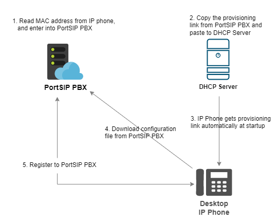
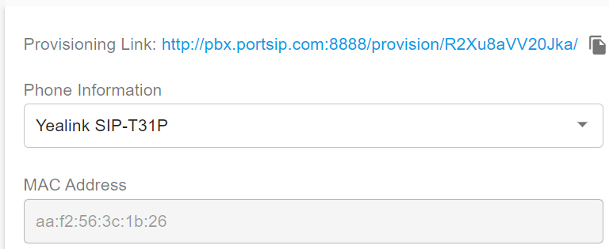
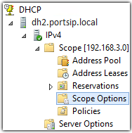
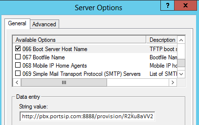

# Provision Phone Using DHCP Option 66

## What is Option 66

For most networks, RPS is the easiest way to provision your phones. However, if you have blocked access to the internet for your phone system, or you have legacy phones, then another way to provision a big number of phones is to use DHCP **option 66**. (Nothing to do with the infamous route **66** ). Option 66 is an option set in your DHCP server, that allows you to specify a server to provision a device from. In our case, option 66 can be set to be the provisioning URL for the phone. The sequence will be:

1. Phone boots up
2. Phone requests IP from DHCP server
3. DHCP server gives an IP PLUS an **option 66**
4. This option 66 will contain the URL to the provisioning root folder on PortSIP PBX
5. The phone will download the configuration file from PortSIP PBX using its MAC address

<figure><figcaption></figcaption></figure>

## Copy Provisioning Link 


Due do the security concern, please disable the auto provision security enhance if you wish to provision the phones by OPTION 66. Please see the article [DHCP Option 66 and Auto-Provisioning in PortSIP PBX](auto-provisioning-security.md#dhcp-option-66-and-auto-provisioning-in-portsip-pbx).


The first step is to copy your provisioning link. It's different for each PortSIP PBX installation for security reasons. To determine it:

1. Go to the **PBX Web Portal >  Users** page and select a phone to edit.&#x20;
2. Click the **Phone Provisioning** tab, and configure a phone for this user. Once completed to configure the phone by clicking the OK button, you will need to open this **Phone Provisioning** tab again.
3. If a phone is successfully configured with a user, the provisioning link will be shown at the top in the provisioning link section (see below screenshot.)
4. To obtain the root folder, just remove the last part of the URL after the dash, which specifies the actual file.
5. For example, [http://pbx.portsip.com:8888/provision/R2Xu8aVV20Jka/](http://pbx.portsip.com:8888/provision/R2Xu8aVV20Jka/)where **pbx.portsip.com** is your FQDN, the **R2Xu8aVV20Jka** is the randomly generated provisioning folder name
6. This link will be the one to use in **option 66** unless you have Snom phones
7. For the SNOM phone users, if your **PortSIP PBX version is less than v16.2** must append the `cfg{mac}` to the link, e.g. [http://pbx.portsip.com:8888/provision/R2Xu8aVV20Jka/](http://pbx.portsip.com:8888/provision/R2Xu8aVV20Jka/)cfg{mac}; This step should be skipped if your PortSIP PBX version is v16.2 or higher.

<figure><figcaption></figcaption></figure>

## Set the DHCP Option 66

This example shows the process for the Microsoft DHCP server. Three scopes can be set depending on whether you want it to apply to all phones or just to particular phones:

* Global Scope, which will offer the option to each DHCP client.
* Reservation Scope, which will offer the option to device matching MAC address only.
* Dynamic Scope, which requires a device **Vendor Class Identifier**.

Generally, you can use a global scope if all phones use the same provisioning folder. So if all your phones are Yealink, Fanvil, GreandStream, Dinstar, ALE, or Htek, you can use a global scope. If you have a few Snom phones, then you will need to create a separate reservation for them as they require a different URL in option 66. To set option 66:

1. Open the DHCP Server applet
2. Navigate to the IPv4 Scope to **Scope Options**
3. Right-click and select **Configure Options…**
4. Scroll down to find Option 66, **Boot Server Host Name**.
5. Paste the PortSIP provisioning link obtained in the above step to the string value field.
6. Save and restart the DHCP server.

<figure><figcaption></figcaption></figure>

<figure><figcaption></figcaption></figure>

If you have a few phones of a different brand that require a different format, then you will need to create a reservation for them so that the DHCP server will give them a different URL.

## Restart IP Phones 

Now you need to restart your IP phone so it takes a new IP and gets the provisioning URL. The phone should read the configuration and provision itself.

