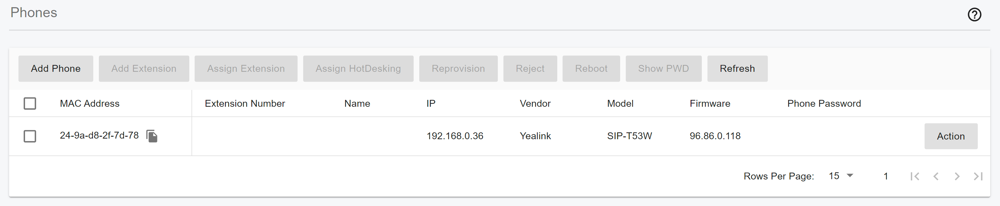
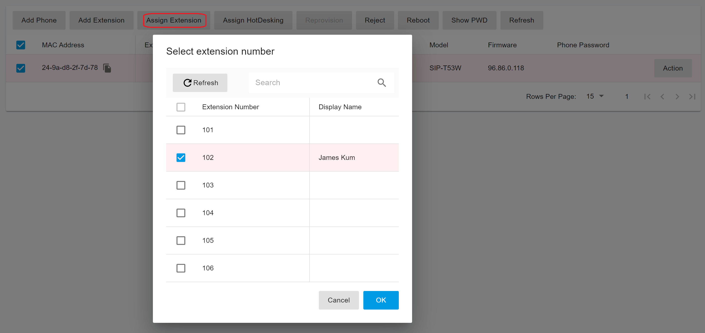

# Provision Phone Using PnP

## Topology

PnP provisioning requires that the PortSIP PBX run on the default sip port 5060 and that the IP phones reside on the same local LAN subnet as PortSIP PBX.

<figure><figcaption></figcaption></figure>

To auto-provision phones using Plug and Play:

1. Plug the phone into the network.
2. The phone will send a multicast message across the LAN, this will be picked up by PortSIP PBX.
3. The phone will show up in the **Call Manager > Phones** menu in the Web Portal as a new phone.

<figure><figcaption></figcaption></figure>

4. Choose the phone and click the **Assign Extension** button to assign the phone to an existing extension or click the **Add Extension** to create a new one for the phone.

<figure><figcaption></figcaption></figure>

5. Go to the extension’s **Phone Provisioning** tab and specify other configuration settings for the phone.
6. Enter the password to access the IP Phone web portal.
7. Select **Phone Display Language** and **Timezone** for the phone.
8. Click **OK.**
9. The PBX sends the configuration file URL to the IP Phone, the IP phone will download the configuration file automatically.
10. The phone will apply the settings and connect to PortSIP PBX. The IP phone will be manageable from within the PortSIP PBX Web Portal.

<figure><figcaption></figcaption></figure>

As shown in the screenshot above, you can set a password for the IP Phone web portal, and choose a network interface that the IP Phone can use to connect to PBX. This value usually refers to the **Outbound Proxy Server** for the IP Phone.&#x20;

<figure><figcaption></figcaption></figure>

As shown in the screenshot above, you can choose a **transport** that the IP Phone can use to connect to the PBX. The **Save to RPS** option indicates that you can save the provisioning link to the IP Phone RPS. The **HTTPS** option is used to generate the provisioning link for HTTPS or not.

### **Provision Phones Using the Provisioning Link Manually**

Remote phones that are not on the same LAN as the PortSIP PBX and that can't broadcast the SIP message then must be configured manually by the provisioning link. To provision a remote phone:

1. From the **Call Manager > Phones** menu in the PortSIP PBX Web Portal, select **Add Phone**.
2. Select the extension that the phone uses.
3. Enter the MAC address of the phone (which can be found at the bottom of the phone).
4. Select the appropriate phone model from the drop-down menu.
5. Select **Phone Display Language** and **Timezone** for the phone.
6. Enter the password for access the IP Phone web portal.
7. Click the **OK** button and then edit this extension.
8. Copy the provisioning link.
9. Insert the provisioning link manually into the phones. You can find it in the **Phone Provisioning** tab of the extension configuration.

Once the IP Phone is successfully provisioned, it will register to the PortSIP PBX automatically. You can see the phone in the below screenshot in the **Call Manager > Phones** menu.

<figure><figcaption></figcaption></figure>
