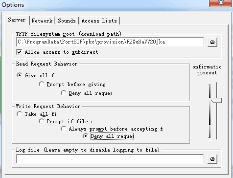

# Provision Phone Using TFTP

TFTP stands for Trivial File Transfer Protocol. It is mainly used for automated file transfers between machines on UDP Port 69. In a VoIP environment, TFTP is used to upload firmware files to Gateways, Phones, and other hardware.

## Install TFTP Server&#x20;

There are a lot of free and open-source TFTP servers available, such as tftp32d and PumpKIN. Download one and install it as needed.

## Configuring PumpKIN&#x20;

1. Launch PumpKIN.
2. From the PumpKIN menu follow to **Options > Server > TFTP file system root**. Point PumpKIN to the provisioning folder of your PortSIP PBX – by default:   **C:\ProgramData\PortSIP\pbx\provision\R2Xu8aVV20Jka.** Where **R2Xu8aVV20Jka** is the randomly generated provisioning folder name. This folder will be used to place files you need to upload via TFTP or download.
3. Other options can be set as needed. For example: **Read and Write Request Behavior** if you want a prompt before files are uploaded or downloaded. Change network ports, timeout, etc.
4. Now you have a TFTP server installed you can begin updating your phones, gateways, and routers as needed.

<figure><figcaption></figcaption></figure>

