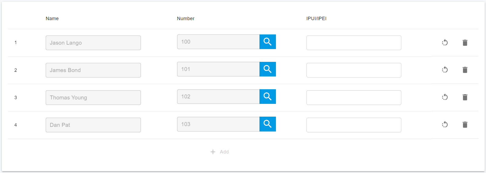
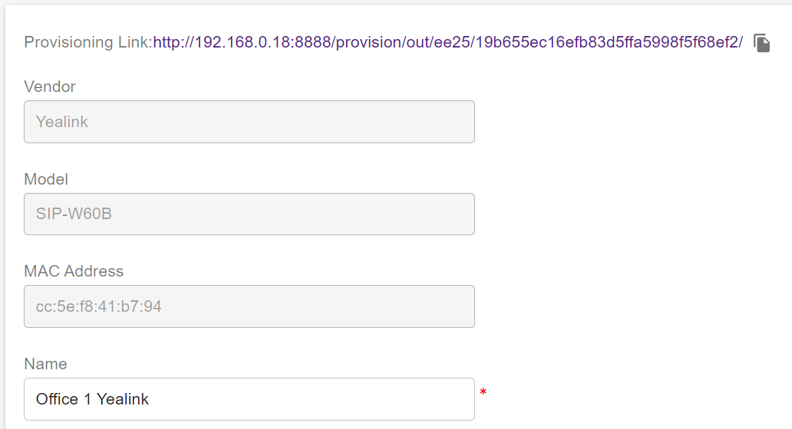

# Provision SNOM DECT IP Phones

From the v16.2 version, PortSIP supports the SNOM DECT IP Phones.

## Supported SNOM DECT IP Phone Models

This guide applies to the following models:

* M300
* M400
* M700
* M900

## Factory Reset the SNOM DECT System 

### Reset SNOM M300, M400, M700 and M900 base station to factory defaults 

1. Press and hold the **reset** key for at least 10 seconds.
2. After the base station restarts, it will be successfully reset.

### Reset SNOM M25, M65, M70, M80, M85, M90 handsets to factory defaults 

1. Press the **Menu** key.
2. Navigate to **Settings > Reset** settings, and select **Yes** to reset settings.
3. Enter the PIN **0000** and press **OK** to confirm.
4. After the handset restarts, your SNOM handset will be successfully reset.

## Upgrade the Base Station to the Latest Firmware 

Before you start provisioning your SNOM DECT phone with PortSIP PBX, make sure your DECT base is running the necessary firmware. Here’s how you can check and update the firmware of your SNOM DECT system:

1. Open your web browser and navigate to the IP address of your DECT phone. Log in to your account (the default username/password is admin/admin).
2. Go to **Home/Status > Firmware Version**. Compare the Version and Branch with the latest available firmware version for your DECT device.
3. Navigate to **Firmware Update**. In the:
   * &#x20;**Firmware update server address** field, enter http://dect.snom.com.&#x20;
   * **Required Version** field, enter the latest available firmware as per SNOM's support website. For instance, at the time of creating this guide, the latest firmware is **670** and the **Required branch** is **202** for the M900 base.
4. After entering a valid firmware number, click on **Save/Start Update**.
5. The firmware upgrade will begin after a few minutes. The LED on the base station will start flashing red to indicate the upgrade process.

Please note that the firmware upgrade process may take some time. Do not interrupt the process until the firmware upgrade is complete. If you encounter any issues, please refer to the troubleshooting section of the user guide or contact technical support.

Here also have the SNOM official guides:

* [How to update M300,M700,M900 DECT Base Station manually](https://service.snom.com/display/wiki/How+to+update+M300%2CM400%2CM700%2CM900+DECT+Base+Station+manually)
* [How to update M-Series - DECT handsets](https://service.snom.com/display/wiki/How+to+update+M-Series+-+DECT+handsets)

## Add a DECT Phone in PortSIP PBX

Please follow the below steps to add the DECT phone to the PortSIP PBX.

<figure><figcaption></figcaption></figure>

1. Sign in to the PortSIP PBX web portal and navigate to **Call Manager > DECT Phones** from the menu.
2. Click on the **Add** button. A popup window will appear.
3. In this window, select your phone model and enter the MAC address of the phone, then click the **OK** button.
4. Provide a user-friendly name for this DECT Phone.
5. In the **Network** field, select the network interface that the DECT Phone will use.
6. Choose the transport protocol that the phone will use to send and receive SIP messages with the PBX.
7. If your PBX has internet access, please enable the **Save to RPS** option.

## Assign Users to the Handsets 

1. Now you need to assign the users to handsets.
2. Click on the **Users** tab, and select the users for each handset.
3. If you want to limit the extension user use of the specified handset, please enter the IPUI/IPEI of the handset. Otherwise, leave it as empty.

<figure><figcaption></figcaption></figure>

## Auto Provision Handsets by RPS

If your PBX installation is in the cloud and you have turned on the **Save to RPS** to configure the DECT phone in the above steps**,** the DECT Phone will download the configuration file and provision handsets, the handsets of this DECT Phone station will register to the PortSIP PBX automatically.

## Provision Handsets Manually

If your PBX installation is on-premise without internet access or you turned off the **Save to RPS** option, you will need to follow the below steps to provision handsets:

1. Click the menu Call Manager > DECT Phones, and double the DECT phone.
2. Copy the provisioning link.

<figure><figcaption></figcaption></figure>

3. Enter the DECT Phone handset's IP address in the web browser and open it.
4. In menu Settings > Auto Provision > Server URL enter the provisioning link copied.
5. Press the **Confirm** button to save the link and then press the button **Auto Provision Now**.

### Only for Yealink W80 and W90 DECT Manager Base Stations


Please ignore this step if the device is not W80 and W90.


1. Open your web browser and enter the IP address of the Base Station. This will open the Base Station’s interface. Navigate to the **Base Mode** menu.
2. On the **Base Mode** page, input the IP address of the DECT Manager. After entering the IP address, click on the ‘Confirm’ button.

<figure><figcaption></figcaption></figure>

3. Open your web browser and input the IP address of the DECT Manager to access its interface.
4. On the **Base Station Registration** page, click the **Register** button next to the base you want to connect to your DECT Manager, then press **OK**.
5. Proceed to the **Base Station Settings** menu. You should now see the status of the base as **Active and synced**.

<figure><figcaption></figcaption></figure>

### Register the Yealink Handsets and Assign Users 

1. Open your web browser and input the device's IP address to access its interface.&#x20;
2. Navigate to the **Handset & Account** menu and select the **Handset Registration** page.&#x20;
3. You will see a list of all the user extensions that you assigned in the previous step **Assign Users to the Handsets**. Click the **edit** icon next to each extension to make changes.

<figure><figcaption></figcaption></figure>

4. Click on **Start Register Handset**.&#x20;
5. On your handset, either press the R**eg.** softkey for E**asy Pairing** or navigate to the **Settings** menu and select **Registration > Base 1**.&#x20;
6. From the scanning results list, select your base and enter the PIN **0000** when prompted.
7. &#x20;Repeat these steps for all extensions to which you wish to assign a handset.

