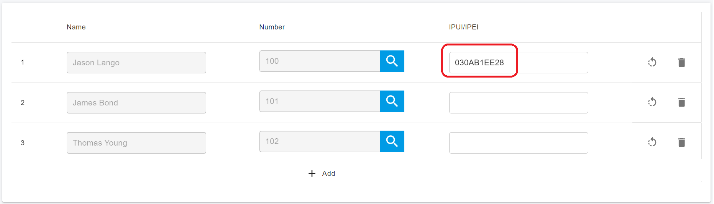

# Provision SNOM DECT IP Phones

From the v16.2 version, PortSIP supports the SNOM DECT IP Phones.

## Supported SNOM DECT IP Phone Models

This guide applies to the following models:

* M300
* M400
* M700
* M900

## Factory Reset the SNOM DECT System 

### Reset SNOM M300, M400, M700 and M900 base station to factory defaults 

1. Press and hold the **reset** key for at least 10 seconds.
2. After the base station restarts, it will be successfully reset.

### Reset SNOM M25, M65, M70, M80, M85, M90 handsets to factory defaults 

1. Press the **Menu** key.
2. Navigate to **Settings > Reset** settings, and select **Yes** to reset settings.
3. Enter the PIN **0000** and press **OK** to confirm.
4. After the handset restarts, your SNOM handset will be successfully reset.

## Upgrade the Base Station to the Latest Firmware 

Before you start provisioning your SNOM DECT phone with PortSIP PBX, make sure your DECT base is running the necessary firmware. Here’s how you can check and update the firmware of your SNOM DECT system:

1. Open your web browser and navigate to the IP address of your DECT phone. Log in to your account (the default username/password is admin/admin).
2. Go to **Home/Status > Firmware Version**. Compare the Version and Branch with the latest available firmware version for your DECT device.
3. Navigate to **Firmware Update**. In the:
   * &#x20;**Firmware update server address** field, enter http://dect.snom.com.&#x20;
   * **Required Version** field, enter the latest available firmware as per SNOM's support website. For instance, at the time of creating this guide, the latest firmware is **670** and the **Required branch** is **202** for the M900 base.
4. After entering a valid firmware number, click on **Save/Start Update**.
5. The firmware upgrade will begin after a few minutes. The LED on the base station will start flashing red to indicate the upgrade process.

<figure><figcaption></figcaption></figure>

Please note that the firmware upgrade process may take some time. Do not interrupt the process until the firmware upgrade is complete. If you encounter any issues, please refer to the troubleshooting section of the user guide or contact technical support.

Here also have the SNOM official guides:

* [How to update M300,M700,M900 DECT Base Station manually](https://service.snom.com/display/wiki/How+to+update+M300%2CM400%2CM700%2CM900+DECT+Base+Station+manually)
* [How to update M-Series - DECT handsets](https://service.snom.com/display/wiki/How+to+update+M-Series+-+DECT+handsets)

## Add a DECT Phone in PortSIP PBX

Please follow the below steps to add an SNOM DECT phone to the PortSIP PBX.

<figure><figcaption></figcaption></figure>

1. Sign in to the PortSIP PBX web portal and navigate to **Call Manager > DECT Phones** from the menu.
2. Click on the **Add** button. A popup window will appear.
3. In this window, select your phone model and enter the MAC address of the phone, then click the **OK** button.
4. Provide a user-friendly name for this DECT Phone.
5. In the **Network** field, select the network interface that the DECT Phone will use.
6. Choose the transport protocol that the phone will use to send and receive SIP messages with the PBX.

## Assign Users to the Handsets 

Next, you'll need to assign users to the handsets. Here's how you can do it:

1. Click on the **Users** tab.
2. For each handset, select the users you want to assign.
3. If you want to restrict a user to a specific handset, enter the handset’s IPUI/IPEI in the provided field. If you don’t want to impose any restrictions, leave this field empty.
4. Click the OK button to save the settings.

Remember, assigning users to specific handsets can help manage calls more effectively. However, be sure to double-check the IPUI/IPEI to avoid any mix-ups.&#x20;

<figure><figcaption></figcaption></figure>

## Removing the IPUI/IPEI for a User

If you need to remove a specific IPUI/IPEI for a user, please enter `FFFFFFFFFF` in the IPUI/IPEI field.

## Enter the Provisioning URL in the DECT Web UI

You will need to follow the below steps to provision handsets:

1. Click the menu **Call Manager > DECT Phones**, and double the DECT phone.
2. Copy the provisioning link.

<figure><figcaption></figcaption></figure>

3. Enter the DECT Base station's IP address in the web browser and open it.
4. In the menu **Management > Configuration > Configuration Server Address Settings**, enter the provisioning link copied.
5. Click the **Save and Reboot** button.

<figure><figcaption></figcaption></figure>

## Register the SNOM Handsets and Assign Users 

To register the handsets and assign them to users, follow the numerical order you established during the configuration process. Here are the steps:

1. Press the menu button on the handset. (For an M25 handset, press the center button of the navigation circle.)
2. Navigate to **Connectivity** from the menu and press the center button of the navigation circle.
3. Select **Register**.
4. When prompted for the **Access Code**, enter **0000** (four zeros) and press the **OK** button.
5. Once successfully paired, the handsets will automatically be assigned to the users.
6. Repeat these steps for each handset you wish to register to the base station.

## Upgrading SNOM Handsets Firmware 

To upgrade the device's firmware, the handset must be connected to the DECT base station as an extension. This step can only be performed after the base has been upgraded and provisioned, and the handsets have been paired. Here are the steps to check the firmware of your SNOM handset and perform the upgrade:

1. Press the **Menu** key on your handset.
2. Navigate to **Settings > Status > Handset status**.
3. The **SW version** indicates your device’s current firmware.
4. Open your web browser and navigate to your phone’s IP address.
5. Log in to your account (the default username is admin, and the password is that you set in the step [**Add a DECT Phone in PortSIP PBX**](provision-snom-dect-ip-phones.md#add-a-dect-phone-in-portsip-pbx)).
6. Navigate to the **Firmware Update** tab.
7. In the **Firmware update server address** field, enter [http://dect.snom.com](http://dect.snom.com). The model of the connected handset will be displayed in the **Type** field (for example, M70).

<figure><figcaption></figcaption></figure>

8. In the **Required Versio**n field, enter **670**, and in the **Required branch** field, enter the number of the latest firmware, which is 201.
9. After entering a valid firmware number, press **Start Updat**e.


Before performing the upgrade, ensure that the handset is placed in the charging cradle and is charged to over 50%.


