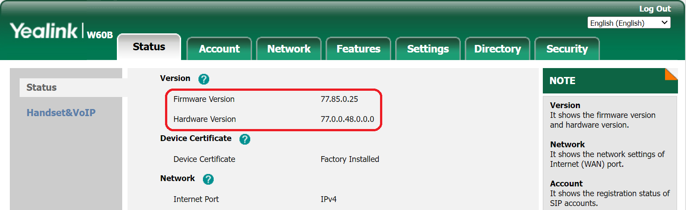
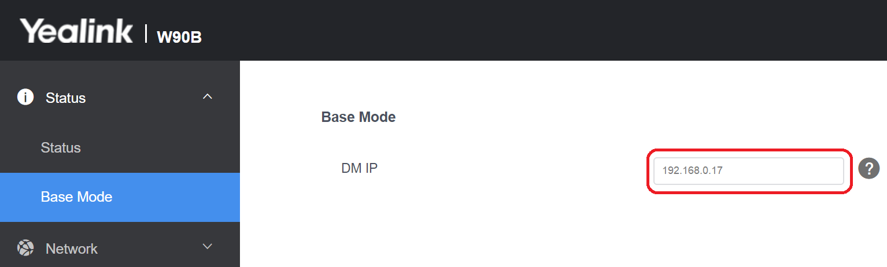

# Provision Yealink DECT IP Phones

From the v16.2 version, PortSIP supports the Yealink DECT IP Phones.

## Supported Yealink DECT IP Phone Models

This guide applies to the following models:

* W60B
* W70B
* W80B/DM
* W90B/DM

## Factory Reset the Yealink DECT System 

1. Hold the device button for at least 20 seconds.
2. Release the button.
3. The device will now proceed to reset and reboot.

You can also click the Reset To Factory Settings button to reset the system by navigating to the menu **Settings > Upgrade > Select and Upgrade Firmware.**

## Upgrade the DECT Base and Handsets to the Latest Firmware 

Ensure that the DECT device and handsets are running on the latest firmware. To check which firmware the phones are running:

<figure><figcaption></figcaption></figure>

You can follow the below steps to upgrade the firmware:

1. Access the [official Yealink website](https://www.yealink.com/en/solution-detail/resource-for-3cx) and then click **Software**. Select your phone model and download the latest Firmware image file.
2. Sign in to your Yealink DECT Manager web portal in the browser.
3. Navigate to **Settings > Upgrade > Select and Upgrade Firmware**.
4. Click **Browse** choose the firmware image file saved from the Yealink website, and press **Upgrade**.
5. If using the Yealink W80 or W90 repeat this step for all the Yealink Base Stations you will connect to the DECT Manager.

You can also upgrade the handset firmware in the same steps.

<figure><figcaption></figcaption></figure>

## Add a DECT Phone in PortSIP PBX

Please follow the below steps to add the DECT phone to the PortSIP PBX.

<figure><figcaption></figcaption></figure>

1. Sign in to the PortSIP PBX web portal and navigate to **Call Manager > DECT Phones** from the menu.
2. Click on the **Add** button. A popup window will appear.
3. In this window, select your phone model and enter the MAC address of the phone, then click the **OK** button.
4. Provide a user-friendly name for this DECT Phone.
5. In the **Network** field, select the network interface that the DECT Phone will use.
6. Choose the transport protocol that the phone will use to send and receive SIP messages with the PBX.
7. If your PBX has internet access, please enable the **Save to RPS** option.

## Assign Users to the Handsets 

Next, you'll need to assign users to the handsets. Here's how you can do it:

1. Click on the **Users** tab.
2. For each handset, select the users you want to assign.
3. If you want to restrict a user to a specific handset, enter the handset’s IPUI/IPEI in the provided field. If you don’t want to impose any restrictions, leave this field empty.

Remember, assigning users to specific handsets can help manage calls more effectively. However, be sure to double-check the IPUI/IPEI to avoid any mix-ups.&#x20;

<figure><figcaption></figcaption></figure>

## Auto Provision Handsets by RPS

If your PBX installation is in the cloud and you have turned on the **Save to RPS** to configure the DECT phone in the above steps**,** the DECT Phone will download the configuration file and provision handsets, the handsets of this DECT Phone station will register to the PortSIP PBX automatically.

## Provision Handsets Manually

If your PBX installation is on-premise without internet access or you turned off the **Save to RPS** option, you will need to follow the below steps to provision handsets:

1. Click the menu **Call Manager > DECT Phones**, and double the DECT phone.
2. Copy the provisioning link.

<figure><figcaption></figcaption></figure>

3. Enter the DECT Base station's IP address in the web browser and open it.
4. In the menu **Settings > Auto Provision > Server URL**, enter the provisioning link copied.
5. Press the **Confirm** button to save the link and then press the button **Auto Provision Now**.

### Only for Yealink W80 and W90 DECT Manager Base Stations


Please ignore this step if the device is not W80 and W90.


1. Open your web browser and enter the IP address of the Base Station. This will open the Base Station’s interface. Navigate to the **Base Mode** menu.
2. On the **Base Mode** page, input the IP address of the DECT Manager. After entering the IP address, click on the **Confirm** button.

<figure><figcaption></figcaption></figure>

3. Open your web browser and input the IP address of the DECT Manager to access its interface.
4. On the **Base Station Registration** page, click the **Register** button next to the base you want to connect to your DECT Manager, then press **OK**.
5. Proceed to the **Base Station Settings** menu. You should now see the status of the base as **Active and synced**.

<figure><figcaption></figcaption></figure>

### Register the Yealink Handsets and Assign Users 

1. Open your web browser and input the device's IP address to access its interface.&#x20;
2. Navigate to the **Handset & Account** menu and select the **Handset Registration** page.&#x20;
3. You will see a list of all the user extensions that you assigned in the previous step **Assign Users to the Handsets**. Click the **edit** icon next to each extension to make changes.

<figure><figcaption></figcaption></figure>

4. Click on **Start Register Handset**.&#x20;
5. On your handset, either press the R**eg.** softkey for E**asy Pairing** or navigate to the **Settings** menu and select **Registration > Base 1**.&#x20;
6. From the scanning results list, select your base and enter the PIN **0000** when prompted.
7. &#x20;Repeat these steps for all extensions to which you wish to assign a handset.

