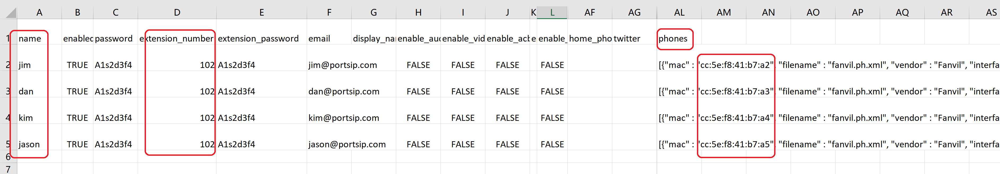

# Zero Touch Provisioning Phones

Zero Touch Provisioning (ZTP) is a feature that enables IP phones or devices to self-configure straight out of the box, eliminating the need for manual configuration via the phone interface.

IP phones are shipped directly to users from the factory. Each phone or device has a unique MAC address, which allows the PortSIP PBX to automatically associate the unique MAC address with the phone configuration file URL and store it in the vendor’s RPS server.

Once your phone is plugged in and online, it retrieves the configuration URL from the phone vendor’s RPS server by its MAC address, then redirects to your PortSIP PBX, and begins downloading its configuration.

## Working Principle

* The process begins when the **PBX service provider** places an order with the I**P Phone seller**. The seller then dispatches the IP Phone to the **end users** via courier services like DHL/FEDEX, and also sends the Phone MAC addresses to the **PBX service provider**.
* The **PBX service provider** then creates multiple users and configures the IP Phones with the MAC addresses by importing a CSV file, making the process straightforward and efficient. The PBX then writes these Phones' MAC addresses and configuration file URLs into the IP Phone vendor’s RPS server.
* When the **end users** receive the IP Phone and connect it to the internet, the phone will automatically reach out to the vendor’s RPS server to retrieve the configuration file URL. It will then download the configuration file from PortSIP PBX and register itself to the PortSIP PBX automatically. This way, all users and phones are provisioned seamlessly!

To use the zero-touch feature and get your IP phones up and running with minimal effort, follow the below instructions.

## Prerequisites

In this example, we assume will use the zero-touch provisioning for 5 IP Phones, the model is **Fanvil X303**, these 5 phones are shipped to the users, and we have all these 5 phones' MAC addresses, they are:

* CC-5E-F8-41-B7-A1
* CC-5E-F8-41-B7-A2
* CC-5E-F8-41-B7-A3
* CC-5E-F8-41-B7-A4
* CC-5E-F8-41-B7-A5

## Export a Template File

Please follow the below steps:

### Create a user with phone provisioning information for the template

1. Create a user with the IP Phone by selecting the menu **Call Manager > Users**, and clicking the **Add** button.&#x20;
2. Enter the **username**, **password**, **email**, and **extension number**, **extension password**, then click the **PHONE PROVISIONING** tab.
3. On the **PHONE PROVISIONING** tab, click the **Add Phone** button, and select the Phone model, in case is **Fanvil X303**, enter the phone's MAC address, in case is **CC-5E-F8-41-B7-A1**.
4. Configure the necessary parameters for this phone, and please pay attention to the **Network** combobox, please choose the appropriate network interface, if the PBX is on the internet, you will need to choose the **Web Domain** or **Public IPv4** here, if you have a PortSIP SBC configured, you can also choose the **SBC base domain or IP address**.
5. Choose the appropriate transport for the IP Phone that will used to register to PBX.
6. Ensure the **Save to RPS** is turned on.
7. Click the **OK** button to save the changes.

### Export the user as a template file

1. Selecting the menu **Call Manager > Users,** click the **Export** button to export the user with Phone information in a CSV file.

## Edit the template file

1. Open the CSV file, there is a line of the user you created, change the **name**, **password**, **extension number**, e**xtension password**, and IP Phone **MAC address** to **CC-5E-F8-41-B7-A2** for the second user.
2. Copy the lines for the other three users, and change the **name**, **password**, **extension number**, e**xtension password**, and IP Phone **MAC address** for every user (please don't include the information for user and phone MAC address **CC-5E-F8-41-B7-A1 since it is already in the PBX)**.  Please see the below screenshot:

<figure><figcaption>
Copy users and change the name, password, extension number, extension password, and phone MAC address
</figcaption></figure>


You can use the same password and extension password for all users without modifying them, but this is not recommended.


## Import the users with phone information

1. Selecting the menu **Call Manager > Users,** click the **Import** button to import the user with Phone information to PortSIP PBX.
2. After successfully importing the users, the PortSIP PBX writes the IP Phone configuration URL to the IP Phone RPS server. After successful import, PortSIP PBX will write the IP Phone configuration URL to the IP Phone RPS server.
3. When the user receives the IP Phone and connects it to the internet, the phone will automatically reach out to the vendor’s RPS server to retrieve the configuration file URL. It will then download the configuration file from PortSIP PBX and register itself to the PortSIP PBX automatically. This way, all users and phones are provisioned seamlessly!

Please also reference the article [Bulk Importing Users and Auto Provisioning IP Phones](bulk-importing-users-and-auto-provisioning-ip-phones.md).

