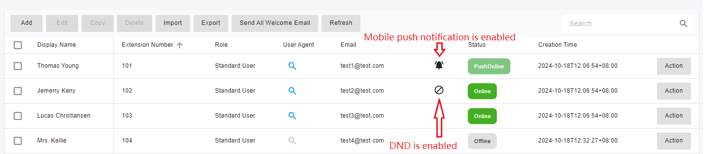

# Users

This section explains how to create and configure extensions in PortSIP PBX. There are multiple methods to create an extension.

* When provisioning a new phone, you could choose to create a new extension for that phone.
* Extensions can be manually created from the left menu: **Call Manager > Extensions**.
* Extensions can be imported from the `.csv` file.
* Create the extension by calling the REST API.
* Create the extension by copying from an existing extension.

To configure an extension,

1. Sign in to the PortSIP PBX Web Portal by **System Admin** credentials, click the menu **Tenants**, select a tenant then click the **Manage** button to manage this tenant, or sign a user who has the `Tenant Admin` permission into the Web Portal to manage that tenant.&#x20;
2. Click on the left menu option **Call Manager > Extensions** in the PortSIP PBX Web Portal. Click on **Add** to create a new one, or select an existing extension and click the **Edit** button to configure or manage the existing extension users.

## User

Enter the **Username** and **Password** in the section **User**. Please keep in mind this username and password are only for access to the PBX Personal Web Portal. In case assume we create a user whose user name is **jamesbond.**

The user can grant permissions by selecting a role from the **Role** list box; the **User** role indicates that the user has typical extension access; the **Admin** role indicates that the user is a tenant administrator who can manage the tenant through the web portal.

If a user has the **Admin** role, we refer to him as a **Tenant Admin**. A tenant admin has ability to manage the tenant which it belongs.

The PortSIP PBX allows adding more than one administrator to a tenant.

The **Email** field is mandatory since the PBX will need to send the notification email to the user's email address.

The **Display Name** is the full name of the user, like **James Bond**.

After creating a user, that user can sign in to the Personal Web portal entering the **Username**, **Password**, and tenant's **SIP domain**.

Please refer to the below screenshot, which shows that the user of a tenant signs in to the web portal, just enter the tenant's SIP Domain and click the **Next** button.

<figure><figcaption></figcaption></figure>

If the SIP domain you entered is correct, you will see the below screenshot to allows you enter the username and password otherwise you will get an error.

<figure><figcaption></figcaption></figure>

## Extension

The extension number and password are mandatory fields that must be filled in under the **Extension** page.

If the tenant's SMTP server is configured, once an extension is successfully created, a welcome email will be sent to the user's email address with details about the newly created extension and PBX parameters such as the PBX SIP domain, the PBX IP, and the QR code. The PortSIP UC App can be used to scan the QR code and register to the PBX without having to enter any information manually.

There is a QR code for this extension; instead of entering the information manually, you can save the QR code and use the PortSIP App to scan the QR code to sign in to the PBX.

The **Preferred transport for QR code** list box allows you to specify the preferred transport for the QR code; when registering PBX by scanning the QR code, the PortSIP App will prioritize the preferred transport.

The **Generate QR code with the below network interface** option allows you to specify the "**outbound proxy server"** address for the client app when it scans the QR code to register to the PBX.

You can select a DID from the trunk and trunk DID pool for the extension in the **Outbound Caller ID** section; when the extension makes an outbound call to a trunk, the **Outbound Caller I** will be presented in the **From** header of the INVITE SIP message.

As shown in the screenshot below, if the call is made over trunk 1, the **Outbound Caller ID** will be **022000**, and if it is made over trunk 2, the **Outbound Caller ID** is **88010**.

<figure><figcaption></figcaption></figure>

* Record audio calls: If this option is selected, any audio calls with this extension audio calls will be recorded as audio files.
* Record video calls: If this option is selected, any video calls with this extension will be recorded as video files, and any video calls will be recorded as video files (MP4).
* Always make outbound anonymous calls: When this option is enabled, the user part of the "**From**", "**P-Asserted-Identity**", and "**P-Preferred-Identity**" headers in the **INVITE** message sent to the trunk will be set to "**anonymous**".
* Always deliver outbound caller ID: If you enable this option, the **Outbound Caller ID** will always be set as the user part of the **From** header in the INVITE delivered to the trunk.

## Forwarding Rule

Each extension can have a set of call forwarding rules that define what PortSIP PBX should do when the extension user is unable to answer an incoming call. This can be configured using the following criteria.

* The user’s status
* The time

Each status requires a call-forwarding rule. For example, if the user is unable to take a call whilst their status is "**Available**", the call can forward to voicemail or to the mobile phone number / Landline.


Forwarding the call to a certain mobile number requires the trunk and outbound rule configured.


The forwarding rules have the following optional values:

* Forward to voicemail: The call will be routed to the voicemail service so that the caller can leave a voice message. There is an option to select an extension number for the voicemail box. For example, if you select extension 108, the voicemail will be saved in the 108's mailbox; if you leave it blank, the voicemail will be saved in the extension's own mailbox.
* Forward to number: permits you to enter a number and then forward the call to that number; the number can be an extension number or system extension number(ring group, virtual receptionist, meeting number, queue number) or a PSTN phone number.
* Hangup: The call will be terminated by the PBX.
* Ring anyway: send the call to this extension anyway.
* Exceptions: you can create exception rules for an extension by entering the caller ID, selecting the time shifts in the **Received During** field, and choosing the desired action in the **Forward To** field. If a call matches one of the exceptions, it will be rerouted according to that exception rule and the extension’s normal forwarding rules will be bypassed.

## Voicemail

The **Voicemail** page allows you to specify the extension's voice mail preferences (including the voicemail PIN number for authentication), enable or disable PIN Authentication, and enable PortSIP PBX to read out the message's date and time.

The **Greetings for Voicemail** section allows you to configure your voicemail greetings.

Click the "**+**" button to upload the new greeting file, and click the **Lock** icon to specify it as a greeting file.

## Office Hours

The Office Hours Scheduling feature allows a user’s status to be changed on the basis of global office hours or specific office hours.

Choose whether the extension will use **Global Office Hours** or **Specific Office Hours**. Select the **Use Specific Office Hours** option to set specific office hours, and that allows the creation of different office hours for each day.

The time shift **00:00-23:59** indicates that the entire day is open for business, whereas **00:00-00:00** indicates that the entire day is closed.

For more details about the Office Hours and Holidays, please read the [Office Hours and Holiday Schedule](../office-hours-and-holiday-schedule/).

## Phone Provisioning

The **Phone Provisioning** tab allows you to add or edit the settings of phones linked to this extension. The management of IP phone settings is discussed in the section [**4 Phone Device Management**](../4-phone-device-management/).

## BLF

You can configure the BLF lights on an IP phone in this tab.

Match a BLF button with an extension, so that this button will show the status of that extension. The number of available BLF buttons varies per phone. The following options are available for BLFs.

* BLF: shows the dialog status of another extension
* Visual Park: the unique park feature that PortSIP PBX offered, get more details in the article [Call Parking](../14-call-parking/).
* Speed Dial: link to a phone number for easy calling
* Custom Speed Dial
* Change Status

## Balance

The balance for an extension can be recharged by the tenant administrator. When billing is enabled, the call will fail if the balance is insufficient.

## Extension Status

We can see the extension status in the list by selecting **Call Manager > Users** from the menu. The extension's current status is indicated in the **Status** column. The alarm icon indicates that an extension has enabled push notifications successfully; the blocked icon indicates that the extension has enabled DND.

<figure><figcaption></figcaption></figure>

You can click on the search icon to check an online extension's device details.

As shown in the below screenshot, extension 102 is registered from a PortSIP UC client (IP is 192.168.0.22, the port is 5960 over the UDP transport), and the Yealink T53 IP Phone (IP is 192.168.0.36, the port is 5060 over the UDP transport).

<figure><figcaption></figcaption></figure>

## Register the Client App and IP Phone to PBX

Please read this article to learn how to register the client app and IP Phone to the PortSIP PBX: [How to Configure the Endpoints?](how-to-configure-the-endpoints.md)

