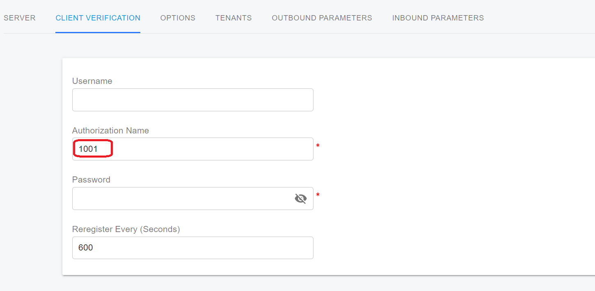
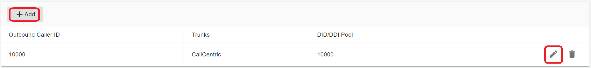

# Handle Outbound Calls Through SIP Trunk

This topic describes how PortSIP PBX handles outbound calls through a SIP trunk. Specifically, the INVITE message structure and how the SIP field values are populated.

## **DID Pool**

Please read [What is Direct Inward Dialing (DID)](../../faq/what-is-direct-inward-dialing-did.md)? to understand the DID concept.

Since the PortSIP PBX is a multi-tenant PBX, if more than one tenant sets up the SIP trunk from the same trunk provider in the PBX, and sets the same DID number for the inbound rules, when a call is arriving at the PBX by dialing the DID number, the PBX does not know which tenant should route the call to; and when an extension of a tenant makes the call to the trunk, setting the outbound caller ID, which belongs to another tenant, will cause problems there.

To avoid the problems above, PortSIP PBX introduced the **DID Pool** concept.

### Trunks Added by System Admin

Once a tenant was assigned with the trunk by the **System Admin**, the **System Admin** must set up a DID pool for that tenant, the DID pool number cannot overlap with other tenants' DID pools. When a tenant creates the inbound rule based on an assigned trunk, the tenant can only use the DID number from the DID pool.

### Trunks Added by Tenant Admin

If a **Tenant Admin** adds a trunk for himself, a DID pool must be specified for that trunk. When creating the inbound rule for this tenant based on this trunk after it was added, the DID number used must be in this DID pool range. The DID pool number cannot overlap with the same trunk provider.

Tenant A, for example, adds a trunk of the **trunk provider XYZ** and sets the DID Pool to 1000-2000; Tenant B also adds a trunk of the same **trunk provider XYZ** and sets the DID Pool to 2000-3000; This will fail because the DID Pool number of the same trunk is overlapping; when a call to number 2000 is incoming, the PBX does not know which tenant should route the call to.

The DID pool allows a single number or a number range as below:

* 1000-2000
* 282556000-282556900
* 101;203;300-450


The DID number and DID number range cannot begin with "**+"**, "**0"**, or "**00"** when setting into the DID Pool for a tenant; if your DID number or DID number range begins with "**+"**, "**0"**, or "**00"**, please remove it before entering.



## Structuring the INVITE Message

The values that PortSIP PBX sends in outgoing INVITE messages can be configured in the SIP trunk settings on the **Outbound Parameters** page. From here, you can set what values will be placed in each SIP field, but this will be explained later in more detail.

The base INVITE message PortSIP PBX sends when making an outgoing call through a SIP Trunk looks like this:

```log
INVITE sip:88888888@pstn.twillio.com:5060 SIP/2.0
Via: SIP/2.0/UDP 192.168.0.11:5060;branch=z9hG4bK-524287-1---39f4bc06b915b70f;rport
Max-Forwards: 19
Contact: <sip:101@192.168.0.11:5060;ob>
To: <88888888@pstn.twillio.com>
From: <sip:101@sip.portsip.io>;tag=35c2342b
Call-ID: DSSzmYKnCwhMeB1TWUwv2A..
CSeq: 1 INVITE
Session-Expires: 300
Min-SE: 90
Accept-Language: en
Allow: REGISTER, INVITE, ACK, CANCEL, OPTIONS, BYE, REFER, NOTIFY, SUBSCRIBE, UPDATE, INFO, MESSAGE, PUBLISH
Content-Type: application/sdp
Supported: replaces, norefersub, tdialog, join, timer
User-Agent: PortSIP UC - Call Manager 16.0.0.302
X-CID: QERh8-brREchTYRqTSTALQ..
X-Session-Id: 678271070897180672
X-Trunk-Name: CallCentric
Content-Length: 361
```

## Configurable SIP Fields <a href="#h.rhrzb9hdve5w" id="h.rhrzb9hdve5w"></a>

PortSIP PBX does not allow full customization of the INVITE, so its base structure always needs to contain the SIP fields shown above.&#x20;

PortSIP PBX enables the following fields to be configured:

* Request Line URI : User Part&#x20;
* Request Line URI : Host Part&#x20;
* Contact : User Part&#x20;
* Contact: Host Part&#x20;
* To : Display Name&#x20;
* To : User Part&#x20;
* To : Host Part&#x20;
* From : Display Name&#x20;
* From : User Part&#x20;
* From : Host Part&#x20;
* Remote Party ID - Called Party : Display Name&#x20;
* Remote Party ID - Called Party : User Part
* Remote Party ID - Called Party : Host Part&#x20;
* Remote Party ID - Calling Party : Display Name&#x20;
* Remote Party ID - Calling Party : User Part&#x20;
* Remote Party ID - Calling Party : Host Part&#x20;
* P-Asserted Identity : Display Name&#x20;
* P-Asserted Identity : User Part&#x20;
* P-Asserted Identity : Host Part&#x20;
* P-Preferred Identity : Display Name&#x20;
* P-Preferred Identity : User Part&#x20;
* P-Preferred Identity : Host Part&#x20;
* P-Called-Party-ID : Display Name&#x20;
* P-Called-Party-ID : User Part&#x20;
* P-Called-Party-ID : Host Part
* Privacy Types Supported

## Variables <a href="#h.d7pw10ze1a4e" id="h.d7pw10ze1a4e"></a>

The variables briefly described below can be assigned to each of the SIP Fields mentioned in the section [Configurable SIP Fields](handle-outbound-calls-through-sip-trunk.md#h.rhrzb9hdve5w).

### **AuthID**

The value of the AuthID variable is derived from the **Authentication ID** field in the menu **Call Manager** > **Trunks** >  Edit Register Based Trunk > **Client Verification** tab >  **Authentication Name** (aka SIP user ID).&#x20;

This variable is only valid for the **Register Based Trunk** and **Accept Register Based Trunk**.

<figure><figcaption></figcaption></figure>

### CalledNum&#x20;

The **CalledNum** variable contains the dialed/destination number the INVITE message is supposed to initiate the call.

### CallerNum

This variable refers to the user part of the SIP **To** header.

### CallerDispName

If an extension user registered with PortSIP PBX makes a call to an external number and sends a value in the **From : Display Name**, PortSIP tries to maintain this value when constructing the INVITE to be sent to the SIP Trunk. If the endpoint doesn't use the display name, then PortSIP PBX will use the name of the extension for this variable.

### OriginatorCallerID

The **OriginatorCallerID** variable attempts to use the original number of the Caller, even if that number has not originated from the PortSIP PBX.

If an extension user registered to PortSIP PBX uses the anonymous dial code to make an outbound call, this variable will be populated with the value **anonymous**.

### Anonymous

When the PBX sends the call to the trunk, this variable will be populated with the value **anonymous**.

### Custom Field&#x20;

Choosing this as a variable will allow you to enter a value manually.

### TrunkHostPort

This variable is the combined value of the **Host Domain or IP or IP** and **Port** fields in the **Trunks** > Edit SIP Trunk > **Server** tab.

### OutHostPort

This variable is the combined value of the **Outbound Proxy Server** and **Outbound Proxy Server Port** fields in the **Trunks** > Edit SIP Trunk > **Server** tab.

### ContactUri

The "**ContactUri**" variable value containing the IP and port on which a SIP Trunk should contact PortSIP PBX, is typically used to populate the **Contact : Host Part**. The port is always the port of PortSIP transport.

### OutboundCallerId

During an outbound call, the PBX will check for an Outbound Caller ID in some different locations with descending priority. The highest priority is the **Outbound Caller ID** field that can be set in extension settings.

Click the menu **Call Manager** > **Users** > Edit User > **Extension** tab, and in the **Outbound Caller ID** section, we can set up the outbound caller ID for the user.

The outbound caller ID must be in the trunk's DID pool range, and the DID number can be started with "+", "0", "00", or "+00".

<figure><figcaption></figcaption></figure>

As described in the [User Groups](../5-user-management/user-groups.md) section, we can create a user group, add users as group members, and assign DID numbers to the group. If an outbound rule was created with the caller user group criteria ("Calls from user groups" option in the outbound rule) and the group member's outbound caller ID is empty, the PBX uses the outbound caller ID from the group to which the caller belongs when the group member makes the outbound call using this outbound rule.

If the user's outbound caller ID and the user group outbound caller ID both are empty or the outbound rule is without the user group criteria, then the outbound caller ID is taken from the company's outbound caller ID settings. Click the menu **Company**" > "**Outbound caller ID,** you can set the outbound caller ID for the tenant scope (Company).

In summary, when making an outbound call to a SIP trunk, the outbound caller ID will be applied in the following priority order:

1. If the caller extension has set up the outbound caller ID, the PBX will use that ID to overwrite the FROM header as settings.
2. If the caller extension’s outbound caller ID is empty, the PBX will use the outbound caller ID of the outbound rule to overwrite the FROM header as settings.
3. If the outbound rule has not set up the outbound caller ID, but that rule has set up the user group, and that user group has the outbound caller ID set up, the PBX will use the outbound caller ID of the matched user group to overwrite the FROM header as settings.
4. If none of the above outbound caller IDs are set up, the PBX will use the company’s outbound caller ID to overwrite the FROM header as settings.

## Outbound Caller ID for PBX Service

You can configure the outbound caller ID for system services such as Virtual Receptionist, Call Queue, Ring Group, and Meeting in PortSIP PBX.

When a call is not answered by call queue/ring group agents or fails/times out in the virtual receptionist, it may be re-routed to the trunk; similarly, when a meeting invites an external number to join the meeting by calling the trunk, the outbound caller ID will be taken from their outbound caller ID settings; if no outbound caller ID is set up for these services, the company's outbound caller ID will be taken.

## Bypass the Outbound Caller ID Settings

PortSIP PBX also allows you to bypass the PBX Outbound Caller ID settings and use the caller device to specify the outbound caller ID—just add a SIP header into the INVITE message.

If you add the **X-Outbound-Cli** SIP header to the INVITE message when making a call to the PBX, once the PBX receives the call from the client app/device, the PBX will rewrite the INVITE message before sending it to the trunk.

```
X-Outbound-Cli: rewrite-from=123
```

When making calls to the PBX, including the above header in the INVITE message causes the PBX to rewrite the username in the **From** header to **123** when sending the INVITE to the trunk.

```
X-Outbound-Cli: rewrite-pai=456
```

When making calls to the PBX, including the above header in the INVITE message causes the PBX to add the "**P-Asserted-Identity**" SIP header and set the username to **456** when sending the INVITE to the trunk.

```
X-Outbound-Cli: rewrite-rpi=789
```

When making calls to the PBX, including the above header in the INVITE message causes the PBX to add the "**Remote-Party-ID**" SIP header and set the username to **789** when sending the INVITE to the trunk.

If you want to rewrite the above headers only on a specific trunk, you can use the parameter below.

```
X-Outbound-Cli: rewrite-from=123;trunk-name:abc
```

```
X-Outbound-Cli: rewrite-from=123;rewrite-rpi=789;rewrite-pai=456;trunk-name:abc;
```

When the above header is added, the PBX will rewrite the headers when sending the INVITE to the trunk named **abc**; if no **trunk-name** parameter is specified, the PBX will rewrite the INVITE message on any trunk that the call is routed through.


When using the "X-Outbound-Cli" header to bypass the PBX outbound caller ID settings, the specified outbound caller ID must be in the trunk DID Pool range assigned to the tenant.


## Remove the SIP Header

PortSIP PBX  support allows you to remove the following SIP headers when sending the SIP message to the SIP trunk:

* P-Asserted-Identity
* P-Preferred-Identity
* P-Called-Party-ID

Simply set up the SIP headers as shown in the following screenshot and the headers will be removed.

<figure><figcaption></figcaption></figure>

## Privacy Types Supported

The PortSIP PBX supports the following Privacy types:

* user: user-level privacy function provided. Any non-essential informational headers are removed, including the Subject, Call-Info, Organization, User-Agent, Reply-To, and In-Reply-To. Possibly the original value of the From header is changed to anonymous.
* header: headers that cannot be set arbitrarily by the user (Contact/Via) are modified. No unnecessary headers that might reveal personal information about the originator of the request are added. (The values modified must be recoverable when further messages in the dialog need to be routed to the originator.)
* id: third-party asserted identity kept private with respect to SIP entities outside the trust domain with which the user authenticated.
