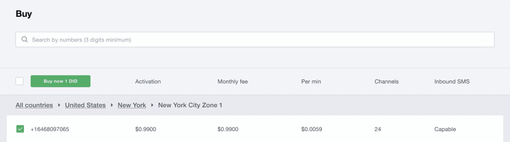
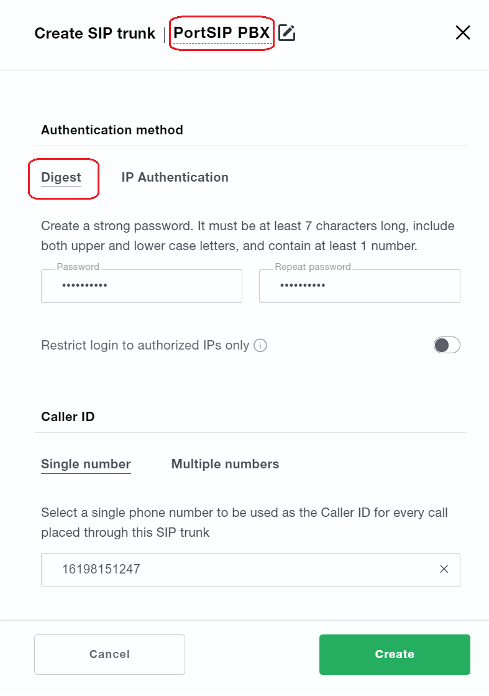

# Set Up Wavix SIP Trunk


This guide is only applicable for the PortSIP PBX v22 or higher.


Wavix is a SIP trunk provider, it provides a robust set of calling, SMS/MMS features, and reliability that enhances your communications.

One of the primary advantages of trunking with Wavix is its greatly expanded geographic reach. Wavix provides connectivity across 170+ countries, allowing you to make and receive calls around the world. Your callers and customers worldwide can connect with your business at local rates.

PortSIP PBX integrated the Wavix SIP trunking that allows you to set up easily.

## Purchase a DID on the Wavix platform

Before placing or receiving a call, you need to have an active DID or a dozen DID numbers on your Wavix account. If you already have an active number on your Wavix account, the below steps are optional.

To purchase a DID on your Wavix account:

1. Log in to your account
2. Click on **Buy** under **Numbers & trunks** in the top menu
3. Select a country and region you wish to purchase a DID in
4. Choose a specific number or numbers and click the **Buy Now** button
5. You will be redirected to the Cart where you can confirm your choice and check out the DID(s).

<figure><figcaption>
Search and buy a number
</figcaption></figure>


Some DIDs may require proof of local address and other documents before they can be activated. To enable these DIDs to receive inbound calls, upload the documents required, and wait until they are approved by the Wavix Number Provisioning team.


## Create a SIP Trunk on the Wavix platform

To create a new SIP trunk on the Wavix platform

1. Select **Trunks** under **Numbers & trunks** in the top menu
2. Click the **Create new** button
3. Select **Digest** or **IP Authentication** under the **Authentication method**

### Digest

If selected **Digest**, specify the SIP trunk name, set SIP trunk password, and select one of the DIDs on your account as Caller ID.

<figure><figcaption>
Configure SIP trunk
</figcaption></figure>

### IP Authentication

If select IP Authentication,

After the SIP trunk is successfully created, it will appear on the list of SIP trunks on your account.

<figure><figcaption>
List of SIP trunks and SIP trunk ID
</figcaption></figure>


Please be advised that your 5-digit SIP trunk username is generated automatically and displayed in the SIP trunk ID column.


