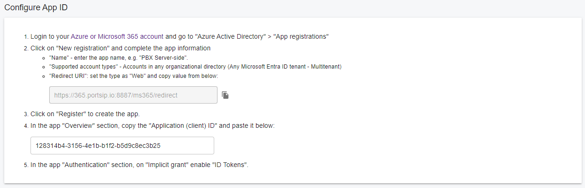
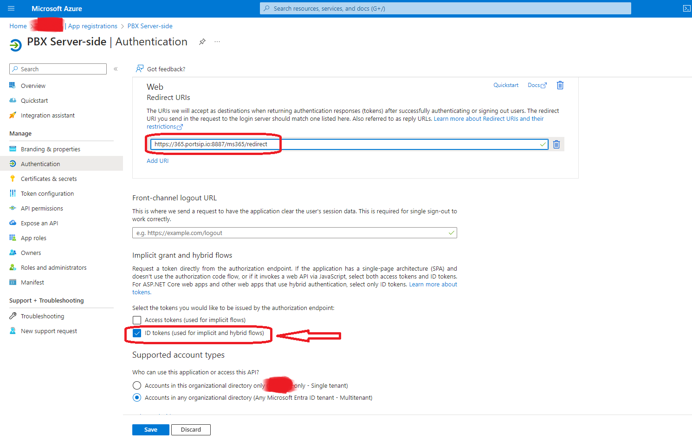
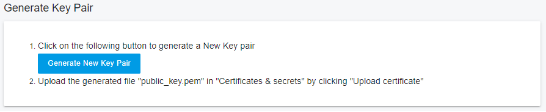
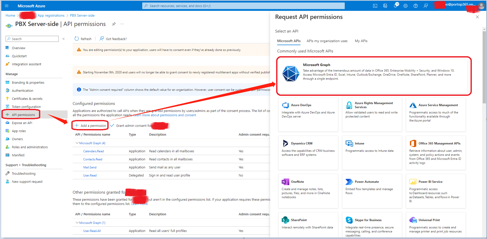
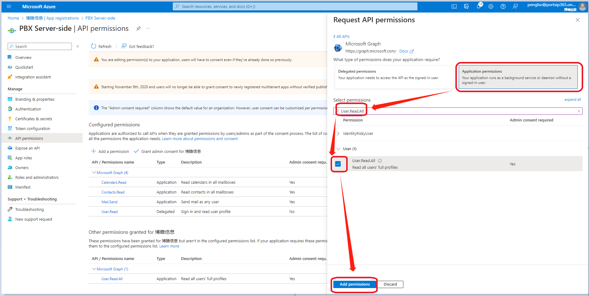
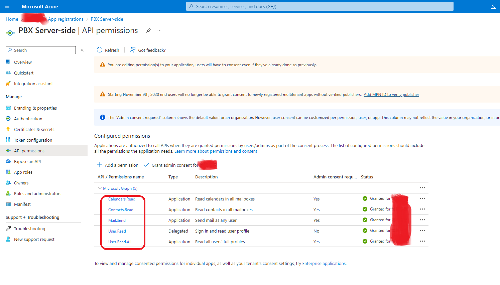
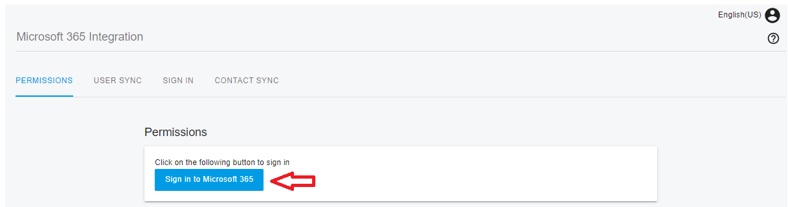
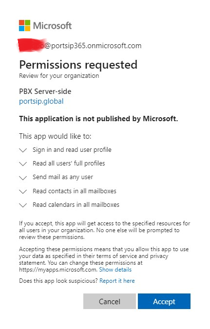
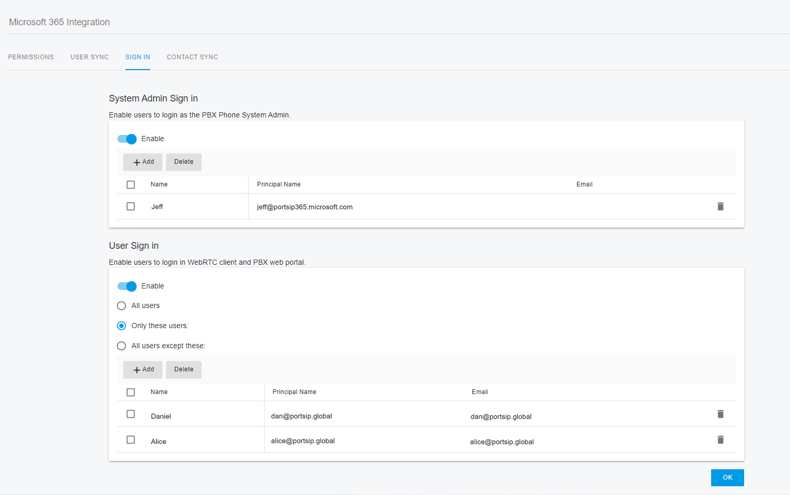
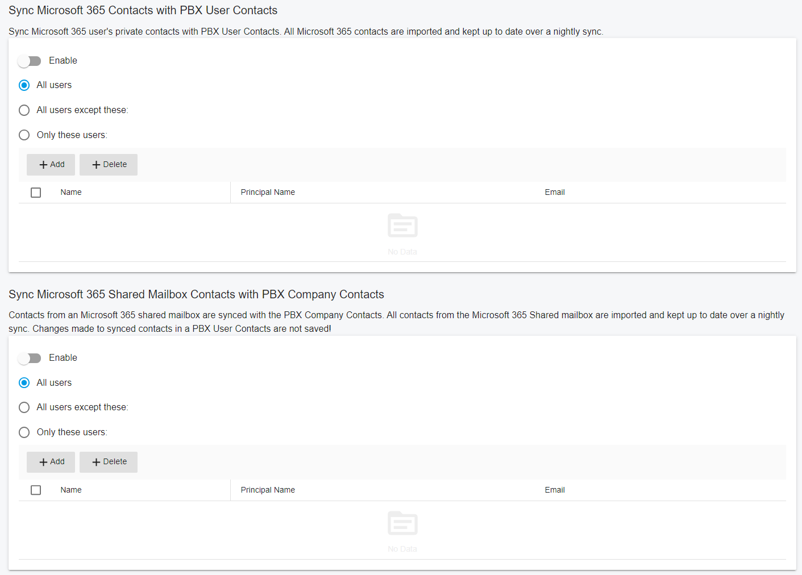

# Microsoft 365 Integration

The PortSIP PBX integrates with Microsoft 365 to provide the following features:

* Synchronous user accounts from Microsoft 365 or Azure Active Directory (Local Active Directory synced to the cloud using Azure Connect).
* Allow users to use their Microsoft Account to log in to the PortSIP WebRTC Client.
* Microsoft 365 Users' personal contacts are synchronized with the PortSIP PBX user's personal contacts.
* Shared mailbox contacts are synchronized with the PortSIP PBX Company contacts.

## Pre-Requisites 

* You need PortSIP PBX running on a static public IP address.
* A web domain (which is FQDN) in PortSIP PBX with a valid SSL certificate. The certificate should be issued by a trusted certificate provider such as Digicert, Thawte, Godaddy, etc. You can read this [article ](certificates-for-tls-https-webrtc/)to configure the SSL certificate.
* Requires the PBX tenant who wants to enable the Microsoft 365 integration to have Microsoft 365 Accounts with an Exchange subscription plan:
  * Microsoft 365 Business Basic, Standard, or Premium
  * Microsoft 365 F3, E3 or E5

## Configuring Microsoft 365 Access 

### Configure the App ID for the Tenant

The tenant needs to be configured AZURE or Microsoft 365 account to allow synchronization with PortSIP PBX.&#x20;

1. Sign in to your [Azure or Microsoft 365 account](https://portal.azure.com/).
2. Click the **Microsoft Entra ID** icon, select the left menu **App registrations,** and click **New application.**
3. Enter a friend name for the Name for example: **PBX Server-side**.
4. Supported account types: choose Accounts in this organizational directory only (PortSIP Solutions, Inc. only - Single tenant)
5. Sign in to the PortSIP PBX web portal as the Tenant Administrator (or switch to the tenant scope from the PBX System Administrator).
6. Select the menu **Advanced > Microsoft 365 Integration,** and **c**opy the **Redirect URI.**

<figure><figcaption></figcaption></figure>

7. Paste the redirect URI to MS 365 and save.

<figure><figcaption></figcaption></figure>

8. Copy the **Application (client) ID** from Microsoft 365.

<figure><figcaption></figcaption></figure>

9. Paste the **Application (client) ID** to the PBX.

<figure><figcaption></figcaption></figure>

9. Enable **ID Tokens** as the guide in Microsoft 365.

<figure><figcaption></figcaption></figure>

6. Schedule a time for the PBX system to synchronize with Microsoft 365 users. By default, this is set to occur at midnight (00:00). Suggest not to change the default settings.

<figure><figcaption></figcaption></figure>

### Enable Multi Tenants Access

In step 5 above when you enable the **ID tokens**, please choose the **Accounts in any organizational directory (Any Azure AD directory - Multitenant)**, see the following screenshot.

<figure><figcaption></figcaption></figure>

### Generate Key Pair

Now generate the certificate public key for Microsoft 365 (go to PortSIP PBX Web portal menu  **Advanced > Microsoft 365 Integration**).

1. Click the button **Generate New Key Pair**, and download the **public\_key.pem** file.

<figure><figcaption></figcaption></figure>

2. Go to Microsoft 365, and upload the **public\_key.pem** file to Microsoft 365 by clicking the **Upload certificates.**

<figure><figcaption></figcaption></figure>

## Configuring API Permissions 

Select the menu **API permissions**, click **Add a permission**, and then select the **Microsoft Graph.**

<figure><figcaption></figcaption></figure>

In the Microsoft Graph page as shown below, click on **Application permissions**. Then, type each of the permissions listed below into the **Select permissions** field. After selecting them, click on the **Add permissions** button.

* User.Read.All
* Calendars.Read
* Contacts.Read
* Mail.Send

<figure><figcaption></figcaption></figure>

Once all required permissions have been successfully granted, it will appear as shown in the screenshot below.

<figure><figcaption></figcaption></figure>

## Configuring Tenant Access for Microsoft 365 

1. Choose a tenant and click the **Manage** button or sign in to the PortSIP PBX web portal as the **tenant administrator** to configure the Microsoft 365 integrations for a tenant.
2. Select the menu **Advanced > Microsoft 365 Integration**.

### Grant Permissions

1. On the section **Permissions**, click the button **Sign in to Microsoft 365.**

<figure><figcaption></figcaption></figure>

2. The browser will pop up a window to ask to grant the permissions, click the **Accept** button.

<figure><figcaption></figcaption></figure>

The browser will navigate back to the PortSIP PBX portal automatically, please select the menu  **Advanced > Microsoft 365 Integration** to continue configuring the integration settings.

### Configuring User Synchronization 

Now you need to synchronize the users from Microsoft 365 to PortSIP PBX:

1. Set the extension number range to be assigned to Microsoft users. You can configure a starting extension, otherwise, it will use the first available extension.
2. The synchronization is one-way (Microsoft 365 to PortSIP PBX) and happens every middle night(time 00:00) or the custom time that you scheduled. If you have not deleted the user in Microsoft 365 it will reappear in PortSIP PBX the next day.
3. You can sync Microsoft 365 user photos to PortSIP PBX to show the photo as a profile picture in the apps and in the WebRTC client.

<figure><figcaption></figcaption></figure>

### Configuring SSO 

Once Microsoft 365 is successfully integrated, a Microsoft icon will appear on both the PBX Web portal and WebRTC Client login pages. This indicates that Single Sign-On (SSO) is enabled. Users can then click on this icon to log in to the PortSIP web portal and WebRTC client using their Microsoft credentials.

<figure><figcaption></figcaption></figure>

### Configuring Contact Synchronization 

You can have personal 365 contacts synced to the PortSIP PBX user's personal contacts. This is a one-way synchronization: Contacts need to be managed and updated from Microsoft 365. You can do the same for Microsoft 365 shared mailbox contacts and synchronous these to the PortSIP PBX company contacts. All contacts in [“Well-Known Folders”](https://learn.microsoft.com/en-us/dotnet/api/microsoft.exchange.webservices.data.wellknownfoldername?view=exchange-ews-api) (Default) folders will be synced.

<figure><figcaption></figcaption></figure>

