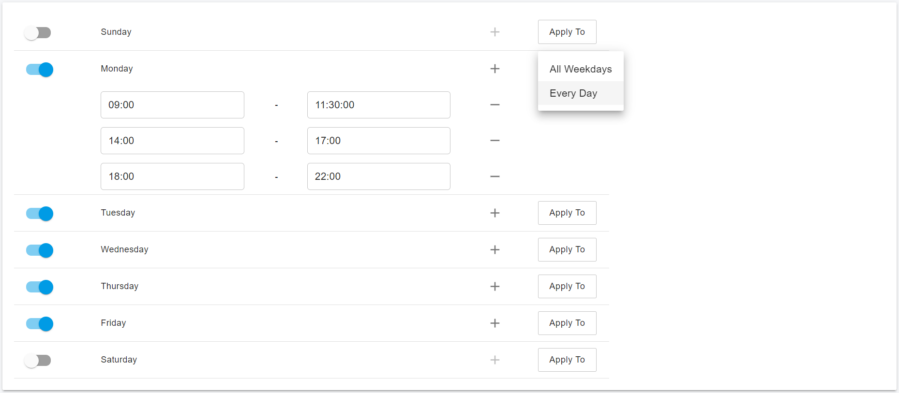
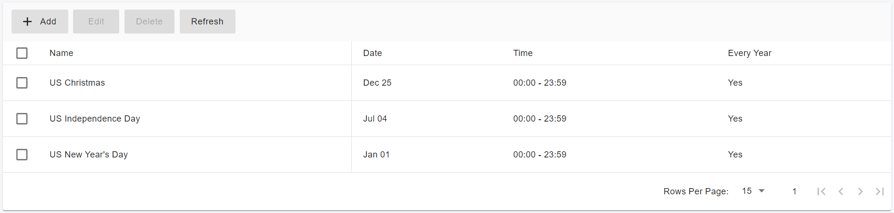
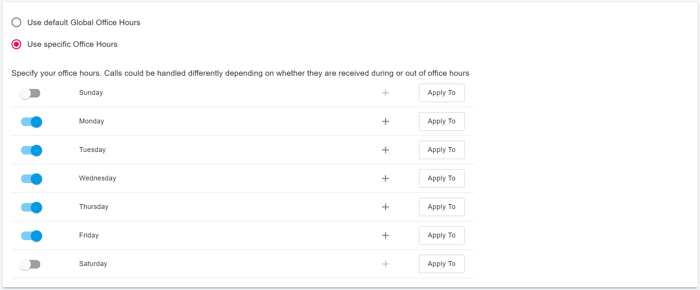
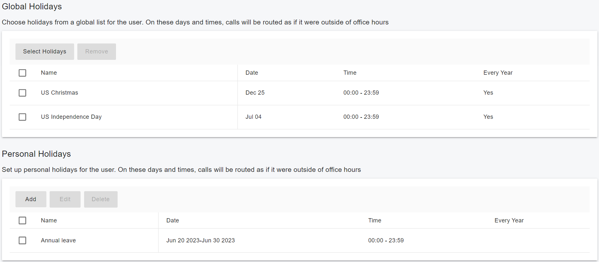

# Configuring Office Hours and Holiday Schedule

Office Hours and Holiday Schedules are configured in the PortSIP Web Portal by the tenant Admin. Once configured, they can be assigned to inbound rules used to route callers to specific destinations such as Virtual Receptionists (Auto Attendants), Call Queues, and users based on the time of the day, day of the week, or on selected holidays.

## Office Hours and Holiday Schedule

### Office Hours

You can configure office hours to define one or more shifts based on your business requirements. A shift is a period of time that is treated as work hours.

### Holiday Lists

You can define holiday lists for your organization and users. Use holidays to specify non-working days based on your business requirements.

### Schedule

PortSIP PBX provides the following Office Hours and Holiday Schedule options:

* Global Office Hours: The global office hours are defined in the tenant scope, the inbound rule, and the outbound rule, and the user can refer to global office hours for appropriate routing behavior.
* Global Office Hours: Defined at the tenant level, these office hours can be used by the inbound and outbound rules and users for appropriate routing behavior.
* Inbound & Outbound Rule Office Hours: You can define specific office hours for inbound and outbound rules instead of using global office hours.
* User Office Hours: You can define specific office hours for users instead of using global office hours.
* Global Holidays: Defined at the tenant level, these holidays can be used by the inbound and outbound rules and users for appropriate routing behavior.
* Inbound & Outbound Rule Holidays: You can select one or more holidays from the global holiday list to apply to a specific rule.
* User Holidays: You can create holidays for users and choose from the Global holiday list as well.

### Configuring Global Office Hours

To create global office hours, follow these steps:

1. Sign in to the PortSIP PBX web portal as the tenant admin.
2. Select **Company > Office Hours** from the menu.
3. In the **Office Hours** section, you can create one or more shifts as the office hours for a day. Use the **Apply To** button to apply those office hours to every day or all weekdays.
4. If a day is turned off, it means the office is closed for the entire day.
5. If a day is turned on but no shift is defined, the entire day will be treated as office hours.

A user, inbound rule, or outbound rule can choose to use the global office hours for routing calls.

<figure><figcaption></figcaption></figure>

### Configuring Global Holiday List

To create holidays, follow these steps:

1. Sign in to the PortSIP PBX web portal as the tenant admin.
2. Select **Company > OfficeHours** from the menu.
3. In the **Holidays** section, you can create one or more holidays. It is recommended to give each holiday a friendly name.
4. A holiday can be a specific time shift within a day or a range of days. It can be specified for a particular year or for every year.

A user, inbound rule, or outbound rule can choose to use the Global Holiday List for call routing.

<figure><figcaption></figcaption></figure>

### Configuring User Office Hours

To create office hours for a user, follow these steps:

1. Sign in to the PortSIP PBX web portal as the tenant admin or as a user.
2. Select **Call Manager > Users > Office Hours** from the menu.
3. You can allow the user to use the global office hours by choosing the **Use Default Global Office Hours** option. This is the default setting.
4. You can choose the **Use Specific Office Hours** option to define custom office hours for that user.

<figure><figcaption></figcaption></figure>

### Configuring User Holiday List

To create holidays for a user, follow these steps:

1. Sign in to the PortSIP PBX web portal as the tenant admin or as a user.
2. Select **Call Manager > Users** from the menu, then select a user to edit and click the **Office Hours** tab.
3. In the **Global Holidays** section, you can select one or more holidays from the global holiday list for the user.
4. In the **Personal Holidays** section, you can define custom holidays for the user, such as annual leave.

For a user, both selected global holidays and personal holidays will be treated as their holidays.

<figure><figcaption></figcaption></figure>

