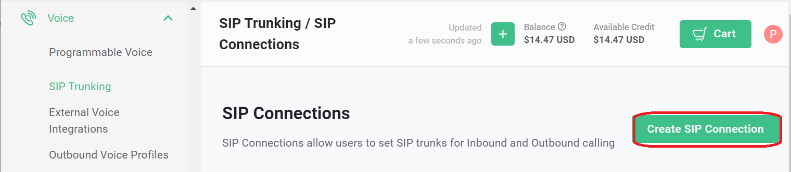
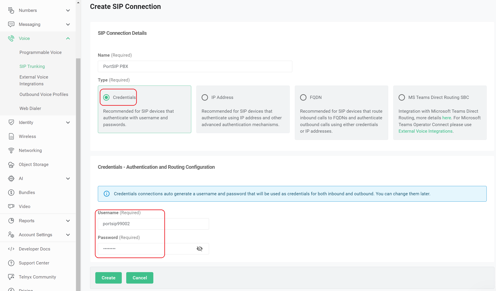
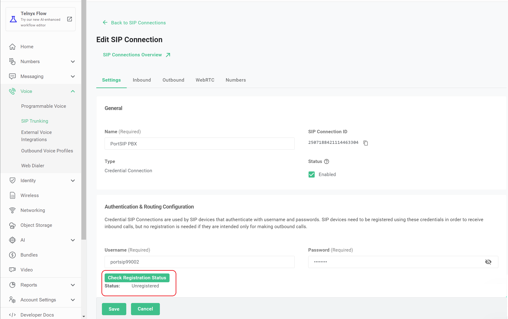
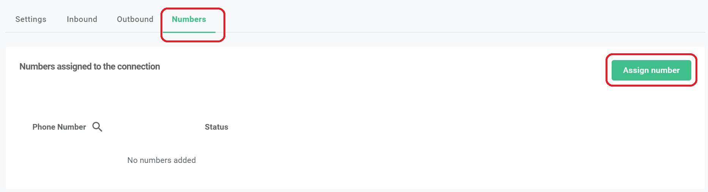
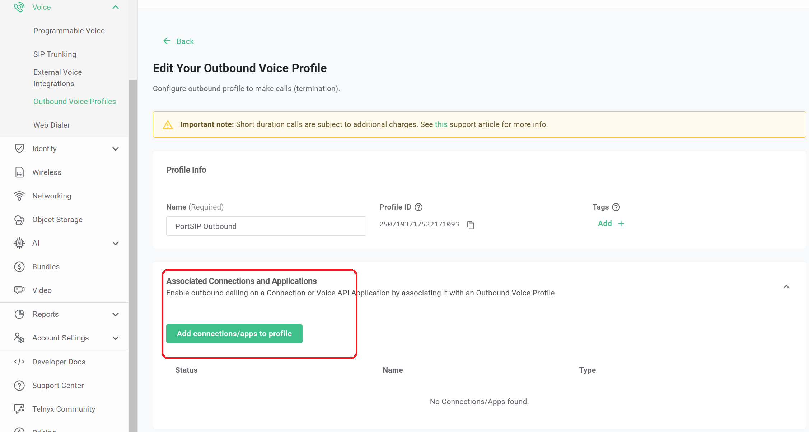
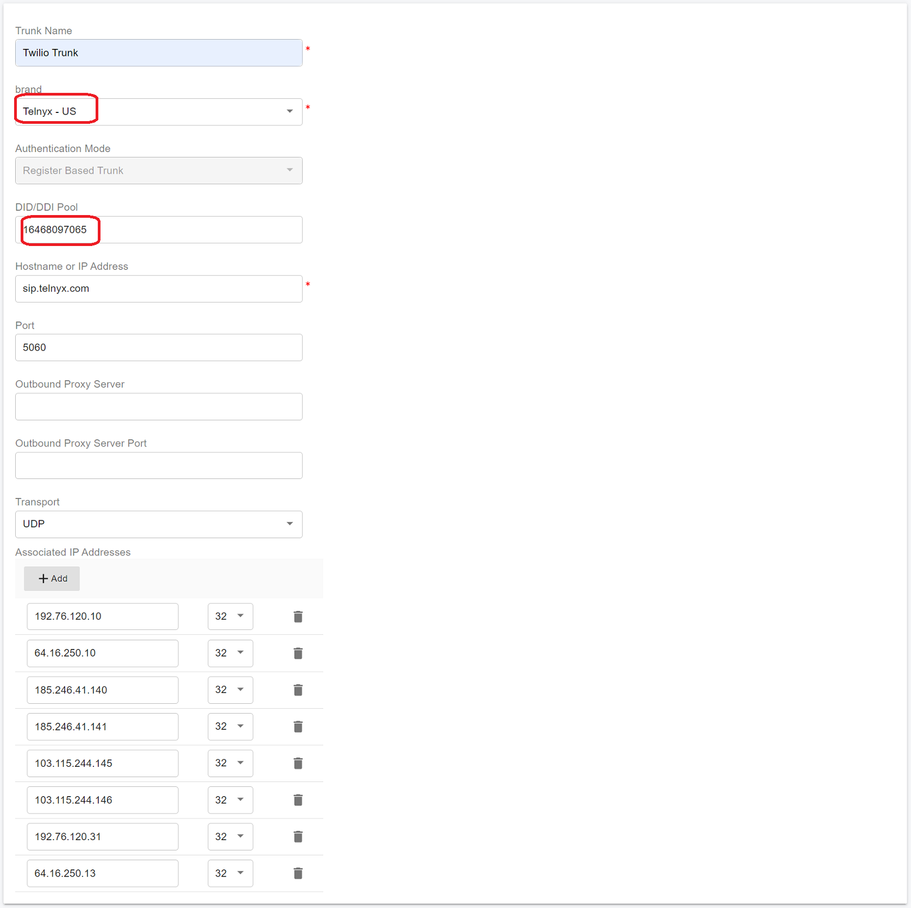
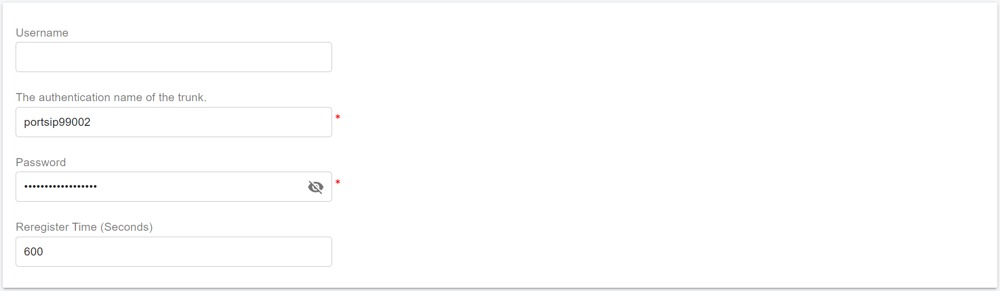
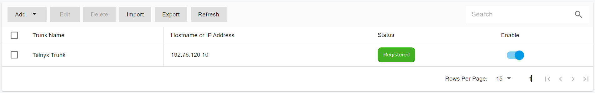

# Configuring Telnyx Register Authentication Trunk

Before proceeding with the next steps, you need to [purchase a DID on the Telnyx platform](purchase-a-did-on-telnyx-platform.md).

## Create a SIP Trunk on the Telnyx platform

To create a new SIP trunk on the Telnyx platform:

### Create SIP Connection

1. Navigate to the menu **Voice > SIP Trunking**, and press the button **Create SIP Connection**

<figure><figcaption></figcaption></figure>

2. Enter a friendly name for this trunk connection
3. Choose the **Credentials** for the **Type** section, input a **Username** and **Password** of your choosing, and is secure.

<figure><figcaption></figcaption></figure>

4. Press **Create,** and the page will bring up to the edit Connection details page
5. In the future, you can click **Check Registrations Status** to check if your PortSIP PBX is registered to the Telnyx trunk**.**

<figure><figcaption></figcaption></figure>

6. Click the **Numbers** tab, then press the **Assign Number** button to choose numbers, press **Assign Selected Numbers**

<figure><figcaption></figcaption></figure>

7. Press the **Save** button to save changes.

### Create Outbound Profile

1. Navigate to the **Voice** menu and select **Outbound Voice Profiles**.
2. Click **Add New Profile**.
3. Enter a friendly name, such as "PortSIP Outbound", and click **Create**. This will take you to the profile details page.
4. In the **Associated Connections and Applications** section, click **Add connections/apps to profile**.
5. Select the SIP connection you created previously and click **Add connections/apps to profile**.
6. Click **Save** to apply the changes.

<figure><figcaption></figcaption></figure>

## Configure Register Authentication Trunk in PortSIP PBX

The Register Authentication Telnyx trunk refers to the **Register Based Trunk** in PortSIP PBX. You must configure the Register Based Trunk at the PortSIP PBX **system administrator level**. Once successfully configured, you can share this trunk with tenants.

Please follow these steps:

1. Sign in to the PortSIP PBX Web Portal as a System Administrator.
2. Navigate to the left menu and select **Call Manager > Trunks**.
3. Click the **Add** button to open a menu.
4. From the menu, choose **Register Based** **Trunk**.

<figure><figcaption></figcaption></figure>

5. Enter the trunk name and choose the brand:
   * **Name**: Enter a friendly name for the trunk.
   * **Brand**: Select a Telnyx location near you from the Brand field, for example, "Telnyx - US".
   * **DID Pool**: This step is only for you at the _**Tenant admin Level**_ to configure this **Register Based Trunk**,  you will need to set up your Telnyx DID numbers for this DID pool for this trunk.
     * This tenant can only use the DID numbers within the DID pool range to create inbound and outbound rules and configure the outbound caller ID for extensions.
     * &#x20;The DID pool can consist of a single number, a range of numbers, or a combination of both. For example:
       * `16468097065`
       * `16468097065-16468097066`
       * `16468097065-16468097066;16468097069`&#x20;
       * `16468097065-16468097066;16468097070-16468097080`

<figure><figcaption></figcaption></figure>

6. Click the **Next** button, and set up the trunk credentials.
   * **Authentication name**: Fill in the username you set up in the section[ Create SIP Connection](configuring-telnyx-register-authentication-trunk.md#create-sip-connection).
   * **Password**: Fill in the password you set up in the section[ Create SIP Connection](configuring-telnyx-register-authentication-trunk.md#create-sip-connection).

<figure><figcaption></figcaption></figure>

6. Click the **Next** button, you can adjust the options for the trunk.
   * &#x20;**Max Concurrent Calls:** This field sets the maximum number of calls that PortSIP can establish with this trunk. You can adjust it to an appropriate value.
   * We recommend keeping the default settings for other options unless you have specific requirements.

<figure><figcaption></figcaption></figure>

7. This step is only available when configuring the Register-Based Trunk at the _**System Administrator Level**_. Click the **Next** button to assign this trunk to the tenants and provide your Telnyx DIDs/Numbers to them with the DID Pool (DID numbers).  A DID can be only assigned to one tenant.
   * A tenant assigned to this trunk can only use the DID numbers within the DID pool range to create inbound and outbound rules and configure the outbound caller ID for extensions.
   * DID Pool: The DID pool can consist of a single number, a range of numbers, or a combination of both. For example:
     * `16468097065`
     * `16468097065;16468097066`
     * `16468097065-16468097066;16468097069`&#x20;
     * `16468097065-16468097066;16468097070-16468097080`

<figure><figcaption></figcaption></figure>

Click the **OK** button to save the changes. The trunk configuration is now complete.

Once the PortSIP PBX successfully registers this trunk to the Telnyx platform, in the trunk list page you will see the status displayed as **Registered**.

<figure><figcaption></figcaption></figure>

Now you can follow the article to [Configuring Outbound & Inbound Calls](configuring-outbound-and-inbound-calls.md).

