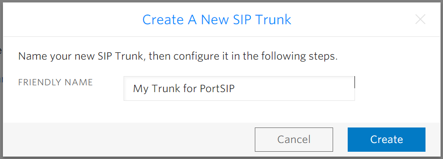

# Configuring Twilio Interconnect Trunk

Before proceeding with the next steps, you need to [purchase a DID on Twilio](purchase-a-did-on-the-twilio.md).

## Twilio Interconnect Trunk

Twilio Interconnect is an alternative to the open Internet that provides private connections between your network and Twilio. It offers the best performance and data throughput and the lowest latency. Since your data never touches the public Internet, it also provides the best security and can guarantee quality from end to end.

For more details please check:

* [Twilio Elastic Trunking](https://www.twilio.com/docs/sip-trunking)
* [Twilio Interconnect](https://www.twilio.com/en-us/interconnect)
* [Interconnect](https://www.twilio.com/docs/interconnect)
* [Configure your Trunk using Twilio Interconnect](https://www.twilio.com/docs/sip-trunking/configure-with-interconnect)

### Choose the product that is right for you 

There are several reasons why Interconnect is the preferred method of connecting to Twilio. _High availability,_ guaranteed data throughput\_, _quality of service,_ and _enterprise-grade security are just a few of the strong arguments for making use of Twilio Interconnect_. If you need highly consistent connectivity between your communication infrastructure and Twilio, then Twilio Interconnect is the right choice likewise, if you have policies (internal or external) that preclude you from sending traffic across the open Internet — for example, HIPAA, PCI, or GDPR.

Twilio Interconnect has several flavors to accommodate various use cases:

* [Cross Connect](https://www.twilio.com/docs/interconnect/crossconnect) allows you to set up a dedicated, physical fiber interconnection with Twilio.
* [Third-Party Exchange](https://www.twilio.com/docs/interconnect/third-party-exchange) is a way of having a private connection through a third-party provider that Twilio has an exchange agreement with.
* [VPN](https://www.twilio.com/docs/interconnect/virtual-private-network) is the best option if you want to quickly try something out and play with some ideas, or if you have no presence in any of our or our partners' data centers and wish to have a secure connection to us.

## Create a SIP Trunk on the Twilio Platform

To create a new SIP trunk on the Twilio platform:

1. From your [Twilio Console](https://console.twilio.com/), navigate to the **Elastic SIP Trunking** area (or click on the icon on the left vertical navigation bar).
2. Select the menu **Manage > Trunks**.

<figure><figcaption></figcaption></figure>

3. Click **Create new SIP Trunk**,  give it a friendly name, then press **Create**.

<figure><figcaption></figcaption></figure>

### Trunk Termination

Once created, we can leave all of the settings on the General page untouched and switch over to the Termination section.  When PortSIP PBX places a call, this is where it’ll be sending the call information to Twilio.

<figure><figcaption></figcaption></figure>

1. Go ahead and configure a unique URI:
   * In the **Termination** section, enter a Termination SIP URI you prefer.
   * If there display the **Available** in green means that URI is acceptable. Click on **Show localized URIs** and copy the URIs information so you can use them to configure the trunk in your PortSIP PBX.

<figure><figcaption></figcaption></figure>

2. Move down to the **Authentication** section.  Starting with an IP ACL, create one that has the public IP address of your PortSIP PBX installation.  This information is present in the PortSIP PBX Home page.

<figure><figcaption></figcaption></figure>

3\. Create a username and password pairing in the **Credential List**. This info will also make its way into the PortSIP PBX Trunk configuration.

<figure><figcaption></figcaption></figure>

Press the **Create** button and now switch to the **Origination** page.

### Trunk Origination

In the **Origination** section of the configuration, configure your origination SIP URI, which identifies the network element entry point into your PortSIP PBX. To ensure your calls go over your private connection include the `edge` parameter in the URI with the value of the Twilio [Interconnect Edge Location](https://www.twilio.com/docs/global-infrastructure/edge-locations#private-interconnect) where your private connection is configured, for example:

* `sip:151.101.2.3;edge={EDGE_LOCATION}`
* `sip:pbx.portsip.com;edge={EDGE_LOCATION}`

Note: without the {}, for example:

* `sip:151.101.2.3;edge=ashburn-ix`
* `sip:pbx.portsip.com;edge=ashburn-ix`

<figure><figcaption></figcaption></figure>

### Assigning DID Numbers To Your Elastic SIP Trunk

1. On the left side of the screen under **Phone Numbers > Manage > Active Numbers**.
2. Click a number that you want to assign to your trunk.
3. On the new page under the Voice Configuration section, select **SIP Trunk** for the **Configure with** field. Then, for the **SIP Trunk** field, choose the trunk you previously created that you want to assign the number to.
4. Click the **Save Configuration**, that number is now associated with your SIP Trunk.

<figure><figcaption></figcaption></figure>

And with that, you’ve configured Twilio Elastic SIP Trunk!

## Configuring the Trunk with PortSIP PBX

The Twilio Interconnect trunk refers to the **Register Based Trunk** in PortSIP PBX.

&#x20;You can configure the Twilio Interconnect Trunk at either the PortSIP PBX **system administrator level** or the **Tenant Admin level**:

* If configured at the system administrator level, you can share this trunk with tenants.
* If configured at the tenant admin level, this trunk can only be used by the tenant itself.

Please follow the below steps:

1. Sign in to the PortSIP PBX Web Portal as a System Administrator or Tenant Admin. Navigate to the left menu and select **Call Manager > Trunks**.&#x20;
2. Click the **Add** button to open a menu. From the menu, choose **Register Based Trunk**.

<figure><figcaption></figcaption></figure>

3. Enter the trunk name and choose the brand:
   * **Name**: Enter a friendly name for the trunk.
   * **Brand**: Select **Twilio Interconnect** from the Brand field. **Important**!&#x20;
   * **DID Pool**: This step is only for you at the _**Tenant admin Level**_ to configure this **Register Based Trunk**, you will need to set up your Twilio DID numbers for this DID pool for this trunk.&#x20;
     * This tenant can only use the DID numbers within the DID pool range to create inbound and outbound rules and configure the outbound caller ID for extensions.
     * The DID pool can consist of a single number, a range of numbers, or a combination of both. For example:
       * `12027594810`
       * `12027594810;12027594815`
       * `12027594810-12027594815;12027594820`&#x20;
       * `12027594810-12027594815;12027594830-12027594845`
4. **Hostname or IP Address**: For this field, input one of your Twilio trunk Termination URIs that we saved in the above based on your PortSIP PBX location:
   * portsip-pbx.pstn.ashburn.twilio.com&#x20;
   * portsip-pbx.pstn.umatilla.twilio.com&#x20;
   * portsip-pbx.pstn.dublin.twilio.com&#x20;
   * portsip-pbx.pstn.frankfurt.twilio.com&#x20;
   * portsip-pbx.pstn.sao-paulo.twilio.com&#x20;
   * portsip-pbx.pstn.singapore.twilio.com&#x20;
   * portsip-pbx.pstn.tokyo.twilio.com&#x20;
   * portsip-pbx.pstn.sydney.twilio.com

<figure><figcaption></figcaption></figure>

5. Click the **Next** button, and enter the ID and Password that we had defined in the Twilio Credential List for the **SIP trunk authentication name** and **password** fields**.**

<figure><figcaption></figcaption></figure>

6. Click the **Next** button, you can adjust the options for the trunk.
   * You must turn off the **Need Registration** option since the Twilio Interconnect trunk doesn't accept the REGISTER message.
   * **Max Concurrent Calls:** This field sets the maximum number of calls that PortSIP can establish with this trunk. You can adjust it to an appropriate value.
   * We recommend keeping the default settings for other options unless you have specific requirements.

<figure><figcaption></figcaption></figure>

7. This step is only available when configuring the Register-Based Trunk at the _**System Administrator Level**_. Click the **Next** button to assign this trunk to the tenants and provide your Twilio DIDs/Numbers to them with the DID Pool (DID numbers).  A DID can be only assigned to one tenant.
   * A tenant assigned to this trunk can only use the DID numbers within the DID pool range to create inbound and outbound rules and configure the outbound caller ID for extensions.
   * DID Pool: The DID pool can consist of a single number, a range of numbers, or a combination of both. For example:
     * `12027594810`
     * `12027594810;12027594815`
     * `12027594810-12027594815;12027594820`&#x20;
     * `12027594810-12027594815;12027594830-12027594845`

<figure><figcaption></figcaption></figure>

Click the **OK** button to save the changes, the trunk configuration is completed.

Since the Twilio trunk is turned off the **Need Registration** option, in the trunk list page you will always see the status displayed as **Registered**.

<figure><figcaption></figcaption></figure>

Now you can follow the article to [Configuring inbound and outbound calls.](configuring-outbound-and-inbound-calls.md)

