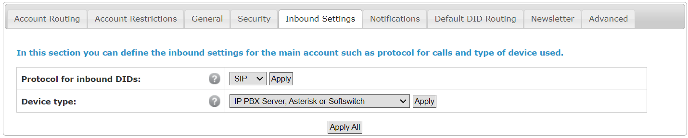
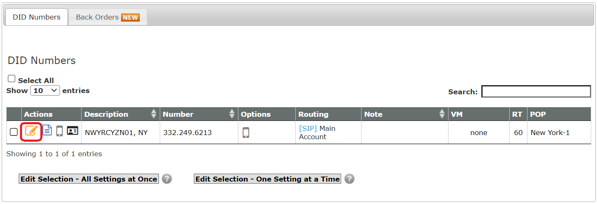
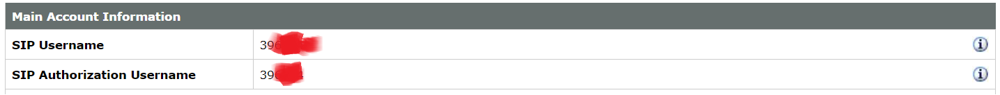
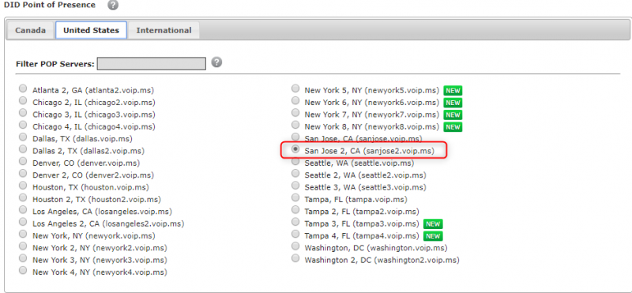
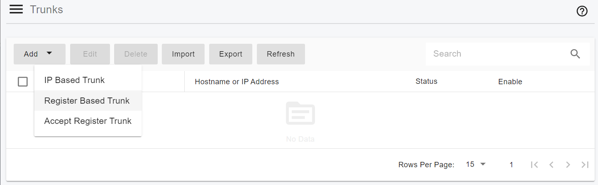
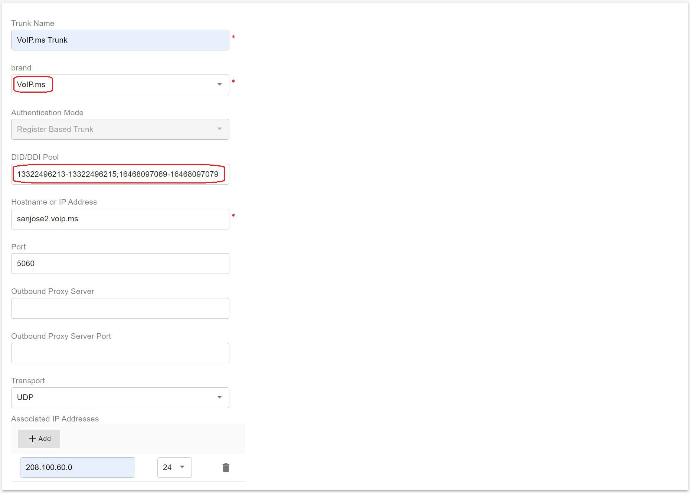
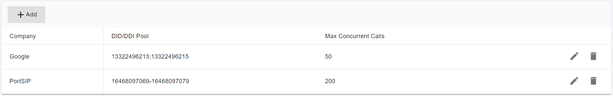
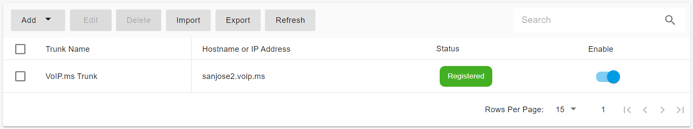

# Configuring VoIP.ms Register Based Trunk

Before proceeding with the next steps, you need to [purchase a DID on the VoIP.ms](purchase-a-did-on-voip.ms.md).

## Create a SIP Trunk on the VoIP.ms Platform

To create a new SIP trunk on the VoIP.ms platform:

1. Go to **Main Menu** and click **Account settings**
2. Under the **Inbound Settings** tab:
   * &#x20;Protocol: Select SIP&#x20;
   * Device Type: Select IP PBX Server, then apply the change.

<figure><figcaption></figcaption></figure>

### Link DIDs to Main Account

You need to make sure that the DIDs ordered are linked to your Main Account.&#x20;

1. Navigate to the menu **DID Numbers > Manage DID(s)**.&#x20;
2. Click on the Edit DID icon and make sure that the routing points to SIP/IAX and your main account.

<figure><figcaption></figcaption></figure>

### Collecting Settings for PortSIP PBX

In order to be able to register and operate the trunk in your PortSIP PBX, you will to gather some information that will be needed in the configuration of the trunk in PortSIP PBX.

* Username: The username for registering the trunk can be found under the **Main Menu > Account Information.**

<figure><figcaption></figcaption></figure>

* Password: The trunk password can be found in the email you received from VoIP.ms during the registration process. You can also change the password by navigating to the menu **Main Menu > Account Settings > Security**.
* DID numbers: The DID numbers can be seen by navigating to the menu **DID Numbers > Manage DID(s).**
* Registrar: Go to the menu **Main Menu > Account Settings > Default DID Routing**. From here make a note of the selected server. In this example, the server is **sanjose2.voip.ms**.

<figure><figcaption></figcaption></figure>

## Configuring Trunk with PortSIP PBX

The Register Based VoIP.ms trunk refers to the **Register Based Trunk** in PortSIP PBX. You can configure the Register Based Trunk at either the PortSIP PBX **system administrator level** or the **Tenant Admin level**:

* If configured at the system administrator level, you can share this trunk with tenants.
* If configured at the tenant admin level, this trunk can only be used by the tenant itself.

Please follow the below steps:

1. Sign in to the PortSIP PBX Web Portal as a System Administrator or Tenant Admin. Navigate to the left menu and select **Call Manager > Trunks**.&#x20;
2. Click the **Add** button to open a menu. From the menu, choose **Register Based Trunk**.

<figure><figcaption></figcaption></figure>

3. Enter the trunk name and choose the brand:
   * **Name**: Enter a friendly name for the trunk.
   * **Brand**: Select VoIP.ms from the Brand field.
   * **DID Pool**: This step is only for you at the _**Tenant admin Level**_ to configure this **Register Based Trunk**, you will need to set up your VoIP.ms DID numbers for this DID pool for this trunk.&#x20;
     * This tenant can only use the DID numbers within the DID pool range to create inbound and outbound rules and configure the outbound caller ID for extensions.
     * The DID pool can consist of a single number, a range of numbers, or a combination of both. For example:
       * `13322496213`
       * `13322496213;13322496215`
       * `13322496213-13322496215;16468097069`&#x20;
       * `13322496213-13322496215;16468097069-16468097079`

<figure><figcaption></figcaption></figure>

3. Hostname or Address: For this field, enter **sanjose2.voip.ms** that you noted in the[ Collecting Settings for PortSIP PBX](configuring-voip.ms-register-based-trunk.md#collecting-settings-for-portsip-pbx).
4. Associated IP Addresses: [VoIP.ms](http://www.voip.ms/) offers many different points of presence, please add the the server IPs to the Associated IP Address with CIDR format. All traffic originating from these IP addresses will be recognized as VoIP.ms trunk and the anti-hacking algorithms will not come into effect. For more information on the IPs related to our servers, click [here](https://wiki.voip.ms/article/Servers).
5. Click the **Next** button, and provide the **SIP trunk authentication name** and **password** set up for the SIP  trunk on the VoIP.ms platform([Collecting Settings for PortSIP PBX](configuring-voip.ms-register-based-trunk.md#collecting-settings-for-portsip-pbx)).&#x20;

<figure><figcaption></figcaption></figure>

7. Click the **Next** button, you can adjust the options for the trunk.
   * &#x20;**Max Concurrent Calls:** This field sets the maximum number of calls that PortSIP can establish with this trunk. You can adjust it to an appropriate value.
   * We recommend keeping the default settings for other options unless you have specific requirements.

<figure><figcaption></figcaption></figure>

8. This step is only available when configuring the Register-Based Trunk at the _**System Administrator Level**_. Click the **Next** button to assign this trunk to the tenants and provide your VoIP.MS DIDs/Numbers to them with the DID Pool (DID numbers).  A DID can be only assigned to one tenant.

* A tenant assigned to this trunk can only use the DID numbers within the DID pool range to create inbound and outbound rules and configure the outbound caller ID for extensions.
* DID Pool: The DID pool can consist of a single number, a range of numbers, or a combination of both. For example:
  * `13322496213`
  * `13322496213;13322496215`
  * `13322496213-13322496215;16468097069`&#x20;
  * `13322496213-13322496215;16468097069-16468097079`

<figure><figcaption></figcaption></figure>

Click the **OK** button to save the changes, the trunk configuration is completed.

Once the PortSIP PBX successfully registers this trunk to the VoIP.ms platform, in the trunk list page you will see the status displayed as **Registered**.

<figure><figcaption></figcaption></figure>

Now you can follow the article to [Configuring inbound and outbound calls.](configuring-outbound-and-inbound-calls.md)

