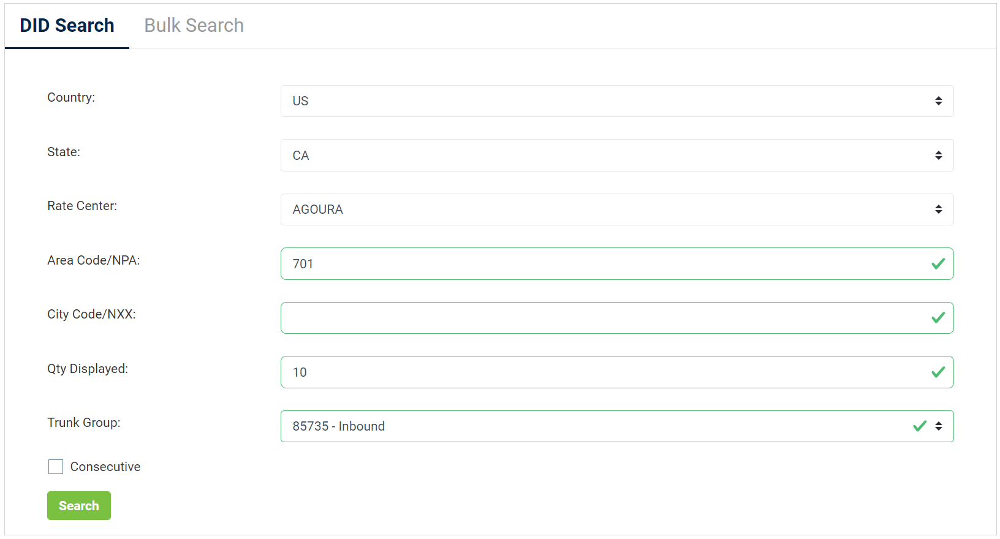
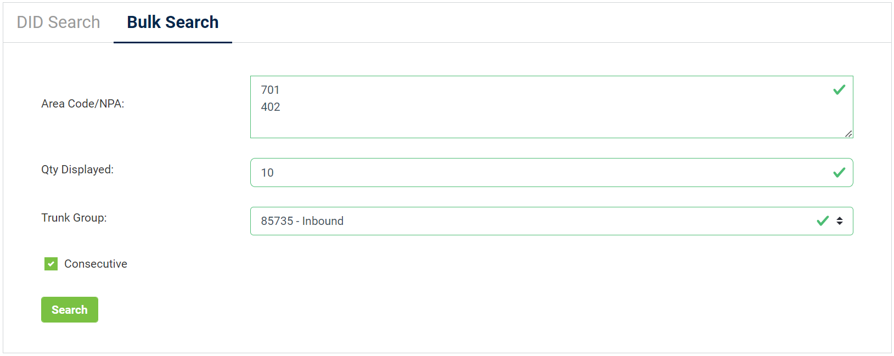
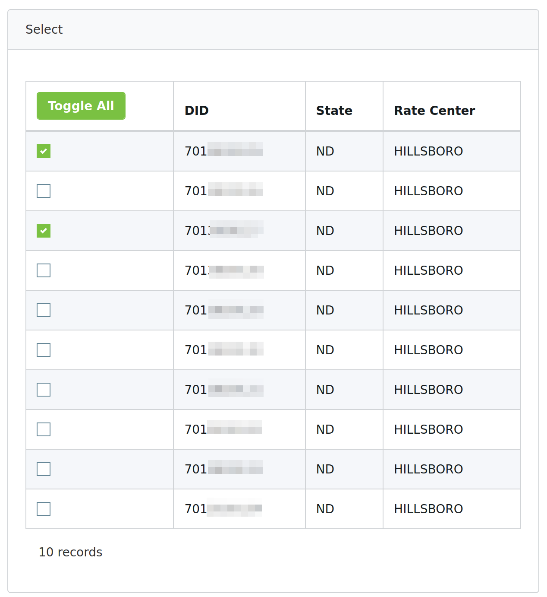

# Purchase a DID on Voxtelesys Platform

Before placing or receiving a call, you need to have an active DID or a dozen DID numbers on your Voxtelesys account. If you already have an active number on your Voxtelesys account, the below steps are optional.

To purchase a DID on your Voxtelesys account:

1. Log in to your account on the [Voxtelesys ](https://portal.voxtelesys.net/)platform
2. Select the menu **Phone Numbers > Number Ordering**

Note: You can also buy the DID by following this article on the Voxtelesys website: [Order/Add DIDs.](https://voxtelesys.com/tutorial/voxtelesys-portal-order-add-dids)

## **DID Search**

Click the **DID Search** tab. DID Search allows you to lookup DID numbers using a variety of settings.

* Country: Select the United States or Canada from the drop-down menu.
* State: Select the State or Province from the drop-down menu.
* Rate Center: Select a geographical location from the drop-down menu.
* Area Code/NPA: Type in the area code.
* City Code/NXX: Type in the city code. It is for a specific search and may filter out available numbers in your area.
* Qty Displayed: Select the quantity of numbers displayed in your search.
* Trunk Group: Make sure you select a trunk group. Please reach out to Voxtelesys Support if you do not have one.
* Consecutive: Check this option to view consecutive numbers or uncheck it to view nonconsecutive numbers.

<figure><figcaption></figcaption></figure>

## Bulk Search

Click the **Bulk Search** tab. Bulk Search allows you to view numbers from multiple area codes to make your search quicker and easier.

* Area Code/NPA: Search multiple area codes at the same time by entering each one on a new line.
* Qty Displayed: Select the quantity of numbers displayed in your search. The maximum is 30 per area code.
* Trunk Group: Make sure you select a trunk group. Please reach out to Voxtelesys Support if you do not have one.
* Consecutive: Check this option to view consecutive numbers or uncheck it to view nonconsecutive numbers.

<figure><figcaption></figcaption></figure>

## Select Phone Numbers

Select the phone number(s) you want to order/setup and click on **Next** so you can review your order.

<figure><figcaption></figcaption></figure>

## Review & Submit

* Review your invoice.
* Then select a payment method.

If everything looks good, click on **Submit Payment** to complete your order,  the numbers are now assigned to your account.

After purchasing the DID, you can follow one of the guides to configure the trunk with PortSIP PBX.

* [Configuring Voxtelesys IP Authentication Trunk](configuring-questblue-ip-authentication-trunk.md)
* [Configuring Voxtelesys Register AuthenticationTrunk](configuring-questblue-register-authentication-trunk.md)

