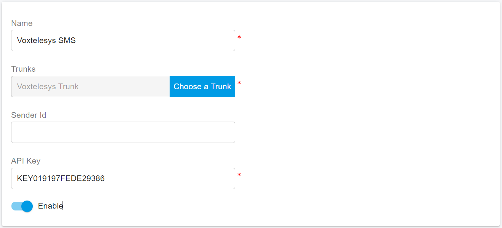

# Voxtelesys SMS Integration

Before proceeding with the next steps, you need to [purchase a DID on the Voxtelesys platform](purchase-a-did-on-questblue-platform.md) with SMS/MMS enabled.

## Create Voxtelesys API Key

You need to create a Voxtelesys API key for the PortSIP PBX to send the SMS/MMS. Please follow the below steps:

1. Login to the [Voxtelesys Portal](https://portal.voxtelesys.net/)
2. Navigate the menu **API Keys > Keys**, click **Create Key**
3. Copy the API key and note it

<figure><figcaption></figcaption></figure>

## Configure SMS with Voxtelesys Trunk in PortSIP PBX

Before configuring SMS in PortSIP PBX, you must have already configured a Voxtelesys SIP trunk using one of the following guides:

* [Configuring Voxtelesys Register Based Trunk](configuring-questblue-register-authentication-trunk.md)
* [Configuring Voxtelesys IP-Based Trunk](configuring-questblue-ip-authentication-trunk.md)

### Sign in PortSIP PBX Web Portal

You can sign in to the PortSIP PBX Web portal using one of the following methods:

1. Sign in as the PBX system administrator, navigate to the **Tenants** menu, choose a tenant, and click the **Manage** button to switch to that tenant.
2. Sign in as a tenant admin to manage the tenant.

For more details please reference [Tenant Management](../../portsip-pbx-administration-guide/3-tenant-management.md).

### Add an SMS configuration

Please follow the below steps:

1. In the PortSIP PBX Web portal, navigate to the left menu, select **SMS/MMS**, and click the **Add** button.&#x20;
2. Choose your configured Voxtelesys Trunk :
   * **Sender ID**: You can leave it as empty.
   * **API Key**: Paste your copied Voxtelesys API Key here.

<figure><figcaption></figcaption></figure>

3. Click **OK** to be brought to the SMS/MMS list page. You can select that SMS configuration, then press the **Copy Webhook** button to copy the Webhook URL. Or Double-click the SMS configuration to edit the SMS configuration, in the details copy the Webhook URL.

## Configure the SMS in Voxtelesys

1. Login to the [Voxtelesys Portal](https://portal.voxtelesys.net/)
2. Navigate to the menu **APIs > Messaging Applications**, and click **Create Application**
3. Fill in the following information
   * **Profile Name**: PortSIP SMS
   * **Trunk Group**: Same group as the API key created in
   * **HTTP Method**: POST
   * **Events**: Inbound messages(MOs)
   * **MO Webhook:** Your PortSIP PBX Webhool URL you copied in the above steps
   * **Authentication**: None
4. Click **Save**

<figure><figcaption></figcaption></figure>

5. Navigate to the menu **Phone Numbers > Numbers**, and click the pencil icon to edit the number which you want to receive the SMS, in the popup windows, fill in the following information:
   * **\`Profile Name**: PortSIP SMS
   * **SMS Enabled:** Check this option
   * **Service Trunk**: SMS | Fax2Email
   * **Messaging Application**: PortSIP SMS
   * **Campaign:** Choose the appropriate value
   * Click **Confirm**

<figure><figcaption></figcaption></figure>

That’s it! The SMS integration between Voxtelesys and PortSIP PBX is now complete.

Here are some additional tips:

* Ensure the DID number (with SMS enabled) is assigned to the user/extension.
* Inbound SMS follows the inbound rules likes inbound calls in PortSIP PBX.
* PortSIP PBX supports SMS in E164 format. Make sure the numbers are configured in PortSIP as E164, and ensure that both your Messaging Application and Inbound Trunk on Voxtelesys are set up in E164 format.

## Verify Configuration

Now you can [create the outbound and inbound rules](configuring-outbound-and-inbound-calls.md) in PortSIP PBX for sending and receiving SMS/MMS using the Voxtelesys Trunk, just like you create the rules for making and receiving calls.

