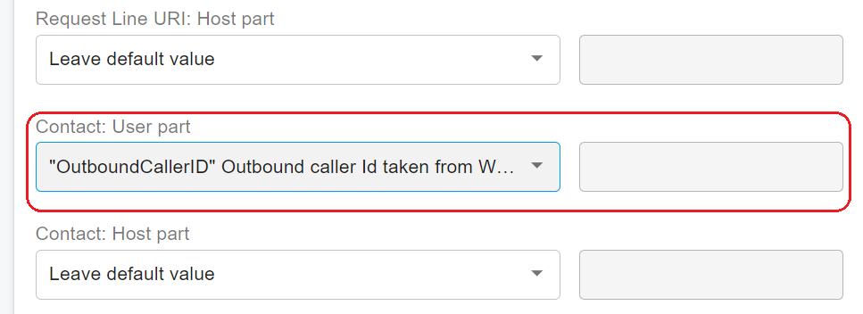

# Configuring Gamma Trunk Parameters

[Gamma ](https://gammagroup.co/products/sip-trunking-call-management/)is the UK’s leading SIP Trunks provider. Gamma SIP Trunks connect your cloud PBX and on-premise PBX phone system directly into the Gamma network via an internet connection to carry and terminate your calls across the public telephone network.

Configuring the [Gamma SIP trunk](https://gammagroup.co/products/sip-trunking-call-management/) into your PortSIP PBX is straightforward. Please follow the steps below:

1. **Sign Up and Purchase**: Create an account with [Gamma ](https://gammagroup.co/products/sip-trunking-call-management/)and purchase your DID numbers.
2. **Configure the Gamma Trunk**: Follow the instructions in the [Configuring the SIP Trunk](../../portsip-pbx-administration-guide/7-trunk-management/configuring-sip-trunk.md) guide to set up the Gamma trunk. Note that the Gamma trunk is classified as an IP-Based Trunk.
3. **Set Up Inbound Rules**: After successfully adding the Gamma trunk as an **IP-Based Trunk** in PortSIP, you can create inbound rules to route incoming calls from Gamma.

For outbound calls, Gamma requires specific configurations. Ensure to review the settings carefully.

## Adjust Outbound Parameters

Double-click the configured Gamma trunk, click on the **Outbound Parameters** tab, and Adjust the following parameters:

### Contact: User part

Choose `"OutboundCallerID" Outbound caller Id taken from Web Portal` for this field.

<figure><figcaption></figcaption></figure>

### From: User part

Choose `"OutboundCallerID" Outbound caller Id taken from Web Portal` for this field.

<figure><figcaption></figcaption></figure>

### P-Asserted-Identity: User part

Choose `"OutboundCallerID" Outbound caller Id taken from Web Portal` for this field.

### P-Asserted-Identity: Host part

Choose `"TrunkHostPort" Trunk host/port` for this field.

<figure><figcaption></figcaption></figure>

## Set Up Outbound Caller ID

Gamma trunks require the CLI presentation (outbound caller ID) to be in E164 format. When setting the Outbound Caller ID for an extension, ensure the number is prefixed with a `+`. Refer to the screenshot below for a visual guide.

<figure><figcaption></figcaption></figure>

## Create Outbound Rules

Now, you can create the outbound rules for the Gamma trunk to make outbound calls.

