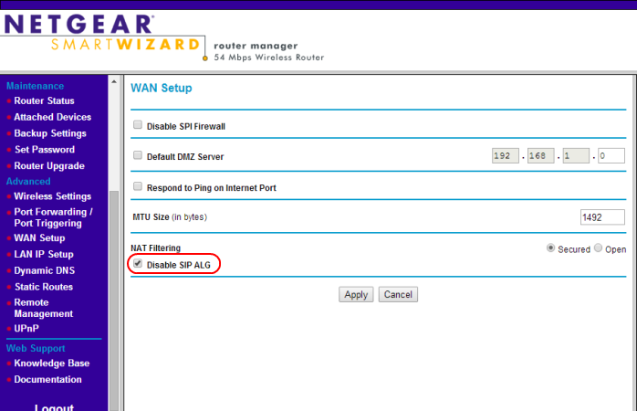

# What is SIP ALG and Why You Need to Disable It?

SIP ALG is the Session Initiation Protocol Application Layer Gateway feature that many routers have enabled by default.

You've successfully set up your VoIP phone system, but you're encountering issues such as dropped calls, absence of incoming calls, or persistent ringing even after answering the call and no voice. The solution to these Voice over IP problems could be as simple as disabling SIP ALG.

In this comprehensive guide, we'll delve into why it's crucial to turn off SIP ALG and provide practical tips to optimize your network for VoIP phone service. This guide is designed to be user-friendly for beginners while still offering valuable insights for advanced users. Let's dive in!

## What is SIP ALG? 

SIP ALG stands for Session Initiation Protocol Application Layer Gateway. This technology, which is also called an application-level gateway,  is available on most commercial routers, and it helps users more reliably initiate SIP calls, even when behind a LAN with a secure firewall configuration. The ALG is a network address translation (NAT) tool that changes private IP addresses and ports into public IP addresses and ports.

The SIP ALG acts as an independent firmware program to prevent firewall-related issues on the router. It inspects the SDP portion of data packets and modifies them so that they send correctly. Remember, all VoIP changes audio data (voice) into packets that are then sent over the net, so theoretically, this should ensure call quality.

Unfortunately, the technology often ends up hindering the quality of SIP calls due to the multi-process nature of SIP and the delicateness of data packets. This is why many VoIP service providers tell you to disable the feature on your router.

The problem with SIP ALG is the packet rewriting aspect of it. SIP ALG can be useful to mitigate multiple NATs, but it doesn’t help the vast majority. Let’s take a more in-depth look at what’s happening with these data packets.

<figure><figcaption>
<em>SIP ALG modifies the destination addresses of VoIP packets causing reliability issues.</em>
</figcaption></figure>

The diagram above shows that the Application Layer Gateway changes the destination public IPs in SIP packets. Certain commercial routers are smart enough to inspect the SIP messages themselves to leave private IP addresses alone.&#x20;

Today’s Unified Communication PBX systems, conference calls, and even audio/video conferencing rely on SIP. Signaling protocols like SDP, RTP, and RTSP all face the same issues because they are a subset of SIP packets.

## Signs SIP ALG Affects VoIP Calls 

There are a few categories of symptoms SIP ALG could affect VoIP calls. It’s not always apparent, especially since these issues often happen silently without users knowing.

* **One-way audio**: Only one party can hear the other during a call.
* **Unresponsive phones**: Phones do not ring when they are called.
* **Dropped calls**: Calls get disconnected after being connected.
* **Unexplained voicemail**: Calls go straight to voicemail without any apparent reason.
* **Degraded call quality**: You may start to experience static, lapses in sound transmission, or echoing. This is due to the modification of the call data during transmission or receipt.
* **Lost calls**: With this router service, it’s easy to lose the call altogether. When data is lost and is unrecoverable, disconnection is likely.
* **Failed registration**: If any acknowledgments fail during a call, the call will fail to connect. This is often a direct result of a SIP ALG operating in the background.

What’s occurring is that some VoIP traffic is getting lost in transit between the phone and the VoIP service provider. This disruption is due to router firewalls. This traffic is crucial for maintaining the phone’s availability and for selecting the appropriate audio codecs.

## Why Disable SIP ALG? 

Conventional wisdom would suggest that an Application-Level Gateway is supposed to be enabled. After all, many consumer and commercial router settings even default SIP ALG to on.

SIP ALG, a feature in most broadband routers, was introduced with good intentions to address the limitations of Network Address Translation (NAT). However, it unfortunately interferes with the built-in functionality of IP and signaling protocols, rendering it unnecessary for today’s VoIP applications.

ALGs operate at the Application Layer of the [OSI Model](https://www.cloudflare.com/learning/ddos/glossary/open-systems-interconnection-model-osi/), and thus, do not consider the datagrams within transport protocols like UDP or TCP. VoIP signaling protocols address these common issues by including both public and private IP addresses in every packet.

Some routers attempt to enhance security by terminating open connections in the firewall, a process known as creating a "firewall pinhole". This allows traffic to function momentarily, but when a SIP proxy drops packets, it can disrupt VoIP calls after they have been established.

## **How to Disable SIP ALG on Your Router** 

Many routers have SIP ALG enabled by default within their device’s firmware. Thanks to user-friendly web interfaces, you can easily enable or disable this setting by checking or unchecking a box. An example is provided below:

<figure><figcaption>
<em>Disabling SIP ALG is often as simple as checking a box.</em> 
</figcaption></figure>

Accessing your router’s interface is almost always very easy. Each router has the IP address of the router’s interface printed on a decal that also includes the default login information so that you change settings through a browser.&#x20;

By default, many manufacturers set the login information as “admin” for the user and “password” for the pass – though some may not need a password. For commercial routers, you’ll want to change this login information to something more secure.

Unfortunately, not all router brands provide an easy method to disable certain features. Let’s guide you through some common methods used by the world’s leading router manufacturers. It’s worth noting that Cisco’s process is a bit more complex as it requires access to the command line to modify router settings.

| **Router Manufacturer** | **Steps to Disable SIP ALG**                                                                                                                                                                                                                                                                                                                                                                                                                                                                                                                                                                                                                                                                                                                                                                                                                                                                                                                                                                                                                                                                                                                                                                                                                                                                                                              |
| ----------------------- | ----------------------------------------------------------------------------------------------------------------------------------------------------------------------------------------------------------------------------------------------------------------------------------------------------------------------------------------------------------------------------------------------------------------------------------------------------------------------------------------------------------------------------------------------------------------------------------------------------------------------------------------------------------------------------------------------------------------------------------------------------------------------------------------------------------------------------------------------------------------------------------------------------------------------------------------------------------------------------------------------------------------------------------------------------------------------------------------------------------------------------------------------------------------------------------------------------------------------------------------------------------------------------------------------------------------------------------------- |
| **Actiontec**           | <ol><li>Select Advanced, click Yes to accept the warning, then click ALG’s.</li><li>Ensure SIP ALG is disabled by removing the check.</li><li>Click Apply.</li><li>Select Advanced, click Yes to accept the warning, then click Remote Administration.</li><li>Click the checkbox to Allow Incoming WAN ICMP Echo Requests (for traceroute and ping), then click Apply.</li></ol>                                                                                                                                                                                                                                                                                                                                                                                                                                                                                                                                                                                                                                                                                                                                                                                                                                                                                                                                                         |
| **Adtran**              | <ol><li>Under Firewall, go to Firewall / ACLs.</li><li>Click on ALG Settings.</li><li>Uncheck the box labeled SIP ALG</li><li>Click Apply.</li></ol>
If you are using the terminal, issue the following command: <em>no ip firewall alg sip</em>
                                                                                                                                                                                                                                                                                                                                                                                                                                                                                                                                                                                                                                                                                                                                                                                                                                                                                                                                                                                                                                                                                 |
| **Arris**               | 
<strong>Most Arris broadband gateways:</strong>
<ol><li>Navigate to the gateway’s IP (192.168.0.1). Username: admin Password: motorola</li><li>Navigate to Advanced, then Options.</li><li>Uncheck the SIP box.</li><li>Click Apply.</li></ol>
<strong>Arris BGW210</strong>
<ol><li>Navigate to 192.168.1.254. Authenticate without a username, and use the password located on the unit’s sticker.</li><li>Under the Firewall section, click on Advanced Firewall.</li><li>Change the Set SIP ALG setting to off.</li><li>Turn off the Authentication Header Forwarding.</li><li>Turn off ESP Header Forwarding.</li><li>Click Save.</li></ol>                                                                                                                                                                                                                                                                                                                                                                                                                                                                                                                                                                                                                                                                         |
| **Asus**                | <ol><li>Under the Advanced Settings section, click WAN.</li><li>Click the NAT Passthrough tab.</li><li>Change the SIP Passthrough setting to “Disable.”</li><li>Click Apply.</li></ol>                                                                                                                                                                                                                                                                                                                                                                                                                                                                                                                                                                                                                                                                                                                                                                                                                                                                                                                                                                                                                                                                                                                                                    |
| **AT\&T**               | 
<strong>U-Verse Pace 5268AC Gateway</strong> This broadband gateway does not support disabling SIP ALG. We recommend configuring your gateway to function only as a modem, not a router (Bridge Mode). You will need to use another router that supports disabling SIP ALG.
                                                                                                                                                                                                                                                                                                                                                                                                                                                                                                                                                                                                                                                                                                                                                                                                                                                                                                                                                                                                                                                     |
| **Cisco**               | 
<strong>Cisco General and Enterprise-Class routers:</strong> <em>no ip nat service sip tcp port 5060</em> <em>no ip nat service sip udp port 5060</em>

<strong>Cisco PIX routers:</strong> <em>no fixup protocol sip 5060</em> <em>no fixup protocol sip udp 5060</em>

<strong>Cisco ASA routers:</strong> Locate ‘Class inspection_default’ under ‘Policy-map global_policy’. Execute this command: <em>no inspect sip</em>
                                                                                                                                                                                                                                                                                                                                                                                                                                                                                                                                                                                                                                                                                                                                                                                                                                                                            |
| **D-Link**              | <ol><li>Click on Advanced Settings.</li><li>Locate the Application Level Gateway (ALG) Configuration.</li><li>Uncheck the SIP option.</li><li>Click Save.</li></ol>
<strong>DIR-655:</strong>
<ol><li>Click Advanced, located along the top.</li><li>Click Firewall Settings on the left side of the screen.</li><li>Uncheck Enable SPI</li><li>Set both UDP and TCP Endpoint Filtering to <em>Endpoint Independent</em>.</li><li>Uncheck SIP from Application Level Gateway Configuration.</li><li>Click Save.</li></ol>                                                                                                                                                                                                                                                                                                                                                                                                                                                                                                                                                                                                                                                                                                                                                                                                            |
| **Fortinet**            | <ol><li>Use the following commands from the CLI interface: config system session-helper show system session-helper</li><li>Find the SIP session instance, typically indicated by #12</li><li>Delete #12 or the appropriate number</li><li>Confirm its deletion by executing this command: show system session-helper. For more guidance, follow <a href="https://community.fortinet.com/t5/FortiGate/Technical-Tip-Disabling-VoIP-Inspection/ta-p/194131?externalID=FD36405">this article</a>.</li></ol>                                                                                                                                                                                                                                                                                                                                                                                                                                                                                                                                                                                                                                                                                                                                                                                                                         |
| **Linksys**             | 
<strong>Linksys Smart Wi-Fi (E-series):</strong>
<ol><li>On the left side of the screen, click on Connectivity.</li><li>Click the Administration tab.</li><li>Under Application Layer Gateway, verify SIP is unchecked.</li><li>Click Apply or Save.</li></ol>
<strong>Older Linksys models:</strong>
<ol><li>Go to the ‘Advanced’ section on the Admin page</li><li>Disable the SIP ALG feature.</li></ol>
<strong>Linksys BEFSR41 routers:</strong>
<ol><li>Click on Applications and Gaming on the Admin page.</li><li>Click on Port Triggering. </li><li>Type in ‘TCP’ as the application.</li><li>Type in ‘5060’ into the Start Port and End Port for the ‘Triggering Range’ and ‘Forwarded Range’ fields.</li><li>Check ‘Enable’.</li><li>Click on Save and Reboot.</li></ol>                                                                                                                                                                                                                                                                                                                                                                                                                                                                                                                                       |
| **Mikrotik**            | 
For Mikrotik routers, SIP ALG is known as SIP Helper.
<ol><li>Use the company’s winbox software.</li><li>Navigate to IP, then Firewall.</li><li>Click on the Service Ports tab and disable it through the GUI.</li><li>You may also run this command from the terminal: <em>/ip firewall service-port disable sip</em></li></ol>                                                                                                                                                                                                                                                                                                                                                                                                                                                                                                                                                                                                                                                                                                                                                                                                                                                                                                                                                                                                 |
| **Netgear**             | 
<strong>For Netgear routers with the Genie interface:</strong>
<ol><li>Select the Advanced tab at the top.</li><li>Expand the Setup menu on the left side of the screen.</li><li>Click WAN Setup.</li><li>Check the box labeled Disable SIP ALG.</li></ol>
<strong>Other Netgear routers:</strong>
<ol><li>Under the Security/Firewall, click on Advanced Settings.</li><li>Disable SIP ALG.</li><li>Locate Session Limit under Security/Firewall.</li><li>Increase the UDP timeout to 300 sec.</li></ol>                                                                                                                                                                                                                                                                                                                                                                                                                                                                                                                                                                                                                                                                                                                                                                                                                      |
| **SonicWall**           | <ol><li>Under System Setup on the left side of the screen, click on VoIP.</li><li>Check ‘Enable Consistent NAT’</li><li>Uncheck ‘Enable SIP Transformations’.</li><li>Click Accept.</li><li>To increase UDP timeouts, navigate to the Firewall Settings, then Flood Protection.</li><li>Click on the UDP tab and modify the default UDP connection timeout to 300 seconds.</li><li>Click the Accept button to save the changes. For more information, consult this <a href="https://www.sonicwall.com/support/knowledge-base/how-to-troubleshoot-common-voip-issues/170503552140480/">support article</a>.</li></ol>                                                                                                                                                                                                                                                                                                                                                                                                                                                                                                                                                                                                                                                                                                                      |
| **TP-Link**             | 
<strong>Newer TP-Link routers (Archer series):</strong>
<ol><li>Click on the Advanced Tab.</li><li>Expand the NAT Forwarding menu on the left side of the screen.</li><li>Uncheck SIP ALG, RTSP ALG, and H323 ALG checkboxes.</li><li>Click Save.</li></ol>
<strong>Older TP-Link routers:</strong>
<ol><li>Use the Telnet client from the Command Prompt.</li><li>Apply the following command: ip nat service sip sw off</li></ol>                                                                                                                                                                                                                                                                                                                                                                                                                                                                                                                                                                                                                                                                                                                                                                                                                                                                                         |
| **UBEE**                | <ol><li>Go to Advanced, then Options.</li><li>Uncheck the SIP and the RTSP checkboxes.</li><li>Click Apply.</li></ol>                                                                                                                                                                                                                                                                                                                                                                                                                                                                                                                                                                                                                                                                                                                                                                                                                                                                                                                                                                                                                                                                                                                                                                                                                     |
| **Ubiquiti**            | 
<strong>UniFi Security Gateway</strong>
<ol><li>Sign in to your UniFi security gateway.</li><li>Click on Routing &#x26; Firewall along the left side.</li><li>Click the Firewall tab at the top and click Settings from the sub-menu.</li><li>Toggle H.323 and SIP to off.</li><li>Click the Apply Changes button.</li></ol>
<strong>EdgeRouters (ER-x)</strong>
<ol><li>Access the router’s administrative interface, typically at 192.168.1.1.</li><li>Use the Config Tree or a command-line interface to disable SIP ALG.</li></ol>
<strong>Config Tree:</strong>
<ol><li>Select config tree in the top right-hand corner.</li><li>Expand system, conntrack, modules, and sip.</li><li>Click the plus sign next to disable.</li><li>Click the Preview option.</li><li>Click Apply.</li></ol>
<strong>Command Line Interface:</strong>
<ol><li>From the administrative interface, choose CLI located at the top right corner of the screen.</li><li>From here, we can also increase UDP timeouts as well.</li><li>Enter these commands into the terminal: <em>configure</em> <em>set system conntrack modules sip disable</em> <em>set system conntrack timeout udp stream 300</em> <em>set system conntrack timeout udp other 300</em> <em>commit</em> <em>save</em> <em>exit</em></li></ol> |
| **Verizon FiOS**        | 
<strong>G1100</strong>

This broadband gateway does not support disabling SIP ALG. We recommend configuring your gateway to function only as a modem, not a router. You will need to use another router that supports disabling SIP ALG.
                                                                                                                                                                                                                                                                                                                                                                                                                                                                                                                                                                                                                                                                                                                                                                                                                                                                                                                                                                                                                                                                                      |
| **ZyXEL**               | 
<strong>ZyXEL ZyWALL/USG60:</strong>
<ol><li>Click on Configuration and expand the Network settings.</li><li>Click ALG along the left side.</li><li>
Uncheck all the checkboxes on the right side:
<ol><li>Uncheck Enable SIP ALG.</li><li>Uncheck Enable SIP Transformations.</li></ol></li><li>Click Apply.</li></ol>
<strong>ZyXEL C1000Z/C1100Z (CenturyLink):</strong>
<ol><li>Click on Advanced Setup.</li><li>Click on SIP ALG along the left side.</li><li>Toggle the SIP ALG setting to Disable.</li><li>Click Apply.</li></ol>
<strong>ZyXEL P600:</strong>
<ol><li>Telnet to the router (192.168.1.1) and enter the password.</li><li>The default password is 1234. Type “24” and press enter.</li><li>Then “8” and press enter.</li><li>Provide this command: <em>ip nat service sip active 0</em></li><li>When done, press Enter.</li></ol>                                                                                                                                                                                                                                                                                                                                                                                                                                                          |

\

