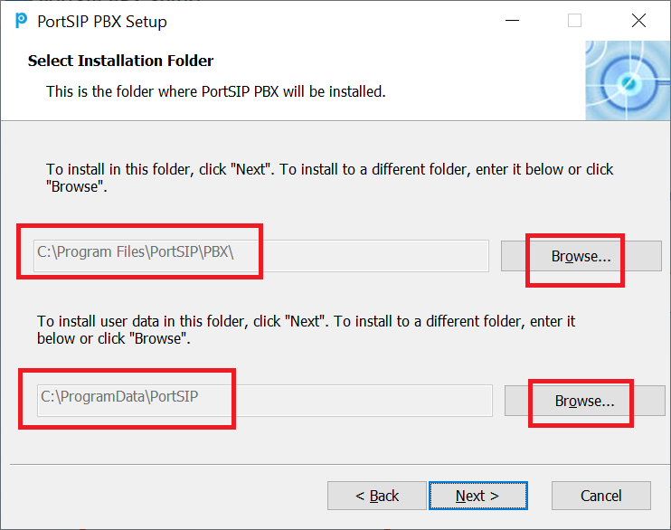

# Installation of PortSIP PBX v16.x

## Downloading PortSIP PBX

You can always find and download the latest free edition of [PortSIP PBX](https://www.portsip.com/portsip-pbx/) on the [PortSIP website](https://www.portsip.com/download-portsip-pbx/). The software is compatible with both 64-bit Windows and Linux operating systems. Please note that a 32-bit version is not available.

The free edition supports up to 3 simultaneous calls and allows for 10 extension registrations. If you need additional capacity for more simultaneous calls or extensions, please visit the [PortSIP PBX Pricing](https://www.portsip.com/portsip-pbx-pricing/) page for further details.

Once the download is complete, you will receive the installer file.

## Installing PortSIP PBX on Linux

### **Supported Linux OS**

* Ubuntu 20.04, 22.04, 24.04
* Debian 11.x, 12.x

It only supports 64-bit OS.

### Minimal Hardware Requirements

The PortSIP PBX requires at least 2 cores, 4G memory, and 30GB HDD.

### **Preparing the Linux Host Machine for Installation**

Tasks that MUST be completed before installing PortSIP PBX

* **Ensure the server date-time is synced correctly**.
* If the Linux on which PBX will be installed is located on a LAN, assign &#x61;**`static private IP address`**&#x74;o the PBX server; if it's on a public network, assign &#x61;**`static public IP address`** and a **`static private IP`** to the PBX server.&#x20;
* Install all available updates and service packs before installing PortSIP PBX.
* Do not install PostgreSQL on your PortSIP PBX Server.
* Ensure that all power-saving options for your system and network adapters are disabled (by setting the system to High-Performance mode).
* Do not install TeamViewer, VPN, or other similar software on the host machine.
* The PortSIP PBX must not be installed on a host that is a DNS or DHCP server.
* The below ports must be permitted by your firewall.
  * UDP: 5060, 5066, 25000-34999, 45000–65000
  * TCP: 5061, 5063, 5065, 5067, 8882, 8883, 8885, 8887, 8888, 8889, 10443. please also ensure the above ports have not been used by other applications.
* Must execute all Linux commands as the root user. please `su root` first.


If the PBX runs on a cloud platform such as AWS and the cloud platform has its own firewall, you **must** also open the ports on the cloud platform's firewall.


### **Step 1 Download the  Installation Scripts**


All commands must be executed in the **`/opt/portsip`** directory.


Execute the below commands to download the installation scripts.


You need to use the command `su -` rather than the `su root`


```shell
su - 
mkdir -p /opt/portsip
cd /opt/portsip
```

```bash
curl https://raw.githubusercontent.com/portsip/portsip-pbx-sh/master/v16.x/new/install_docker.sh \
-o install_docker.sh
```

```bash
curl https://raw.githubusercontent.com/portsip/portsip-pbx-sh/master/v16.x/new/pbx_ctl.sh \
-o pbx_ctl.sh
```

### **Step 2 Setup the Docker Environment**

Execute the below command to install the `Docker-Compose` environment. If you get the prompt likes`*** cloud.cfg (Y/I/N/O/D/Z) [default=N] ?`, enter the **Y** and then press the **Enter** button.

```shell
/bin/sh install_docker.sh
```

### Step 3 Create and Run the PortSIP PBX Docker Container Instance

The below command is used to create and run the PBX on a server whose **public IP address** is`66.175.221.120`. If running the PBX in a LAN without the public IP address, just replace the IP `66.175.221.120` with the PBX server's **LAN private IP address**.


If your PBX server has a public IP, you must use it in the below command for the `-a` parameter. If not, the PBX won’t work with the internet trunk.


```shell
/bin/sh pbx_ctl.sh \
run -p /var/lib/portsip \
-a 66.175.221.120 \
-i portsip/pbx:16
```

Now you can use`https://66.175.221.120:8887` to access the PBX Web portal; the default system administrator name and password are`admin`.

After successfully creating the PBX docker instance, you can use the below commands to manage it.

## Managing PortSIP PBX Docker Instance

First, you will need to at the `/opt/portsip` folder, then you can use the following commands to manage the PortSIP PBX docker instance.

```sh
cd /opt/portsip
```

### Show the PBX Docker Instance Status

```
/bin/sh pbx_ctl.sh status
```

### Start the PBX Docker Instance

```bash
/bin/sh pbx_ctl.sh start
```

### Stop the PBX Docker Instance

```bash
/bin/sh pbx_ctl.sh stop
```

### Restart the PBX Docker Instance

```bash
/bin/sh pbx_ctl.sh restart
```

### Delete the PBX Docker Instance

```bash
/bin/sh pbx_ctl.sh rm
```

## Installing PortSIP PBX on Windows

### **Supported Windows OS**

* Windows 10, 11
* Windows Server 2016, 2019, 2022

It only supports 64-bit OS.

### **Preparing the Windows Host Machine for Installation**

Tasks that MUST be completed before installing PortSIP PBX

* **Ensure server date-time is synced correctly.**
* If the Windows PC / server on which PBX will be installed is located in LAN, assign a **`static LAN private IP address`**&#x66;or the server; if it's in a public network, assign a **`static public IP address`**  and a **`static private IP address`** for the server.
* Install all available Windows updates & service packs before installing PortSIP PBX. The reboot after installing Windows updates may reveal additional updates. Pay particular attention to installing all updates for Microsoft .Net before running the PortSIP PBX installation.
* Anti-virus Software should not scan the following directories to avoid complications and write access delays: `C:\Program Files\PortSIP`; `C:\Programdata\PortSIP`
* Do not install VPN and TeamViewer software on your PortSIP PBX Server
* Do not install `PostgreSQL` on your PortSIP PBX Server
* Ensure the **`Windows Firewall`** service has been started.
* Ensure that all power-saving options for your System and Network adapters are disabled (by setting the system to High-Performance mode).
* Disable Bluetooth adapters if it is a Windows client PC.
* PortSIP PBX must not be installed on a host which is a DNS or DHCP server, or that has MS SharePoint or Exchange services installed.
* The below ports must be permitted by your firewall.
  * UDP: 5060, 5066, 25000-35000, 45000–65000
  * TCP: 5061, 5063, 5065, 5067, 8882, 8883, 8885, 8887, 8888, 8889, 10443. Please also ensure the above ports have not been used by other applications.
* Ensure your Windows firewall is enabled.


If the PBX runs on a cloud platform such as AWS and the cloud platform has its own firewall, you **must** also open the ports on the cloud platform's firewall.


### **Step 1 Installing a fresh PortSIP PBX for Windows**

The PBX installer can be downloaded at[ PortSIP Website](https://www.portsip.com/download-portsip-pbx/).

To install PortSIP PBX, you only need to double-click the installer, which will guide you through the installation process.

PortSIP PBX services will automatically start after successful installation (and thereafter every time your computer starts up).


The following two folders must not be the same when selecting the PBX folders during installation!


<figure><figcaption></figcaption></figure>

## **Configuring Firewall Rules**

After having successfully installed PortSIP PBX, the PortSIP PBX ports have been opened automatically for Windows and Linux.

The below ports must be permitted on the firewall in order to make the PortSIP PBX work properly.

* UDP: 5060, 5066, 25000-35000, 45000–65000
* TCP: 5061, 5063, 5065, 5067, 8882, 8883, 8885, 8887, 8888, 8889, 10443. Please also ensure the above ports have not been used by other applications.

You also need to open the port that you are using for adding new transport:

* Assume you have added a TLS transport on port 5070, you must open TCP port 5070 in your Firewall.
* Assume you have added a TCP transport on port 5071, you must open TCP port 5071 in Firewall.
* Assume you have added a UDP transport on port 5078, you must open UDP port 5078 in your Firewall.

The below example is for creating the firewall rule that allows port 5070 on TCP.

```bash
sudo firewall-cmd --permanent --service=portsip-pbx \
--add-port=5070/tcp \
--set-description="PortSIP PBX"
```

```bash
sudo firewall-cmd --permanent --add-service=portsip-pbx
sudo firewall-cmd --reload
```

The below example is for creating the firewall rule that allows port 5078 on UDP.

```bash
sudo firewall-cmd --permanent --service=portsip-pbx \
--add-port=5078/udp \
--set-description="PortSIP PBX"
```

```bash
sudo firewall-cmd --permanent --add-service=portsip-pbx
sudo firewall-cmd --reload
```

The commands below are used to check the ports that are currently opened for PortSIP PBX.

```
firewall-cmd --info-service=portsip-pbx
```


If the PBX runs on a cloud platform such as AWS and the cloud platform has its firewall or security rules, you **must** also open the ports on the cloud platform's firewall.


## Uninstall PortSIP PBX

Please follow the steps below to uninstall the PortSIP PBX for Linux.

### Uninstall the PBX

Use the following commands to stop and delete the PBX Docker instances  Note, that the PBX data will not lost with the uninstall of the PortSIP PBX.

```bash
cd /opt/portsip
/bin/sh pbx_ctl.sh stop
/bin/sh pbx_ctl.sh rm
```

### Delete the PBX Data

If you want to delete the PBX data, please perform the below commands.


The following commands will DELETE all your PBX data from the server that can't recover, please be careful.


```sh
cd /var/lib/portsip
rm -rf pbx 
rm -rf postgresql
```

For the PBX Windows installation, just uninstall it from the Windows Control Panel.

