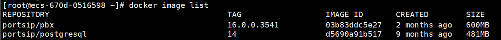

# Upgrade to the Latest v22.x Release


The PortSIP PBX v22.0 hasn't been released yet, the upgrade is unavailable.


This guide provides step-by-step instructions for upgrading your current PortSIP PBX v16.x or v22.x installation to the latest v22.x release.

## Back-Up

Please follow the article [Backup and Restore: An Essential Guide](https://support.portsip.com/portsip-pbx/portsip-pbx-administration-guide/backup-and-restore) to back up the PBX and SBC.

## Prerequisites for Upgrading from v16.x

* If your current installation is PortSIP PBX v16.x, you must first upgrade to the latest version within v16.x (v16.4.4) before proceeding to v22.x.
* Upgrades to v22.x are only supported from v16.4.4. If your installation is a version lower than v16.4.4, please follow the [**Upgrading to the Latest v16.x Release**](../installation-of-portsip-pbx-v16/upgrade-portsip-pbx-to-v16.x.md) to complete the necessary upgrade to v16.4.4 first.

Once your PBX is upgraded to the latest v16.x, please follow the below steps to remove the v16.x installation.

### Remove the current PBX installation


All commands must be executed in the **`/opt/portsip`** directory.


#### 1: Stop PBX docker instances <a href="#step-1-stop-pbx-docker-instance" id="step-1-stop-pbx-docker-instance"></a>

Perform the following commands as root to stop the current PBX Docker instance:

```sh
cd /opt/portsip
sudo /bin/sh pbx_ctl.sh stop
```

#### 2: Delete the PBX docker instances <a href="#step-2-delete-the-pbx-docker-instance" id="step-2-delete-the-pbx-docker-instance"></a>

Perform the following command to delete the PBX Docker instance:

```sh
sudo /bin/sh pbx_ctl.sh rm
```

#### 3: Delete the PBX docker images <a href="#step-3-list-the-pbx-docker-images" id="step-3-list-the-pbx-docker-images"></a>

Perform the following command to list the PBX Docker images:

```sh
docker image list
```

You will get a similar result, as shown in the screenshot below.

<figure><figcaption></figcaption></figure>

You can use the following command to delete Docker images using the first 4 digits of the IMAGE ID for **PBX** and **Postgresql**, in this case, is **03b8** and **d569**.

```
docker image rm 03b8 d569 
```

#### 4: Delete the scripts <a href="#step-4-delete-the-pbx-scripts" id="step-4-delete-the-pbx-scripts"></a>

```sh
rm install_pbx_docker.sh
rm install_docker.sh
rm pbx_ctl.sh
```

### Remove the current SBC installation


All commands must be executed in the **`/opt/portsip`** directory.


If you installed the PortSIP SBC 10.x with the PortSIP PBX v16.x, please follow the below steps to remove it.

#### 1: Stop SBC docker instances <a href="#step-1-stop-pbx-docker-instance" id="step-1-stop-pbx-docker-instance"></a>

Perform the following commands as root to stop the current SBC Docker instance:

```sh
cd /opt/portsip
sudo /bin/sh sbc_ctl.sh stop
```

#### 2: Delete the SBC docker instances <a href="#step-2-delete-the-pbx-docker-instance" id="step-2-delete-the-pbx-docker-instance"></a>

Perform the following command to delete the SBC Docker instance:

```sh
sudo /bin/sh sbc_ctl.sh rm
```

#### 3: Delete the SBC docker images <a href="#step-3-list-the-pbx-docker-images" id="step-3-list-the-pbx-docker-images"></a>

Perform the following command to list the SBC Docker images:

```sh
sudo docker image list
```

You will get a similar result, as shown in the screenshot below.

<figure><figcaption></figcaption></figure>

You can use the following command to delete Docker images using the first 4 digits of the IMAGE ID for **SBC**, in this case, it is **9f51**.

```sh
sudo docker image rm 9f51
```

#### 4: Delete the scripts <a href="#step-4-delete-the-pbx-scripts" id="step-4-delete-the-pbx-scripts"></a>

```sh
rm install_pbx_docker.sh
rm install_docker.sh
rm sbc_ctl.sh
```

## Prerequisites for Upgrading within v22.x

If your current installation is already PortSIP PBX v22.x and you need to upgrade to the latest v22.x, please follow the below steps to remove the current v22.x installation.

### Remove the current PBX installation


All commands must be executed in the **`/opt/portsip`** directory.


#### 1: Stop PBX docker instances <a href="#step-1-stop-pbx-docker-instance" id="step-1-stop-pbx-docker-instance"></a>

Perform the following commands as root to stop the current PBX Docker instance:

```sh
cd /opt/portsip
sudo /bin/sh pbx_ctl.sh stop
```

#### 2: Delete the PBX docker instances <a href="#step-2-delete-the-pbx-docker-instance" id="step-2-delete-the-pbx-docker-instance"></a>

Perform the following command to delete the PBX Docker instance:

```sh
sudo /bin/sh pbx_ctl.sh rm
```

#### 3: Delete the PBX docker images <a href="#step-3-list-the-pbx-docker-images" id="step-3-list-the-pbx-docker-images"></a>

Perform the following command to list the PBX Docker images:

```sh
docker image list
```

You will get a similar result, as shown in the screenshot below.

<figure><figcaption></figcaption></figure>

You can use the following command to delete Docker images using the first 4 digits of the IMAGE ID for **PBX** and **Postgresql**, in this case, they are **527b** and **d0ad**.

```sh
docker image rm 527b d0ad 
```

#### 4: Delete the scripts <a href="#step-4-delete-the-pbx-scripts" id="step-4-delete-the-pbx-scripts"></a>

```sh
rm install_pbx_docker.sh
rm install_docker.sh
rm pbx_ctl.sh
```

### Remove the current SBC installation


All commands must be executed in the **`/opt/portsip`** directory.


If you installed the PortSIP SBC 10.x with the PortSIP PBX v16.x, please follow the below steps to remove it.

#### 1: Stop SBC docker instances <a href="#step-1-stop-pbx-docker-instance" id="step-1-stop-pbx-docker-instance"></a>

Perform the following commands as root to stop the current SBC Docker instance:

```sh
cd /opt/portsip
sudo /bin/sh sbc_ctl.sh stop
```

#### 2: Delete the SBC docker instances <a href="#step-2-delete-the-pbx-docker-instance" id="step-2-delete-the-pbx-docker-instance"></a>

Perform the following command to delete the SBC Docker instance:

```sh
sudo /bin/sh sbc_ctl.sh rm
```

#### 3: Delete the SBC docker images <a href="#step-3-list-the-pbx-docker-images" id="step-3-list-the-pbx-docker-images"></a>

Perform the following command to list the SBC Docker images:

```sh
docker image list
```

You will get a similar result, as shown in the screenshot below.

<figure><figcaption></figcaption></figure>

You can use the following command to delete Docker images using the first 4 digits of the IMAGE ID for **SBC**, in this case, it's bc66.

```
docker image rm bc66
```

#### 4: Delete the scripts <a href="#step-4-delete-the-pbx-scripts" id="step-4-delete-the-pbx-scripts"></a>

```sh
rm install_pbx_docker.sh
rm install_docker.sh
rm sbc_ctl.sh
```


