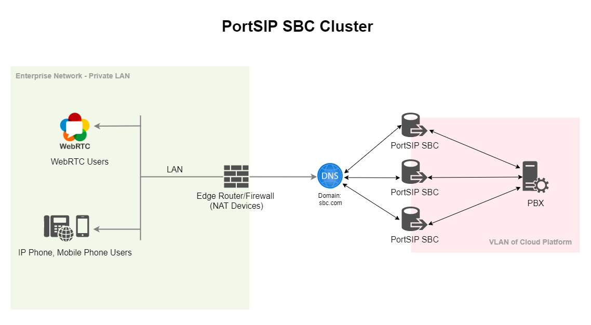

# 11 Deploy the SBC Cluster

If your business handles a large volume of WebRTC and MS Teams calls, or if you use an SBC to isolate your PBX, all calls will be routed through the SBC. In this case, it is recommended to deploy the SBC as a cluster to effectively manage the call traffic.

## Deployment Architecture

<figure><figcaption></figcaption></figure>

As shown in the diagram, the PBX is deployed either on a VLAN or a cloud platform. Several SBC servers are deployed in front of the PBX, preventing users from directly accessing it.

## DNS

You will need to create the DNS record for each SBC server,  the DNS record can be one of he following types:

* A Record
* DNS SRV Record

For example, assume the SBC servers has the below IP addresses:

* SBC 1: 72.247.113.11
* SBC 2: 72.247.113.12
* SBC 3: 72.247.113.13

You can create the following A records for the SBC servers:

* Resolve sbc1.sbc.com to 72.247.113.11
* Resolve sbc2.sbc.com to 72.247.113.12
* Resolve sbc3.sbc.com to 72.247.113.13
* Resolve sbc.com to 72.247.113.11
* Resolve sbc.com to 72.247.113.12
* Resolve sbc.com to 72.247.113.13

## Certificates

Please purchase a wildcardTLS certificate for the domain **sbc.com**.

## Configuring the SBC

Please follow the instructions in the [Configuring SBC for WebRTC](9-configuring-sbc-for-webrtc.md) topic to set up each SBC server. However, pay attention to the following points:

* When adding certificates to the SBC, set the TLS domain to **sbc.com** and enable the **This is SBC Web Domain Certificate** option.
* When setting up the Web Domain for an SBC, enter **sbc.com** as the **Web Domain**.

## Access the SBC

After completing the setup of the SBC servers, you can access the SBC Web Portal using the following URLs:

* To manage SBC 1, use https://sbc1.sbc.com:8883
* To manage SBC 2, use https://sbc2.sbc.com:8883
* To manage SBC 3, use https://sbc3.sbc.com:8883

You can access the WebRTC client using this URL: https://sbc.com:10443/webrtc.

