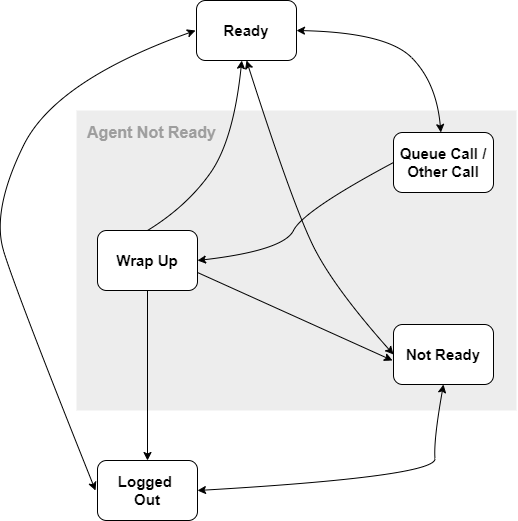

# Agent States and Work Modes

&#x41;_&#x67;ent states_ specify what state an agent is in. For example, an agent in the **Ready** state is available to handle calls from an ACD queue. An agent can have several states with respect to different ACD devices, or he can use a single state to describe his relationship to all ACD devices. Agent states are reported in [queue events](../../../development-portsip/going-real-time-with-portsip-pbx-pub-sub.md#queue_events).

The below Agent-State Diagram shows the agent states. Transitions between states, represented by arrows, show subsequent states that may be entered from a given state. You can use the [WSI](../../../development-portsip/going-real-time-with-portsip-pbx-pub-sub.md) to receive state events.

<figure><figcaption></figcaption></figure>

## Agent Status

### Logged Out

The state where an agent is logged out of the call queue, the ACD will no longer distribute calls to this agent.

### Not Ready

The state where an agent is logged in to the call queue, but is not prepared to handle calls that the ACD distributes. While in this state, an agent can receive calls that are not handled by the ACD.

### Ready

The state where an agent is logged in to a call queue and is prepared to handle calls that the ACD distributes.

### Queue Call / Other Call

The state where an agent is on the current call and can't handle new calls that the ACD distributes. The Queue Call indicates that the agent is on an ACD call, while the Other Call indicates the agent is on a non-ACD call,

### Wrap Up

Also known as "**After Call Work**". the state where an agent, is no longer involved with an ACD call. While in this state, the agent is performing administrative duties for a previous call and cannot receive further calls from the ACD.

## Managing Agent Status

PortSIP provides options that enable agents to control their status. Use these options to change the agent status:


If you create the call queue with "**Set agent to Ready automatically**" turned on, you do not need to set the agent status to "**Ready**" manually.


### FAC - Feature Access Code

Agents can dial a feature access code to change their status for that call queue or to change their status for all call queues to which they belong.

1. **Log the agent into the queue** - Dial `*38` to log into all queues that the agent belongs; Dial `*388000` to log into the queue that number is `8000`. After logging in, if the queue is checked **Set agent to Ready automatically**, the agent state will be changed to **Ready**, otherwise will be **Not Ready**.
2. **Log the agent out of the queue** - Dial `*39` to log out of all queues; Dial `*398000` to log out of the queue that number is 8000.
3. **Set Agent to Ready** - Change the agent state to **Ready** of the queue. Dial `*36` to change the agent state to **Ready** of all queues that the agent belongs; Dial `*368000` to change the agent state to **Ready** of the queue that number is 8000.
4. **Set Agent to Not Ready** - Change the agent state to **Not Ready** of the queue. Dial `*37` to change the agent state to **Not Ready** of all queues that the agent belongs; Dial `*378000` to change the agent state to **Not Ready** of the queue that number is 8000.

### REST API

The PortSIP also supports changing the agent status by calling the REST API.

1. [Log the agent into the queue](https://www.portsip.com/pbx-rest-api/v16/html/index.html#tag/Call-Queue/operation/loginQueueAgent).
2. [Log the agent out of the queue](https://www.portsip.com/pbx-rest-api/v16/html/index.html#tag/Call-Queue/operation/logoutQueueAgent).
3. [Set the agent status](https://www.portsip.com/pbx-rest-api/v16/html/index.html#tag/Call-Queue/operation/setQueueAgentStatus).

## 3 Receive the Agent State Event in Real-time

PortSIP PBX provides a real-time mechanism that allows the admin and queue manager to subscribe to queue and agent status; the PBX will push the related events to the subscriber via WebSocket; For more details please follow [Going Real-Time with PortSIP PBX Pub/Sub](../../../development-portsip/going-real-time-with-portsip-pbx-pub-sub.md#queue_events).
