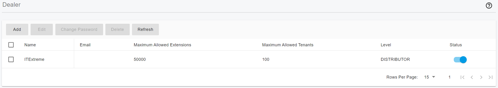
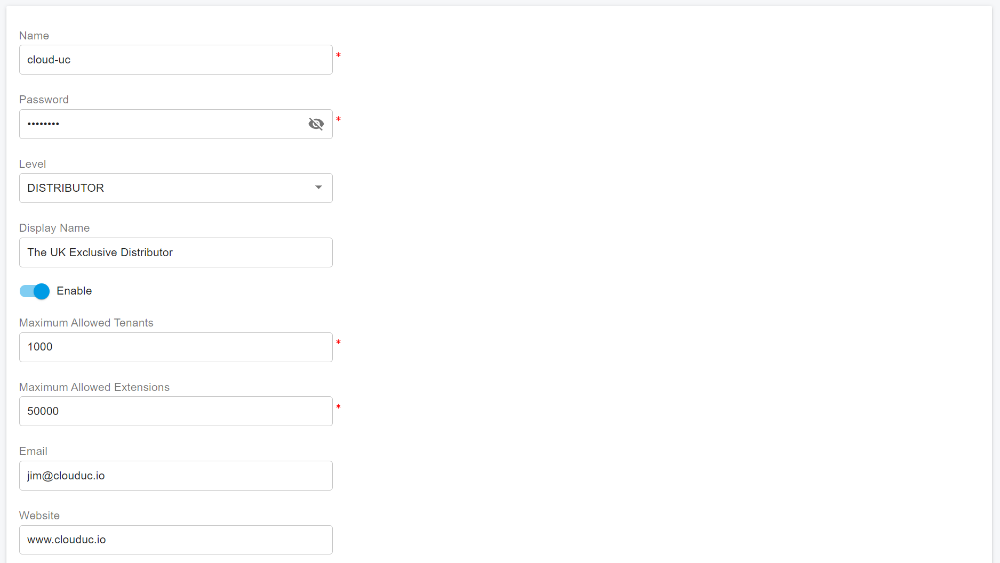
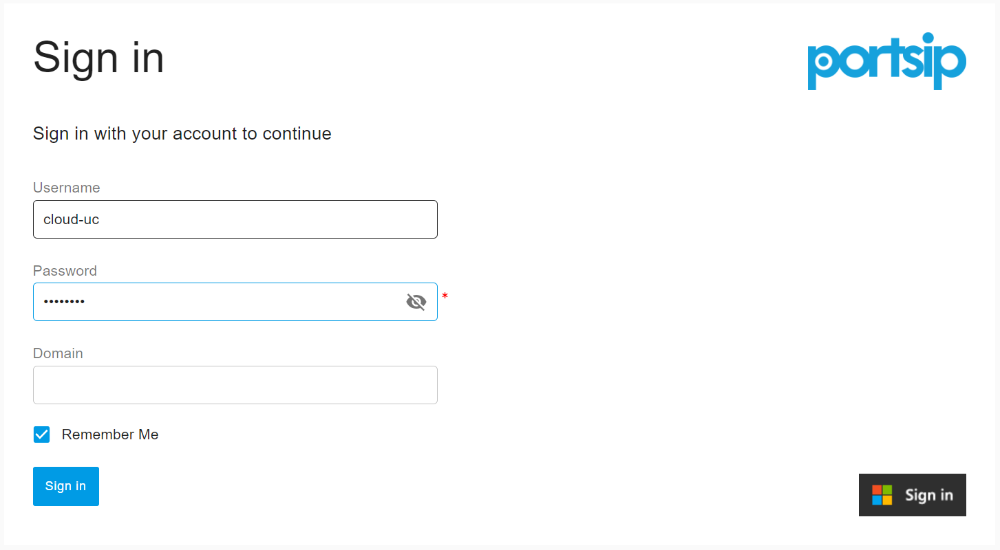
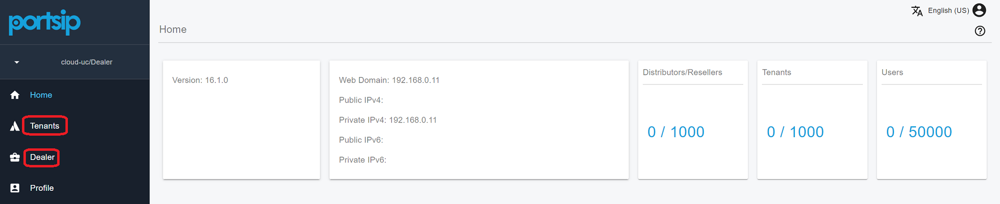

# 22 Dealers

Cloud PBX and UCaaS have revolutionized how organizations operate, enabling scalability, flexibility, and resilience. These solutions allow businesses to focus on their core operations without getting bogged down in the complexities of IT infrastructure. Leading UCaaS providers such as RingCentral, Nextiva, Vonage, and Zoom sell cloud communication services and products to meet the growing demand for modern business communications.

\
Distributors and resellers play a vital role in this ecosystem by partnering with cloud service providers to deliver Unified Communications services and products to end users. A dealer or reseller purchases these cloud-based solutions from the provider and sells them to customers, bridging the gap between the service provider and the market.

Cloud PBX and UCaaS providers, in turn, can focus entirely on hosting and maintaining the Unified Communications PBX system in the cloud, ensuring seamless operations and delivering reliable, continuous service to their partners and customers.

\
PortSIP PBX is a multi-tenant PBX purpose-built for the cloud era, catering to the unique needs of service providers. One of its standout features is the **Dealers Management** functionality, which simplifies the management of distributors and resellers. This capability allows service providers to efficiently oversee their dealer network, enabling them to grow their reach and serve customers more effectively.

## Dealer Levels

PortSIP PBX provides three levels for dealers:

* Distributor
* Sub-Distributor
* Reseller

<figure><figcaption></figcaption></figure>

Each level of the dealer can create, modify, or delete the lower-level dealer.&#x20;

* The service provider can create the Distributor, Sub-Distributor, and Reseller.&#x20;
* The Distributor can only create the Sub-Distributor and Reseller.&#x20;
* The Sub-Distributor can only create the Reseller.&#x20;

All levels of dealers can create and manage their end-users - tenants.

## Add a Dealer

Please follow the below steps to add the dealer to the PortSIP PBX.

* Sign in to the PortSIP PBX web portal as the **system administrator**.
* Click the menu **Dealers**, all dealers will be listed.
* Click the **Add** button.

<figure><figcaption></figcaption></figure>

Enter the appropriate values for the necessary fields, then click the **OK** button to create the dealer. In the **Level** field, you can choose the level for this dealer: Distributor, Sub-Distributor, or Reseller.

You can limit that distributor capability by specifying the maximum of tenants, and the maximum of extensions.

After the dealer is successfully created, that dealer can sign in to the PortSIP PBX web portal to manage its tenants and dealers.

## Sign in the Dealer

A dealer can sign in to the PortSIP PBX web portal by entering the username and password. Please see the below screenshot for an example:

<figure><figcaption></figcaption></figure>

Once the dealer signs in to the PortSIP PBX web portal, they can access the Dealers and Tenants menus which allow them to manage the sub-dealers and tenants they created.

<figure><figcaption></figcaption></figure>

