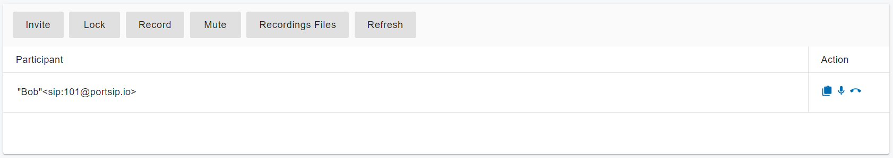

# 25 Meetings

## Creating Meeting

To create a meeting in PortSIP PBX, follow these steps after successful installation:

* Select the menu **Advanced Services > Meeting** and click the **Add** button.
* Enter a **suitable topic** for the meeting to remind participants of the topic to be discussed.
* Enter a **meeting extension number** which will be dialed by the meeting participants to join the meeting. It should not be an existing extension number.
* Select your **meeting mode** from the Meeting Mode drop-down list.
* Enter the **PIN** for this meeting if necessary. If the PIN was set, the participants must enter the PIN when joining the conference.
* Enter the **Admin PIN** for the meeting host. When a user enters this PIN, he/she will be identified as the meeting admin to host the meeting.
* Enter the maximum number of **Maximum Participants** field that limits the count of participants who join this conference.
* Specify the count of videos in **Grids for Video Meeting**. Value auto, 1, 2, 3, 4, 6, 9 supported.
* Set the bandwidth used during a video meeting in “Bitrate(kbps)”. The value ranges from 128 kbps – 8196 Kbps. The higher the value is, the better the video experience would be.
* Choose “Frame Rate” with the range 5 – 30. A higher value will guarantee a fluent video experience.
* Choose the height and width of the video resolution. For 720P, the height is 720 and the width is 1280; For 1080P, the height is 1080 and the width is 1920.
* Choose the **Prompt Language** for vocal notices which will be used when users enter the meeting.
* Choose a **time zone** for meeting time; it uses the tenant’s time zone by default.
* Pick up the **start time** and **end time** of your meeting.

When the PortSIP PBX is successfully installed, you can create a meeting by selecting the menu **Advanced Services** **> Meeting** and clicking the **Add** button, then enter the following information:

* Enter the suitable topic for the meeting to remind participants of the topic to be discussed.
* Enter a meeting extension number which will be dialed by the meeting participants to join the meeting. It should not be an existing extension number.
* Select your meeting mode from the **Meeting Mode** drop-down list.
* Enter the PIN for this meeting if necessary. If the PIN was set, the participants must enter the PIN when joining the conference.
* Enter the Admin PIN for the meeting host. When a user enters this PIN, he/she will be identified as the meeting admin to host the meeting.
* Enter the maximum number of **Maximum Participants** field that limits the count of participants who join this conference.
* Specify the count of videos in “**Grids for Video Meeting**”. Value auto, 1, 2, 3, 4, 6, 9 supported.
* Set the bandwidth used during a video meeting in “**Bitrate(kbps)**”. The value ranges from 128 kbps – 8196 Kbps. The higher the value is, the better the video experience would be.
* Choose “**Frame Rate**” with the range 5 – 30. A higher value will guarantee a fluent video experience.
* Choose the height and width of the video resolution. For 720P, the height is 720 and the width is 1280; For 1080P the height is 1080 and the width is 1920.
* Choose the Prompt Language for the vocal notices which will be used when the user enters the meeting.
* Choose the time zone for the meeting time, it uses the time zone of the tenant by default.
* Pick up the start time and end time of the meeting.
* Dial from Landline/Mobile Phone: You can specify DID numbers here to indicate the caller can dial to join your meeting. For example, you can use the following format: **+44 1494 523 500 (UK); +33 2022 123 123 (FR)**. If you have the inbound rules for routing these numbers to this meeting, then the caller can dial from PSTN to join the meeting
* To invite participants via email, enter their email addresses in the **Invitees** field. The PBX will send a meeting invitation to them, and they can join the meeting by clicking on the link. For more details, please refer to [Joining a Meeting with the Invite Link](joining-a-meeting-with-the-invite-link.md).
* To record the meeting automatically, turn on the **Record Meeting Automatically** option
* To play a welcome message when participants join the meeting, turn on the **Play Welcome Message When Joining Meeting** option.
* Outbound caller ID: if the outbound caller ID for the meeting is set up when inviting an external number to join the meeting, PBX will place the call to that external number on a configured SIP trunk, and this outbound caller ID could be a replacement for certain SIP field. For more details, please refer to the topic [Configurable SIP Fields](../7-trunk-management/handle-outbound-calls-through-sip-trunk.md#h.rhrzb9hdve5w).

## Managing Meeting

### **Joining meeting**

Once a meeting is created, inform the participants of the meeting number (“**Meeting Extension**”). Assuming that the user sets Meetg Extension to 8008, the user can join the conference by dialing 8008 from any SIP client.

### **Inviting participants**

You can also invite an extension or the mobile phone/landline phone user to join the meeting. Please see the below section for more details.

### **Managing the meeting**

Once a meeting is created, select the menu **Advanced Services > Meeting** to list available meetings. You can now choose a meeting and manage it.

* **Edit:** click the Edit button that allows you to change the meeting setting&#x73;**.**
* **Manage**: click the **Manage** button to manage the meeting and participants, see next section.
* **Delete**: End and delete the meeting.

### Managing the participants

Check a meeting in the meeting list, and click the **Manage** button to manage the meeting participants.

<figure><figcaption></figcaption></figure>

*   Invite participant: Click the **Invite** button to select an extension from the extension list, or enter the extension number directly. PBX will start a call to that specified extension.

    Once the call has been answered, the invited extension will be joined into the meeting automatically.

    Mobile number or PSTN number could also be entered here to be invited into the meeting but must configure the appropriate trunk and outbound rules in advance.
* **Lock**: Once the meeting is locked, other users cannot dial into the meeting.
* **Record**: Start or stop the meeting recording
* **Mute**: When the meeting has been muted, all participants can't hear from each other.
* **Recording Files**: List recording files of the meeting. They could be downloaded.
* **Refresh**: Refresh the meeting status and information.

For each participant of the meeting, under the **Action** column, there are some icons that allow you to manage the specified participant.

* **Host:** Set that participant video as the main screen of the video meeting.
* **Mute**: Click the microphone icon to mute/unmute the selected participant.
* **Hang up**: Remove a participant from the meeting.

