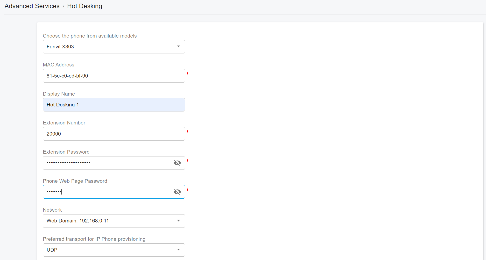

# 26 Hot Desking

Hot desking is a form of workplace sharing where employees will take whatever desk is available instead of having an assigned workspace. It was first introduced in the 1990s. Today, technology has aided in the implementation of hot desking by making it more feasible and accessible. Some businesses use hot desking for the whole company, while others use hot desking for specific spaces or roles in the company. 

With hot desking, workers can typically use any desk phone on the network by logging in to the phone with their voicemail pin. Cloud-based systems also make remote and flexible work environments possible with tools like VoIP communication, desktop virtualization, and more. 

## Key Features & Benefits 

* Employees traveling from different offices can share the same common phone and desk while keeping their own extension profiles and voicemail access
* Enables companies to save cost by allowing employees to login shared phones and still remain productive
* Reduces investment in facilities and hardware
* Supported by the wide range of devices

## Setting Up a Device for Hot Desking 

### Setting Up Hot Desking via PnP Provisioning

This method is typically used for on-premises PBX.

* Sign in to the PBX Web Portal as the tenant administrator.
* Plug the phone into the network.&#x20;
* The phone will send a multicast message across the LAN, which will be received by the PortSIP PBX.&#x20;
* The phone will appear in the **Call Manager > Phones** menu in the Web Portal as a new phone.
* &#x20;Copy the IP phone's MAC address.&#x20;
* Create a hot desking extension for that hot desking phone by selecting **Advanced Services > Hot Desking** from the menu, and clicking **Add**.&#x20;
* Enter basic information about the IP phone, such as its MAC address and provisioning method. If using SBC, select SBC for the **Network** option.
* Enter a friendly name for the **Display Name** and a unique extension number for this hot desking phone.&#x20;
* Click **OK** to create the hot desking extension and generate the configuration file. The PBX will then send a NOTIFY message to the phone with the configuration file URL for provisioning.

<figure><figcaption></figcaption></figure>

The IP phone will automatically download the configuration file, provision itself, and register the hot desking extension.

### Setting Up Hot Desking via RPS Provisioning

This method is typically used if the PortSIP PBX is deployed in the cloud.

* Sign in to the PBX Web Portal as the tenant administrator.
* Copy the IP phone's MAC address.&#x20;
* Create a hot desking extension for that hot desking phone by selecting **Advanced Services > Hot Desking** from the menu, and clicking **Add**.&#x20;
* Enter basic information about the IP phone, such as its MAC address and provisioning method. If using SBC, select SBC for the **Network** option.
* Enter a friendly name for the **Display Name** and a unique extension number for this hot desking phone.&#x20;
* Ensure the **Save to RPS** is turned on.
* Click **OK** to create the hot desking extension and generate the configuration file. and the PortSIP PBX will write the provisioning link to the IP phone's RPS. When the IP phone is powered on, it will query the provisioning link from the RPS server using its MAC address to complete the auto-provisioning.

The IP phone will automatically download the configuration file, provision itself, and register the hot desking extension.

## Logging In

Once the IP phone has successfully registered the hot desking extension with the PBX, it’s ready for hot desking login. In this example, we’ll assume that extension 101 will log in to this hot desking phone.

1. Select **Call Manager > Users** from the menu and double-click extension 101.
2. Click the **Extension** tab and turn on the **Enable Hot Desking** option.
3. Save changes.

From the hot desking phone, dial `*70` followed by the extension number (in this case, `*70101`) to log in. The PBX will answer and prompt the user to enter their voicemail PIN. After entering the PIN, a confirmation prompt will be played, and the device will be re-provisioned for the user’s extension (in this case, 100).

## Logging Out

To log out from an IP phone, the user needs to dial `*71` to log out, and the PBX answers and prompts the user has been logged out. Upon completion, a confirmation prompt is played, and the device is re-provisioned for hot desking.

