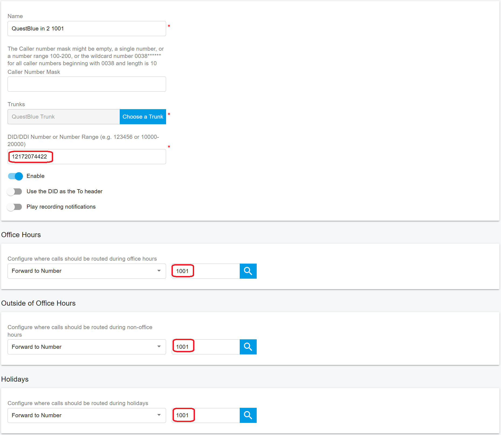
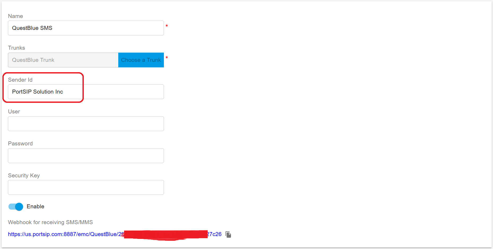
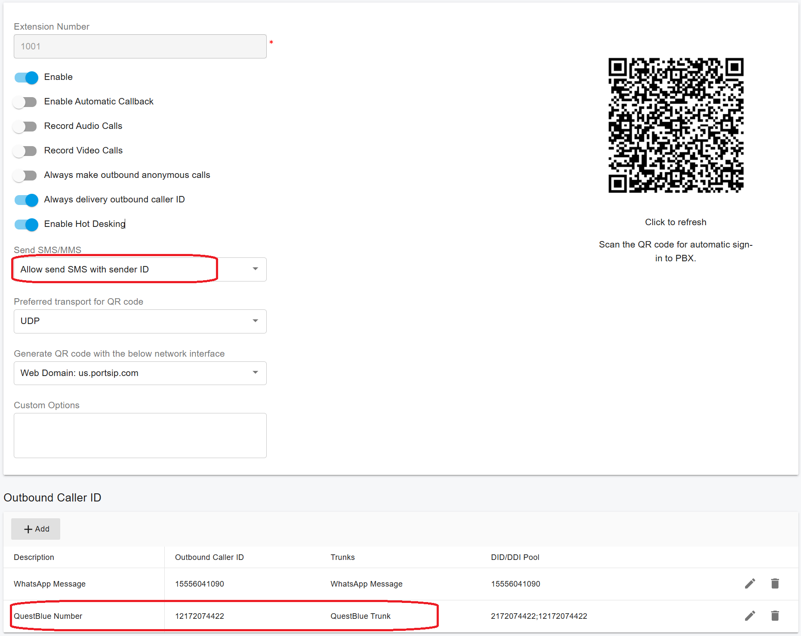

# SMS Channel

PortSIP PBX seamlessly integrates SMS functionality with the following SIP trunk providers:

* Twilio
* Vonage
* VoIP.ms
* QuestBlue
* Wavix
* Telnyx
* Voxtelesys

If you’re using any of these providers, setting up the SMS channel with PortSIP PBX is straightforward.

If your favorite SIP trunk provider for SMS is not listed above, feel free to [email us with your request](mailto:support@portsip.com), and we’ll explore the possibility of integrating it with PortSIP PBX.

## Preparing to Configure SMS in PortSIP PBX

Before configuring the SMS channel in PortSIP PBX, make sure your SMS service is fully set up with your SIP trunk provider by following the steps outlined in the [_Configuring SIP Trunks_](../../configuring-sip-trunks/) guide.

## Configuring the SMS Channel in PortSIP PBX

In this article, we demonstrate configuring SMS integration with PortSIP PBX. For QuestBlue trunk, the DID number _**12172074422**_ will route inbound SMS messages to extension 1001.&#x20;

First, ensure you have completed this setup: QuestBlue SMS Integration.

### Creating an Inbound Rule for SMS

1. Sign in to the PortSIP PBX web portal.
2. Navigate to **Call Manager > Inbound Rules** and click the **Add** button.
3. Complete the inbound rule setup as follows:
   * Enter a descriptive name for the rule.
   * Select the **QuestBlue** trunk you configured.
   * In the **DID/DDI Number or Number Range** field, enter the DID number: **12172074422**.
   * Set the destination to extension **1001**.
4. Click **OK** to save your changes.

<figure><figcaption></figcaption></figure>

Now, register the PortSIP ONE app to the PBX using extension 1001. Once registered, any SMS sent to the number _**+12172074422**_ will be received by extension 1001 directly in the PortSIP ONE app.


With the above inbound rule, calls to the DID +12172074422 will also be routed to extension 1001.


### Sending Outbound SMS

With the PortSIP ONE app, you can send outbound SMS messages through PortSIP PBX. If you have registered a Sender ID with your trunk provider and wish to enable the extension to send outbound SMS displaying this Sender ID, make sure to specify the Sender ID in the SMS settings in the PortSIP PBX web portal, as shown below. For the Sender ID, please refer to: [The Alphanumeric Sender ID.](https://www.twilio.com/docs/glossary/what-alphanumeric-sender-id) More details please consult to your SMS provider.

<figure><figcaption></figcaption></figure>

#### Granting SMS Permissions to an Extension

By default, extensions are not permitted to send SMS. To enable an extension to send outbound SMS, the tenant administrator must grant permission. Follow these steps to allow SMS for an extension:

1. Sign in to the PortSIP PBX web portal.
2. Navigate to **Call Manager > Users**, double-click the desired extension, and go to the **Extension** tab.
3. Under the **Send SMS/MMS** option, select **Allow** or **Allow Send SMS with Sender ID**.

#### Configuring Outbound Caller ID for SMS

In the **Outbound Caller ID** section, you can set up the outbound Caller ID for the extension:

1. Click the **Add** button.
2. Select the configured SIP trunk for SMS sending.
3. Enter a descriptive label in the **Description** field.
4. Enter a DID number from the trunk’s DID pool range.
5. Save your settings.

Refer to the screenshot below for further guidance.

<figure><figcaption></figcaption></figure>

#### Sending an SMS Directly to a Number

#### Sending an SMS to a Contact

