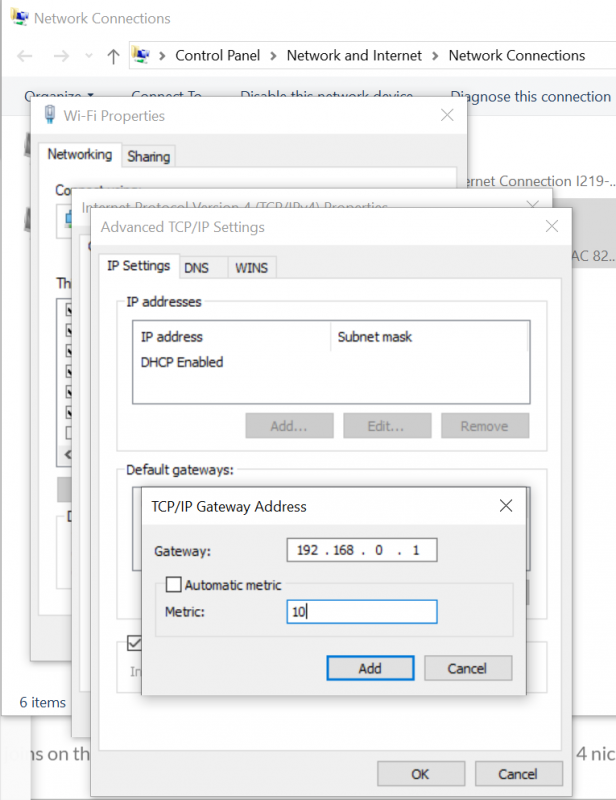
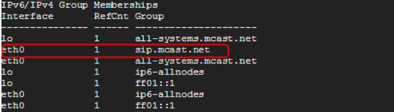

# PnP Auto Provisioning IP Phone Multicast Debug

To enable your PortSIP PBX to answer PnP requests for provisioning purposes, the following requirements must be met:&#x20;

* PortSIP PBX must be able to join the multicast group
* The IP Phone and PBX must be in the same local LAN subnet&#x20;
* The network switch/router must support MultiCast&#x20;
* Your IP Phone must support PnP provisioning

## PortSIP PBX Must be Able to Join the Multicast Group

&#x20;Depending on the network order of the interface PortSIP PBX may not be able to listen for multicast events. Note: Unused LAN Adapters, WiFi and Bluetooth must be disabled and can not be used to join Multicastevents.

## On Windows

To validate that PortSIP PBX is ready to listen for phone requests open the CMD command prompt and type:

`Netsh interface ipv4 show join`&#x20;

You should see the joins on the network interface. Below is an example of a system with 4 NICs to the IP address 224.0.1.75 (marked in green).

<figure><figcaption></figcaption></figure>

If your network interface does not list this address you are not ready to provision your IP phone via PnP.&#x20;

To resolve it, please follow up below steps:

* Open **Control Panel** > **Network and Internet** > **Network Connections**.
* Select the network adapter interface, right-click it, and choose **Properties**, select the **Internet Protocol Version 4 (TCP/IP)**.
* Click on **Properties**, then select **Advanced**. Edit the **Default Gateways** and try setting the **Metric** to the following suggested values one at a time. After each change, reboot the server and check if the joins are visible.
  * 1
  * 10
  * 12
  * 15
  * 20

<figure><figcaption></figcaption></figure>

## On Linux

Connect via SSH to the PBX server and switch to **root**. Enter the command `netstat -g` and check if **sip.mcast.net** is listed for the application interfaces.

<figure><figcaption></figcaption></figure>

## IP Phone and PBX Must be in the Same Local LAN Subnet

As PnP provisioning relies on Multicast message exchange it is mandatory that the phone must be in the same local subnet as the PortSIP PBX.&#x20;

* Will Work: PBX 192.168.1.1 Mask: 255.255.255.0; Phone 192.168.1.28 Mask:255.255.255.0&#x20;
* Will Not Work: PBX 192.168.0.1 Mask: 255.255.255.0; Phone 192.168.1.28 Mask: 255.255.255.0(other subnet)

## IP Phone Must Support PnP Provisioning

&#x20;The actual IP phone must also do its part to announce its presence in the network. However, some firmware versions in the past have shown us that this was not operational to its full extent. Therefore, the phone shall in case it does not work and all aspects above are covered, manually update to the latest supported firmware to ensure PnP functionality.

